# 基础信息

|      |      |
|------|------|
| 名称 | api |
| 编码语言 | .java |
| 代码路径 | xpipe/beacon/src/main/java/io/xpipe/beacon/api |
| 包名 | xpipe.beacon.src.main.java.io.xpipe.beacon.api |
| 概述说明 | 多个Java类实现BeaconInterface，处理不同API请求响应，含路径、Request/Response内部类及字段定义。 |

# 说明

```markdown
## 概述

该代码模块是一个基于Beacon接口的API服务模块，主要用于处理各类系统交互操作。模块采用Java实现，包含多个实现了`BeaconInterface`接口的交换类，每个类对应特定的业务功能。这些类通过定义请求路径(Request Path)和内部数据结构(Request/Response)来实现客户端与服务端的交互。模块整体采用Lombok的`@Jacksonized`、`@Builder`和`@Value`注解来简化代码并确保不可变性和序列化支持。

## 主要业务场景

模块覆盖了以下主要业务场景：

1. **连接管理**
   - 连接信息查询(`ConnectionInfoExchange`)
   - 连接添加/删除/刷新/切换状态(`ConnectionAddExchange`, `ConnectionRemoveExchange`, `ConnectionRefreshExchange`, `ConnectionToggleExchange`)
   - 连接查询和浏览(`ConnectionQueryExchange`, `ConnectionBrowseExchange`)
   - 连接终端交互(`ConnectionTerminalExchange`)

2. **文件系统操作**
   - 文件读写(`FsReadExchange`, `FsWriteExchange`)
   - 文件脚本处理(`FsScriptExchange`)
   - 二进制数据处理(`FsBlobExchange`)

3. **终端管理**
   - 终端启动/等待/注册/准备(`TerminalLaunchExchange`, `TerminalWaitExchange`, `TerminalRegisterExchange`, `TerminalPrepareExchange`)
   - 外部终端启动(`TerminalExternalLaunchExchange`)

4. **Shell操作**
   - Shell启动/停止/执行命令(`ShellStartExchange`, `ShellStopExchange`, `ShellExecExchange`)

5. **守护进程管理**
   - 守护进程状态/模式/版本/停止控制(`DaemonStatusExchange`, `DaemonModeExchange`, `DaemonVersionExchange`, `DaemonStopExchange`)
   - 守护进程焦点和开放接口(`DaemonFocusExchange`, `DaemonOpenExchange`)

6. **系统级交互**
   - 认证握手(`HandshakeExchange`)
   - 密码询问处理(`AskpassExchange`)
   - SSH启动(`SshLaunchExchange`)

7. **分类管理**
   - 分类添加(`CategoryAddExchange`)

所有交换类都遵循统一的模式：定义特定的API路径，使用不可变的请求/响应数据结构，并通过注解支持JSON序列化和构建器模式。模块设计注重类型安全和明确的接口契约，适合构建复杂的系统交互服务。
```


### 包内部结构视图

```mermaid
graph TD
    api --> CategoryAddExchange.java
    api --> ConnectionInfoExchange.java
    api --> FsReadExchange.java
    api --> TerminalLaunchExchange.java
    api --> TerminalWaitExchange.java
    api --> ConnectionAddExchange.java
    api --> ConnectionBrowseExchange.java
    api --> DaemonFocusExchange.java
    api --> ShellStartExchange.java
    api --> ConnectionRefreshExchange.java
    api --> AskpassExchange.java
    api --> SshLaunchExchange.java
    api --> ShellStopExchange.java
    api --> TerminalExternalLaunchExchange.java
    api --> TerminalRegisterExchange.java
    api --> FsBlobExchange.java
    api --> ConnectionToggleExchange.java
    api --> TerminalPrepareExchange.java
    api --> DaemonOpenExchange.java
    api --> DaemonModeExchange.java
    api --> HandshakeExchange.java
    api --> ConnectionRemoveExchange.java
    api --> DaemonStatusExchange.java
    api --> ConnectionTerminalExchange.java
    api --> ShellExecExchange.java
    api --> FsScriptExchange.java
    api --> FsWriteExchange.java
    api --> DaemonVersionExchange.java
    api --> ConnectionQueryExchange.java
    api --> DaemonStopExchange.java
```



该流程图展示了xpipe/beacon项目中api目录下的所有交换类文件结构。根节点为api目录，直接包含30个不同的交换类实现文件，这些文件主要涉及终端操作、连接管理、守护进程控制、文件系统交互等功能模块，每个交换类都代表一种特定的API请求处理逻辑。

# 文件列表 File List

| 名称   | 类型  | 说明 |
|-------|------|-------------|
| [FsReadExchange.java](FsReadExchange.md) | file | FsReadExchange类处理文件读取请求，包含路径和连接UUID。 |
| [ConnectionInfoExchange.java](ConnectionInfoExchange.md) | file | ConnectionInfoExchange类处理连接信息交换，包含请求、响应及信息响应的数据结构。 |
| [CategoryAddExchange.java](CategoryAddExchange.md) | file | Java类定义分类添加接口，包含请求和响应数据结构。 |
| [ShellStopExchange.java](ShellStopExchange.md) | file | ShellStopExchange类处理停止shell请求，路径为/shell/stop，需非空UUID参数。 |
| [SshLaunchExchange.java](SshLaunchExchange.md) | file | SSH启动交换类，含请求参数和响应命令列表。 |
| [AskpassExchange.java](AskpassExchange.md) | file | AskpassExchange类处理密码请求，包含请求和响应结构。 |
| [ConnectionRefreshExchange.java](ConnectionRefreshExchange.md) | file | ConnectionRefreshExchange类，路径/connection/refresh，包含Request和Response静态类。 |
| [ShellStartExchange.java](ShellStartExchange.md) | file | ShellStartExchange类处理shell启动请求，包含请求UUID和响应shell信息。 |
| [DaemonFocusExchange.java](DaemonFocusExchange.md) | file | DaemonFocusExchange类继承BeaconInterface，路径为/daemon/focus，包含空的Request和Response静态类。 |
| [ConnectionAddExchange.java](ConnectionAddExchange.md) | file | 类ConnectionAddExchange处理连接添加请求，包含请求路径和请求响应结构。请求需名称、数据和验证，响应返回连接ID。 |
| [TerminalWaitExchange.java](TerminalWaitExchange.md) | file | 终端等待交换接口，含请求和响应类。请求需UUID，路径为/terminal/wait。 |
| [TerminalLaunchExchange.java](TerminalLaunchExchange.md) | file | 终端启动交换类，含请求和响应结构，路径为/terminal/launch。 |
| [ConnectionTerminalExchange.java](ConnectionTerminalExchange.md) | file | 连接终端交换接口类，含请求响应结构。 |
| [DaemonStatusExchange.java](DaemonStatusExchange.md) | file | DaemonStatusExchange类处理守护进程状态请求，路径为/daemon/status，响应包含mode字段。 |
| [HandshakeExchange.java](HandshakeExchange.md) | file | HandshakeExchange类处理握手请求，无需认证，路径为/handshake，含请求和响应结构。 |
| [DaemonModeExchange.java](DaemonModeExchange.md) | file | DaemonModeExchange类处理守护进程模式请求和响应。 |
| [DaemonOpenExchange.java](DaemonOpenExchange.md) | file | DaemonOpenExchange类处理守护进程请求，包含请求和响应结构。 |
| [TerminalPrepareExchange.java](TerminalPrepareExchange.md) | file | 终端准备交换接口类，含请求和响应结构。请求含UUID和pid，响应含Unicode和转义序列支持标志。 |
| [ConnectionToggleExchange.java](ConnectionToggleExchange.md) | file | Java类实现连接切换接口，含请求和响应结构。 |
| [FsBlobExchange.java](FsBlobExchange.md) | file | FsBlobExchange类处理文件系统blob请求，路径为/fs/blob，包含请求和响应结构。 |
| [TerminalRegisterExchange.java](TerminalRegisterExchange.md) | file | 终端注册交换接口，含请求类（UUID和pid字段）和空响应类。 |
| [DaemonStopExchange.java](DaemonStopExchange.md) | file | DaemonStopExchange类处理守护进程停止请求，路径为/daemon/stop，包含空请求体和带success字段的响应体。 |
| [ConnectionQueryExchange.java](ConnectionQueryExchange.md) | file | ConnectionQueryExchange类处理连接查询，包含请求和响应数据结构。请求含三个过滤字段，响应返回UUID列表。 |
| [DaemonVersionExchange.java](DaemonVersionExchange.md) | file | 守护进程版本交换接口，包含请求和响应结构，响应含版本信息。 |
| [FsWriteExchange.java](FsWriteExchange.md) | file | FsWriteExchange类处理文件写入请求，包含请求和响应结构。 |
| [FsScriptExchange.java](FsScriptExchange.md) | file | FsScriptExchange类处理脚本请求，包含请求和响应数据结构。 |
| [ConnectionBrowseExchange.java](ConnectionBrowseExchange.md) | file | Java类ConnectionBrowseExchange处理连接浏览请求，路径为/connection/browse，包含请求和响应结构。 |
| [ShellExecExchange.java](ShellExecExchange.md) | file | ShellExecExchange类定义请求/响应结构，用于执行shell命令。请求含连接ID和命令，响应含退出码、输出和错误信息。 |
| [ConnectionRemoveExchange.java](ConnectionRemoveExchange.md) | file | Java类ConnectionRemoveExchange处理连接移除请求，路径为/connection/remove，包含请求和响应结构。 |
| [TerminalExternalLaunchExchange.java](TerminalExternalLaunchExchange.md) | file | 终端外部启动交换接口，含请求和响应类。请求含连接和参数列表，响应含命令列表。路径为/terminal/externalLaunch。 |


