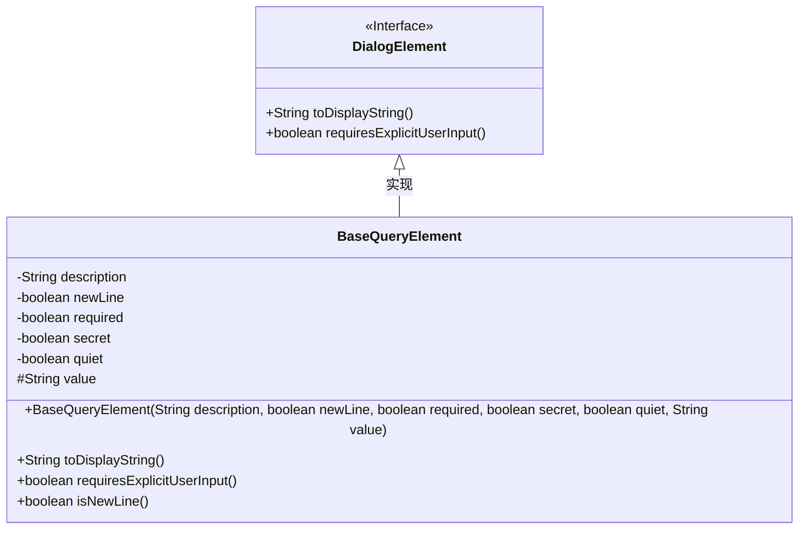
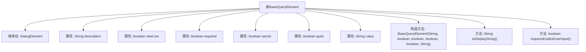

# 基础信息

|      |      |
|------|------|
| 名称 | BaseQueryElement |
| 编码语言 | .java |
| 代码路径 | xpipe/core/src/main/java/io/xpipe/core/dialog/BaseQueryElement.java |
| 包名 | io.xpipe.core.dialog |
| 依赖项 | ['com.fasterxml.jackson.annotation.JsonCreator', 'com.fasterxml.jackson.annotation.JsonTypeName', 'lombok.EqualsAndHashCode', 'lombok.Getter', 'lombok.ToString'] |
| 概述说明 | BaseQueryElement类继承DialogElement，包含描述、换行、必填、保密、静默等属性及显示和输入验证方法。 |

# 说明

BaseQueryElement类继承自DialogElement，用于查询操作。包含description、newLine、required、secret、quiet和value属性。description用于显示字符串，newLine控制是否换行，required标记是否必须输入，secret标识敏感信息，quiet控制静默模式，value存储输入值。构造函数初始化这些属性。重写toDisplayString方法返回description，requiresExplicitUserInput方法检查是否需要显式用户输入。

# 类列表 Class Summary

| 名称   | 类型  | 说明 |
|-------|------|-------------|
| BaseQueryElement | class | BaseQueryElement类继承DialogElement，包含描述、换行、必填、保密、静默和值属性，提供显示和输入验证方法。 |

## 类 BaseQueryElement

|      |      |
|------|------|
| 访问范围 | @JsonTypeName("query");@EqualsAndHashCode(callSuper = true);@ToString;@Getter;public |
| 类型 | class |
| 名称 | BaseQueryElement |
| 说明 | BaseQueryElement类继承DialogElement，包含描述、换行、必填、保密、静默和值属性，提供显示和输入验证方法。 |

### UML类图

这段代码定义了一个名为BaseQueryElement的类，它继承自DialogElement接口。该类主要用于处理查询元素的基本属性，包括描述、换行标志、必填标志、保密标志、静默标志和值。类中包含构造函数和两个重写的方法：toDisplayString()用于返回描述信息，requiresExplicitUserInput()用于判断是否需要显式用户输入。类图清晰地展示了继承关系和成员结构。

### 内部方法调用关系图

这段代码定义了一个名为BaseQueryElement的类，继承自DialogElement类。该类包含多个属性：description用于描述查询元素，newLine表示是否换行显示，required标识是否为必填项，secret控制是否隐藏输入，quiet决定是否静默处理，value存储当前值。构造方法通过@JsonCreator注解支持JSON反序列化，toDisplayString()返回描述文本，requiresExplicitUserInput()判断是否需要用户显式输入。整个类通过Lombok注解简化了getter和toString方法的实现。

### 字段列表 Field List

| 名称  | 类型  | 说明 |
|-------|-------|------|
| value | String | 声明一个受保护的字符串变量value。 |
| quiet | boolean | 私有布尔变量quiet |
| newLine | boolean | 私有布尔类型字段newLine，使用Getter注解。 |
| description | String | 私有字符串描述字段。 |
| required | boolean | 私有布尔类型必填字段 |
| secret | boolean | 私有布尔型变量secret |

### 方法列表 Method List

| 名称  | 类型  | 说明 |
|-------|-------|------|
| toDisplayString | String | 重写toDisplayString方法，直接返回description字段值。 |
| requiresExplicitUserInput | boolean | 检查用户输入是否必需且未提供。 |

