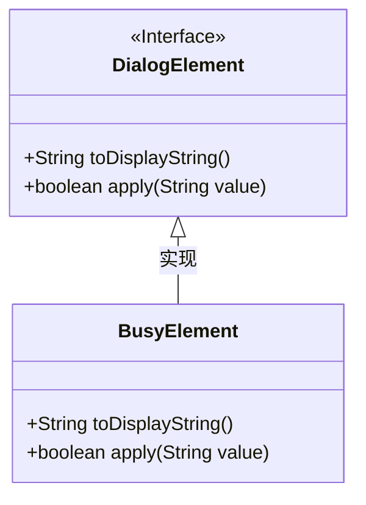
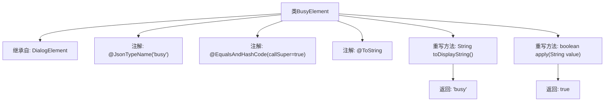

# 基础信息

|      |      |
|------|------|
| 名称 | BusyElement |
| 编码语言 | .java |
| 代码路径 | xpipe/core/src/main/java/io/xpipe/core/dialog/BusyElement.java |
| 包名 | io.xpipe.core.dialog |
| 依赖项 | ['com.fasterxml.jackson.annotation.JsonTypeName', 'lombok.EqualsAndHashCode', 'lombok.ToString'] |
| 概述说明 | BusyElement类继承DialogElement，重写toDisplayString返回"busy"，apply始终返回true。 |

# 说明

这是一个名为BusyElement的Java类，继承自DialogElement类。该类使用JsonTypeName注解标记为"busy"类型，并包含EqualsAndHashCode和ToString注解。它重写了toDisplayString方法，返回固定字符串"busy"，同时重写了apply方法，始终返回true。这个类可能用于表示某种忙碌状态或默认处理逻辑。

# 类列表 Class Summary

| 名称   | 类型  | 说明 |
|-------|------|-------------|
| BusyElement | class | BusyElement类继承DialogElement，重写toDisplayString返回"busy"，apply始终返回true。 |

## 类 BusyElement

|      |      |
|------|------|
| 访问范围 | @JsonTypeName("busy");@EqualsAndHashCode(callSuper = true);@ToString;public |
| 类型 | class |
| 名称 | BusyElement |
| 说明 | BusyElement类继承DialogElement，重写toDisplayString返回"busy"，apply始终返回true。 |

### UML类图

这段类图展示了BusyElement类与DialogElement接口的继承关系。BusyElement是一个具体类，实现了DialogElement接口中定义的两个抽象方法：toDisplayString()返回固定字符串"busy"，apply()始终返回true。类图清晰地体现了接口与实现类之间的层级关系，其中DialogElement作为父接口用<<Interface>>标注，BusyElement通过空心三角箭头表示对接口的实现。两个方法均保持公有属性，符合面向对象设计中接口方法的公开性要求。

### 内部方法调用关系图

该流程图展示了BusyElement类的结构，这是一个继承自DialogElement的Java类，带有三个类级别注解。类中包含两个重写方法：toDisplayString()返回固定字符串"busy"，apply()方法始终返回true。继承关系和注解配置清晰呈现，方法调用路径简洁明了，体现了该组件作为对话框忙碌状态标识的核心功能。

### 字段列表 Field List

| 名称  | 类型  | 说明 |
|-------|-------|------|

### 方法列表 Method List

| 名称  | 类型  | 说明 |
|-------|-------|------|
| toDisplayString | String | 方法重写返回"busy"状态。 |
| apply | boolean | 重写apply方法，始终返回true。 |

