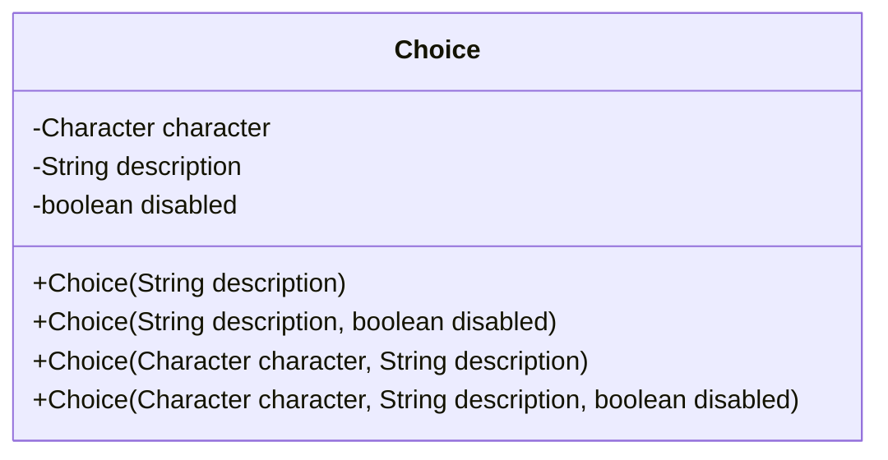
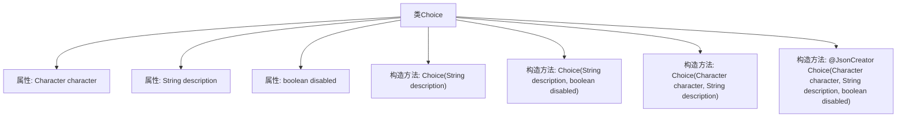

# 基础信息

|      |      |
|------|------|
| 名称 | Choice |
| 编码语言 | .java |
| 代码路径 | xpipe/core/src/main/java/io/xpipe/core/dialog/Choice.java |
| 包名 | io.xpipe.core.dialog |
| 依赖项 | ['com.fasterxml.jackson.annotation.JsonCreator', 'lombok.Value'] |
| 概述说明 | 选项类，含字符、描述和禁用状态，多构造方法支持不同参数组合。 |

# 说明

该内容定义了一个名为Choice的类，用于表示可选项。类包含三个属性：character是可选的输入字符，description是显示的选项描述，disabled表示选项是否被禁用（禁用后仍显示但不可选）。提供了四个构造函数，分别支持不同参数组合初始化对象，包括仅描述、描述加禁用状态、字符加描述、以及字符加描述加禁用状态。所有构造函数均确保属性默认值合理。

# 类列表 Class Summary

| 名称   | 类型  | 说明 |
|-------|------|-------------|
| Choice | class | Choice类包含字符、描述和禁用状态，提供多种构造方法。 |

## 类 Choice

|      |      |
|------|------|
| 访问范围 | @Value;public |
| 类型 | class |
| 名称 | Choice |
| 说明 | Choice类包含字符、描述和禁用状态，提供多种构造方法。 |

### UML类图

这段代码定义了一个名为`Choice`的类，用于表示可选项的配置信息。该类包含三个私有字段：`character`表示可选字符，`description`为选项描述文本，`disabled`标志该选项是否被禁用。提供了四个构造函数，分别支持不同参数组合的初始化方式，包括仅描述、描述加禁用状态、字符加描述，以及全参数构造。类结构简单清晰，主要用于存储和传递选项配置数据，适合在需要展示可选操作的场景中使用。

### 内部方法调用关系图

这段代码定义了一个名为Choice的类，用于表示一个可选项。该类包含三个属性：character（可选字符）、description（描述文本）和disabled（是否禁用）。提供了四个构造方法，分别支持不同参数组合的初始化方式，包括仅描述、描述加禁用状态、字符加描述，以及通过@JsonCreator注解标记的全参数构造方法。流程图清晰地展示了类结构与构造方法之间的层级关系，突出了不同构造方法的参数差异。

### 字段列表 Field List

| 名称  | 类型  | 说明 |
|-------|-------|------|
| character | Character | 角色信息 |
| description | String | {{String description;}} 声明了一个字符串变量description。 |
| disabled | boolean | 布尔变量disabled声明 |

### 方法列表 Method List

| 名称  | 类型  | 说明 |
|-------|-------|------|

