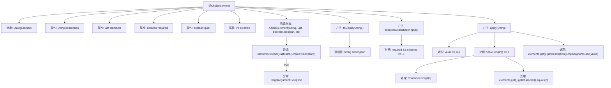

# 基础信息

|      |      |
|------|------|
| 名称 | ChoiceElement |
| 编码语言 | .java |
| 代码路径 | xpipe/core/src/main/java/io/xpipe/core/dialog/ChoiceElement.java |
| 包名 | io.xpipe.core.dialog |
| 依赖项 | ['com.fasterxml.jackson.annotation.JsonCreator', 'com.fasterxml.jackson.annotation.JsonTypeName', 'lombok.EqualsAndHashCode', 'lombok.Getter', 'lombok.ToString', 'java.util.List'] |
| 概述说明 | ChoiceElement类继承DialogElement，含选项列表、描述、必选标记及选中项功能。 |

# 说明

这是一个名为ChoiceElement的Java类，继承自DialogElement，用于处理对话框中的选择元素。类中包含描述文本、选项列表、是否必选、静默模式标志和当前选中索引等属性。构造函数会检查所有选项是否被禁用，并初始化各属性。提供了将描述转为显示字符串、判断是否需要显式用户输入以及根据输入值设置选中项的方法。输入值可以是数字、字符或描述文本，匹配成功会更新选中索引并返回true，否则返回false。

# 类列表 Class Summary

| 名称   | 类型  | 说明 |
|-------|------|-------------|
| ChoiceElement | class | ChoiceElement类继承DialogElement，包含选项列表、描述、必选标记及选中项，支持用户输入处理。 |


## 类 ChoiceElement

|      |      |
|------|------|
| 访问范围 | @JsonTypeName("choice");@EqualsAndHashCode(callSuper = true);@ToString;@Getter;public |
| 类型 | class |
| 名称 | ChoiceElement |
| 说明 | ChoiceElement类继承DialogElement，包含选项列表、描述、必选标记及选中项，支持用户输入处理。 |


### UML类图

```mermaid
classDiagram
    class DialogElement {
        <<abstract>>
        +String toDisplayString()
        +boolean requiresExplicitUserInput()
        +boolean apply(String value)
    }

    class ChoiceElement {
        -String description
        -List~Choice~ elements
        -boolean required
        -boolean quiet
        -int selected
        +ChoiceElement(String description, List~Choice~ elements, boolean required, boolean quiet, int selected)
        +String getDescription()
        +List~Choice~ getElements()
        +boolean isRequired()
        +int getSelected()
        +String toDisplayString()
        +boolean requiresExplicitUserInput()
        +boolean apply(String value)
    }

    class Choice {
        <<Interface>>
        +boolean isDisabled()
        +Character getCharacter()
        +String getDescription()
    }

    DialogElement <|-- ChoiceElement
    ChoiceElement --> Choice : 包含

    // ChoiceElement继承自DialogElement，实现了对话框元素的基本功能
    // 包含Choice接口的列表，用于管理可选项
    // 提供了用户输入处理和选择状态管理功能
```

这段代码展示了一个对话框选择元素(ChoiceElement)的实现，它继承自抽象的DialogElement类。ChoiceElement管理一组Choice接口实现的对象，提供了丰富的交互功能：包括通过数字、字符或描述文本来选择选项，验证用户输入，以及处理必选/可选逻辑。类结构清晰体现了面向对象设计，通过继承和组合关系实现了功能的模块化。


### 内部方法调用关系图



这段代码定义了一个名为ChoiceElement的类，继承自DialogElement，用于处理用户选择逻辑。主要功能包括：通过构造方法初始化选项列表并验证有效性，提供显示字符串的方法，判断是否需要显式用户输入，以及根据用户输入（数字、字符或描述）更新选中项。流程图清晰展示了属性定义、方法调用和输入处理的逻辑分支，特别是apply方法中对不同输入类型的处理流程。

### 字段列表 Field List

| 名称  | 类型  | 说明 |
|-------|-------|------|
| required | boolean | 私有布尔类型只读字段required。 |
| selected | int | 私有整型变量selected，带Getter方法。 |
| description | String | 私有只读字符串描述字段。 |
| elements | List<Choice> | 私有只读列表elements，存储Choice类型元素。 |
| quiet | boolean | 私有布尔变量quiet |

### 方法列表 Method List

| 名称  | 类型  | 说明 |
|-------|-------|------|
| toDisplayString | String | 重写方法toDisplayString，返回description字段值。 |
| requiresExplicitUserInput | boolean | 方法检查需用户输入：必填且未选时返回真。 |
| apply | boolean | 检查输入值，若为null返回真；单字符时匹配数字或元素字符；多字符时匹配元素描述；匹配成功更新selected并返回真，否则返回假。 |


