# 基础信息

|      |      |
|------|------|
| 名称 | Dialog |
| 编码语言 | .java |
| 代码路径 | xpipe/core/src/main/java/io/xpipe/core/dialog/Dialog.java |
| 包名 | io.xpipe.core.dialog |
| 依赖项 | ['io.xpipe.core.util.FailableConsumer', 'io.xpipe.core.util.FailableSupplier', 'io.xpipe.core.util.SecretValue', 'java.util.ArrayList', 'java.util.Arrays', 'java.util.List', 'java.util.function.Function', 'java.util.function.Predicate', 'java.util.function.Supplier'] |
| 概述说明 | Dialog类提供多种对话创建方法，包括空对话、选择对话、查询对话等，支持链式调用和条件控制。 |

# 说明

该代码定义了一个抽象类Dialog，用于构建和管理交互式对话流程。它提供了多种静态工厂方法创建不同类型的对话元素，包括空对话、选择对话、查询对话、秘密输入对话、链式对话、条件重复对话、标题显示对话、忙碌状态对话、延迟加载对话、条件跳过对话和条件重试对话等。类支持对话结果评估、完成回调注册和结果映射等功能，通过抽象方法start和next控制对话流程，并包含内部类Choice和Query处理特定交互场景。

# 类列表 Class Summary

| 名称   | 类型  | 说明 |
|-------|------|-------------|
| Dialog | class | Dialog类提供多种对话创建方法，包括空对话、选择对话、查询对话等，支持链式调用和条件控制。 |


## 类 Dialog

|      |      |
|------|------|
| 访问范围 | public abstract |
| 类型 | class |
| 名称 | Dialog |
| 说明 | Dialog类提供多种对话创建方法，包括空对话、选择对话、查询对话等，支持链式调用和条件控制。 |


### UML类图

```mermaid
classDiagram
    class Dialog {
        <<abstract>>
        -List~FailableConsumer~?~, Exception~~ completion
        -Object eval
        -Supplier~?~ evaluation
        +empty() Dialog
        +choice(String, List~io.xpipe.core.dialog.Choice~, boolean, boolean, int) Dialog.Choice
        +choice~T~(String, Function~T, String~, boolean, boolean, T, T...) Dialog.Choice
        +query~T~(String, boolean, boolean, boolean, T, QueryConverter~T~) Dialog.Query
        +querySecret(String, boolean, boolean, SecretValue) Dialog.Query
        +chain(Dialog...) Dialog
        +repeatIf~T~(Dialog, Predicate~T~) Dialog
        +header(String) Dialog
        +header(Supplier~String~) Dialog
        +busy() Dialog
        +lazy(FailableSupplier~Dialog~) Dialog
        +skipIf(Dialog, Supplier~Boolean~) Dialog
        +retryIf~T~(Dialog, Function~T, String~) Dialog
        +fork(String, List~io.xpipe.core.dialog.Choice~, boolean, int, Function~Integer, Dialog~) Dialog
        +clearCompletion()
        +start() DialogElement
        +evaluateTo(Dialog) Dialog
        +evaluateTo(Supplier~?~) Dialog
        +map~T~(Function~T, ?~) Dialog
        +onCompletion(FailableConsumer~?, Exception~) Dialog
        +onCompletion(Runnable) Dialog
        +onCompletion(List~FailableConsumer~?, Exception~~) Dialog
        +getResult~T~() T
        +complete()
        +receive(String) DialogElement
        +next(String) DialogElement
    }

    class Dialog$Choice {
        -ChoiceElement element
        +start() DialogElement
        +next(String) DialogElement
        -getSelected() int
    }

    class Dialog$Query {
        -QueryElement element
        +start() DialogElement
        +next(String) DialogElement
        -getConvertedValue~T~() T
    }

    class ChoiceElement {
        <<DialogElement>>
        +apply(String) boolean
        +getSelected() int
    }

    class QueryElement {
        <<DialogElement>>
        +apply(String) boolean
        +getConvertedValue~T~() T
        +requiresExplicitUserInput() boolean
    }

    class HeaderElement {
        <<DialogElement>>
    }

    class BusyElement {
        <<DialogElement>>
    }

    Dialog <|-- Dialog$Choice
    Dialog <|-- Dialog$Query
    Dialog --> ChoiceElement : uses
    Dialog --> QueryElement : uses
    Dialog --> HeaderElement : uses
    Dialog --> BusyElement : uses
```

这段代码定义了一个抽象类`Dialog`及其两个内部类`Choice`和`Query`，用于构建交互式对话框系统。`Dialog`提供了多种静态工厂方法创建不同类型的对话框（如选择框、输入框、标题显示等），并支持对话框链式调用、条件跳过、重复和重试等复杂交互逻辑。类图中展示了核心类之间的继承和依赖关系，其中`Dialog`作为基类，`Choice`和`Query`作为具体实现，通过`DialogElement`的子类（如`ChoiceElement`、`QueryElement`）处理具体交互逻辑。系统设计灵活，支持泛型和函数式编程，可扩展性强。


### 内部方法调用关系图

```mermaid
graph TD
    A["抽象类Dialog"]
    B["属性: List<FailableConsumer<?, Exception>> completion"]
    C["属性: Object eval"]
    D["属性: Supplier<?> evaluation"]
    E["静态方法: empty()"]
    F["静态方法: choice(String, List<Choice>, boolean, boolean, int)"]
    G["静态方法: choice(String, Function<T,String>, boolean, boolean, T, T...)"]
    H["静态方法: query(String, boolean, boolean, boolean, T, QueryConverter<T>)"]
    I["静态方法: querySecret(String, boolean, boolean, SecretValue)"]
    J["静态方法: chain(Dialog...)"]
    K["静态方法: repeatIf(Dialog, Predicate<T>)"]
    L["静态方法: header(String/Supplier<String>)"]
    M["静态方法: busy()"]
    N["静态方法: lazy(FailableSupplier<Dialog>)"]
    O["静态方法: skipIf(Dialog, Supplier<Boolean>)"]
    P["静态方法: retryIf(Dialog, Function<T,String>)"]
    Q["静态方法: fork(String, List<Choice>, boolean, int, Function<Integer,Dialog>)"]
    R["方法: clearCompletion()"]
    S["抽象方法: start()"]
    T["方法: evaluateTo(Dialog/Supplier<?>)"]
    U["方法: map(Function<T,?>)"]
    V["方法: onCompletion(FailableConsumer<?,Exception>/Runnable/List<FailableConsumer<?,Exception>>)"]
    W["方法: getResult()"]
    X["方法: complete()"]
    Y["方法: receive(String)"]
    Z["抽象方法: next(String)"]
    AA["内部类: Choice"]
    AB["内部类: Query"]

    A --> B
    A --> C
    A --> D
    A --> E
    A --> F
    A --> G
    A --> H
    A --> I
    A --> J
    A --> K
    A --> L
    A --> M
    A --> N
    A --> O
    A --> P
    A --> Q
    A --> R
    A --> S
    A --> T
    A --> U
    A --> V
    A --> W
    A --> X
    A --> Y
    A --> Z
    A --> AA
    A --> AB
```



这段代码定义了一个抽象对话框类Dialog，提供了多种静态工厂方法用于创建不同类型的对话框（如选择框、输入框、链式对话框等）。核心功能包括对话框生命周期管理（start/next/complete）、结果评估（evaluateTo）和完成回调（onCompletion）。流程图展示了类的主要结构和40+个关键方法/属性的层级关系，包括2个内部类Choice和Query，反映了完整的对话框控制流程和扩展机制。

### 字段列表 Field List

| 名称  | 类型  | 说明 |
|-------|-------|------|
| completion = new ArrayList<>() | List<FailableConsumer<?, Exception>> | 私有列表存储可抛出异常的消费者对象。 |
| evaluation | Supplier<?> | 私有Supplier类型变量evaluation |
| eval | Object | 保护对象eval |

### 方法列表 Method List

| 名称  | 类型  | 说明 |
|-------|-------|------|
| header | Dialog | 静态方法header创建含消息头的对话框，返回消息内容。 |
| evaluateTo | Dialog | 方法设置评估逻辑并返回当前对话框实例。 |
| onCompletion | Dialog | 方法设置完成回调，返回Dialog对象。 |
| start | DialogElement | 抽象方法start，返回DialogElement，可能抛出异常。 |
| map | Dialog | Java方法：泛型Dialog.map，用Function更新evaluation，返回this。 |
| choice | Dialog.Choice | 静态方法创建对话框选择项，含描述、选项列表、必选、静默及默认选中参数。 |
| evaluateTo | Dialog | 方法`evaluateTo`将对话框d的评估结果赋值给当前对象并返回自身。 |
| skipIf | Dialog | 静态方法创建条件跳过的对话框，检查通过则跳过，否则执行原对话框逻辑。 |
| choice | Dialog.Choice | 创建对话框选择项，验证默认值并返回选中项。 |
| onCompletion | Dialog | 方法`onCompletion`接收一个`FailableConsumer`列表参数`s`，将其添加到`completion`集合并返回当前对象。 |
| query | Dialog.Query | 静态方法创建对话框查询对象，含描述、换行、必填、静默、值及转换器参数。 |
| querySecret | Dialog.Query | 静态方法查询密钥，参数含描述、换行、必填及密钥值，返回对话框查询对象。 |
| of | Dialog | 静态方法创建Dialog实例，根据输入元素初始化并处理下一步逻辑。 |
| chain | Dialog | 链式对话框处理，依次执行并返回首个有效结果。 |
| empty | Dialog | 静态方法empty()返回一个空Dialog实例，start()和next()方法调用complete()后返回null。 |
| lazy | Dialog | 静态方法lazy延迟创建Dialog，首次调用start时初始化并返回首个元素，后续通过next处理回答。 |
| clearCompletion | void | 清除完成内容。 |
| onCompletion | Dialog | 定义对话框完成回调方法，添加消费者并返回自身。 |
| repeatIf | Dialog | 静态方法repeatIf创建可重复对话框，基于条件判断是否重启对话。 |
| busy | Dialog | 静态方法返回忙碌对话框实例。 |
| fork | Dialog | 静态方法fork创建对话框，含选择元素和回调函数，处理用户输入并返回新对话框。 |
| header | Dialog | 静态方法`header`接收`Supplier<String>`参数，返回包含`HeaderElement`的`Dialog`对象，消息延迟求值。 |
| getResult | T | 泛型方法返回类型转换结果 |
| retryIf | Dialog | 静态方法retryIf创建可重试对话框，根据条件显示错误消息并重新开始。 |
| complete | void | Java方法complete()：若evaluation非空，遍历执行completion中的消费者逻辑。 |
| receive | DialogElement | 方法接收答案并返回下一对话元素，无则完成。 |
| next | DialogElement | 抽象方法next，接收字符串参数answer，可能抛出异常。 |


