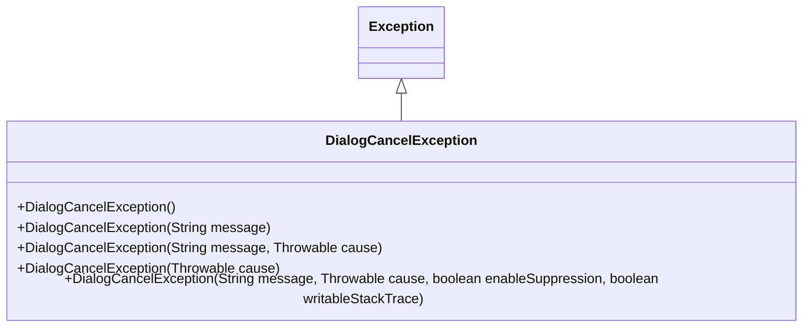
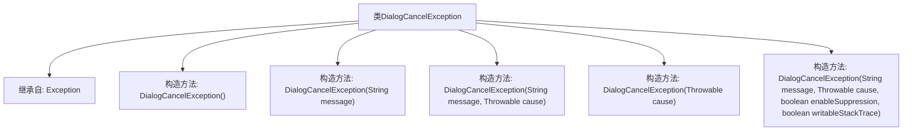

# 基础信息

|      |      |
|------|------|
| 名称 | DialogCancelException |
| 编码语言 | .java |
| 代码路径 | xpipe/core/src/main/java/io/xpipe/core/dialog/DialogCancelException.java |
| 包名 | io.xpipe.core.dialog |
| 依赖项 | [] |
| 概述说明 | DialogCancelException继承Exception，提供多种构造方法处理异常。 |

# 说明

DialogCancelException是一个继承自Exception的自定义异常类，用于处理对话框取消操作。该类提供了五个构造函数，支持不同场景下的异常初始化。默认构造函数不包含任何信息；其他构造函数分别支持传递错误消息、异常原因、同时传递消息和原因、仅传递原因，以及最完整的版本允许控制异常抑制和堆栈跟踪写入。这些构造函数通过调用父类Exception的对应方法实现功能，确保灵活处理对话框取消时的各种异常情况。

# 类列表 Class Summary

| 名称   | 类型  | 说明 |
|-------|------|-------------|
| DialogCancelException | class | DialogCancelException继承Exception，提供多种构造方法处理异常。 |

## 类 DialogCancelException

|      |      |
|------|------|
| 访问范围 | public |
| 类型 | class |
| 名称 | DialogCancelException |
| 说明 | DialogCancelException继承Exception，提供多种构造方法处理异常。 |

### UML类图

这段代码定义了一个名为`DialogCancelException`的自定义异常类，继承自Java标准库中的`Exception`类。该类提供了5个重载构造函数，分别对应不同的异常初始化场景：无参构造、仅消息、消息和原因、仅原因，以及最完整的包含抑制启用和可写堆栈跟踪标志的构造方式。这种设计允许调用方根据不同的错误处理需求灵活地创建异常实例，同时保持了与Java标准异常处理机制的一致性。

### 内部方法调用关系图

该流程图展示了DialogCancelException类的继承关系和构造方法体系。这个自定义异常类继承自Java标准库的Exception基类，提供了5个不同参数的重载构造方法，包括无参构造、仅消息参数、消息和原因参数、仅原因参数，以及支持异常抑制和堆栈跟踪控制的完整参数构造。每个构造方法都通过super调用父类对应构造方法，形成完整的异常处理能力。

### 字段列表 Field List

| 名称  | 类型  | 说明 |
|-------|-------|------|

### 方法列表 Method List

| 名称  | 类型  | 说明 |
|-------|-------|------|

