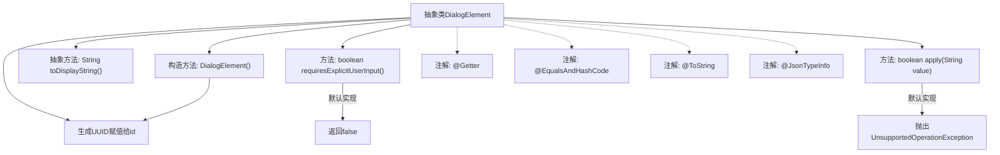

# 基础信息

|      |      |
|------|------|
| 名称 | DialogElement |
| 编码语言 | .java |
| 代码路径 | xpipe/core/src/main/java/io/xpipe/core/dialog/DialogElement.java |
| 包名 | io.xpipe.core.dialog |
| 依赖项 | ['com.fasterxml.jackson.annotation.JsonTypeInfo', 'lombok.EqualsAndHashCode', 'lombok.Getter', 'lombok.ToString', 'java.util.UUID'] |
| 概述说明 | 抽象类DialogElement含ID字段，提供显示字符串方法，默认不需用户输入。 |

# 说明

这段内容描述了一个名为DialogElement的抽象类，它使用了多个注解来提供常用功能。类中包含一个受保护的id字段，通过构造函数自动生成随机UUID字符串。该类定义了一个抽象方法toDisplayString，以及两个具体方法：requiresExplicitUserInput默认返回false，apply方法默认抛出UnsupportedOperationException异常。该类使用了Jackson库的JsonTypeInfo注解来实现多态序列化。整个类设计为可扩展的基类，供具体子类实现核心功能。

# 类列表 Class Summary

| 名称   | 类型  | 说明 |
|-------|------|-------------|
| DialogElement | class | 抽象类DialogElement定义对话元素基类，含ID生成、显示字符串抽象方法及默认操作实现。 |


## 类 DialogElement

|      |      |
|------|------|
| 访问范围 | @Getter;@EqualsAndHashCode;@ToString;@JsonTypeInfo(use = JsonTypeInfo.Id.NAME, property = "type");public abstract |
| 类型 | class |
| 名称 | DialogElement |
| 说明 | 抽象类DialogElement定义对话元素基类，含ID生成、显示字符串抽象方法及默认操作实现。 |


### UML类图

```mermaid
classDiagram
    class DialogElement {
        <<Abstract>>
        #String id
        +DialogElement()
        +String toDisplayString()*
        +boolean requiresExplicitUserInput()
        +boolean apply(String value)
    }
    // DialogElement是抽象基类，使用@JsonTypeInfo支持多态JSON序列化
    // 包含自动生成的UUID作为id，提供默认方法实现
    // 子类需实现toDisplayString()抽象方法
```

类图描述：该图展示了一个名为DialogElement的抽象基类，使用Lombok注解自动生成getter、equals/hashCode和toString方法，并通过@JsonTypeInfo支持多态JSON序列化。类中包含受保护的id字段（通过构造函数初始化为UUID），定义了一个抽象方法toDisplayString()和两个具有默认实现的方法（requiresExplicitUserInput返回false，apply抛出异常）。该设计允许派生类实现特定行为，同时提供基础功能。


### 内部方法调用关系图



这段流程图展示了抽象类DialogElement的结构和关系。该类使用Lombok注解自动生成getter、equals/hashCode和toString方法，并通过@JsonTypeInfo支持JSON多态处理。核心功能包括：构造时自动生成UUID作为id，抽象显示方法toDisplayString()需要子类实现，默认不要求显式用户输入(requiresExplicitUserInput)，apply方法默认抛出未支持操作异常。整体设计为对话框元素的基类，强调扩展性而非直接使用。

### 字段列表 Field List

| 名称  | 类型  | 说明 |
|-------|-------|------|
| id | String | 保护字段id，类型为String |

### 方法列表 Method List

| 名称  | 类型  | 说明 |
|-------|-------|------|
| toDisplayString | String | 抽象方法：返回显示字符串。 |
| requiresExplicitUserInput | boolean | 方法返回false，表示无需显式用户输入。 |
| apply | boolean | 方法未实现，调用时抛出异常。 |


