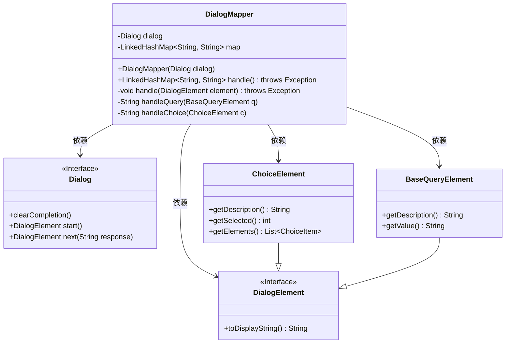
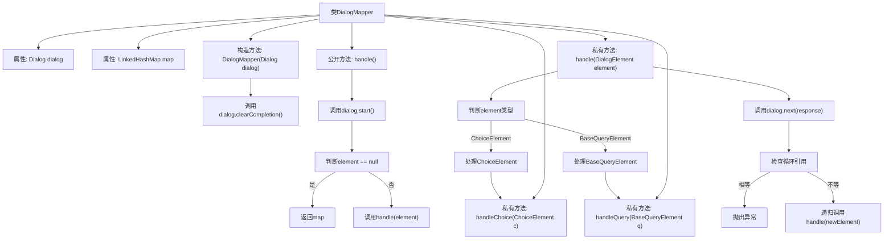

# 基础信息

|      |      |
|------|------|
| 名称 | DialogMapper |
| 编码语言 | .java |
| 代码路径 | xpipe/core/src/main/java/io/xpipe/core/dialog/DialogMapper.java |
| 包名 | io.xpipe.core.dialog |
| 依赖项 | ['java.util.LinkedHashMap'] |
| 概述说明 | DialogMapper处理对话框元素，映射选择与查询结果到LinkedHashMap。 |

# 说明

DialogMapper类用于处理对话框元素，将用户选择或输入映射到键值对集合。构造函数接收Dialog对象并清空其完成状态。handle方法启动处理流程，递归遍历对话框元素。根据元素类型调用不同处理方法：ChoiceElement处理选项选择，BaseQueryElement处理查询输入，结果存入LinkedHashMap。若检测到循环或无效状态抛出异常。最终返回包含所有映射结果的集合。

# 类列表 Class Summary

| 名称   | 类型  | 说明 |
|-------|------|-------------|
| DialogMapper | class | DialogMapper处理对话框元素，映射选择与查询结果到LinkedHashMap。 |

## 类 DialogMapper

|      |      |
|------|------|
| 访问范围 | public |
| 类型 | class |
| 名称 | DialogMapper |
| 说明 | DialogMapper处理对话框元素，映射选择与查询结果到LinkedHashMap。 |

### UML类图

这段代码展示了一个`DialogMapper`类，用于处理对话框交互并将结果映射到键值对集合中。核心功能包括：通过`handle()`方法启动处理流程，递归处理不同类型的对话框元素（选择型和查询型），检测循环引用，并将结果存入`LinkedHashMap`。类图中清晰地展示了`DialogMapper`与对话框相关接口的依赖关系，以及不同类型对话框元素的继承结构。该设计实现了对多种对话框元素的统一处理，同时保持类型特定的处理逻辑。

### 内部方法调用关系图

流程图描述：该流程图展示了DialogMapper类的完整处理流程。从构造函数初始化开始，通过handle()方法启动处理过程，根据DialogElement的类型分别调用handleChoice或handleQuery方法处理不同元素，然后获取下一个元素并检查循环引用，最后递归处理直到元素为空。整个过程维护一个LinkedHashMap来存储处理结果，实现了对话元素的映射和转换功能。

### 字段列表 Field List

| 名称  | 类型  | 说明 |
|-------|-------|------|
| dialog | Dialog | 私有对话框对象 |
| map = new LinkedHashMap<>() | LinkedHashMap<String, String> | 私有LinkedHashMap变量map初始化 |

### 方法列表 Method List

| 名称  | 类型  | 说明 |
|-------|-------|------|
| handle | void | 处理对话框元素，根据类型调用对应方法，检测循环并递归处理。 |
| handleQuery | String | 处理查询，存储描述与值并返回值。 |
| handle | LinkedHashMap<String, String> | 处理对话框元素，非空时执行操作并返回映射。 |
| handleChoice | String | 处理选择元素，存储描述并返回选中项序号。 |

