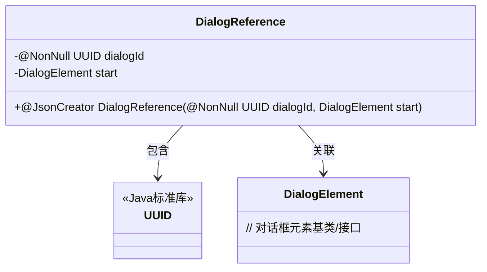
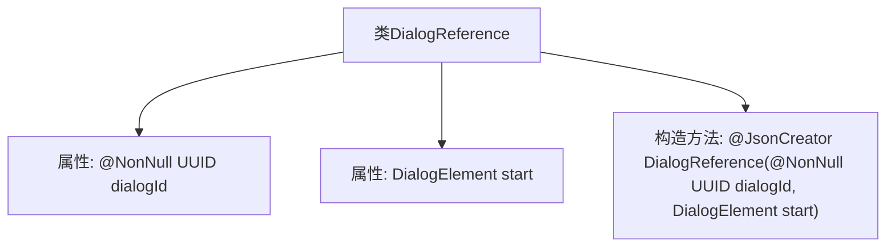

# 基础信息

|      |      |
|------|------|
| 名称 | DialogReference |
| 编码语言 | .java |
| 代码路径 | xpipe/core/src/main/java/io/xpipe/core/dialog/DialogReference.java |
| 包名 | io.xpipe.core.dialog |
| 依赖项 | ['com.fasterxml.jackson.annotation.JsonCreator', 'lombok.NonNull', 'lombok.Value', 'java.util.UUID'] |
| 概述说明 | 定义DialogReference类，包含UUID dialogId和DialogElement start字段，使用@NonNull和@JsonCreator注解。 |

# 说明

DialogReference是一个使用@Value注解的类，表示其不可变性。包含两个成员变量：非空的UUID类型dialogId和DialogElement类型的start。通过@JsonCreator注解的构造函数进行初始化，确保对象创建时接受这两个参数。@NonNull注解强制dialogId不能为空。整体设计用于表示对话框的引用结构。

# 类列表 Class Summary

| 名称   | 类型  | 说明 |
|-------|------|-------------|
| DialogReference | class | DialogReference类包含UUID dialogId和DialogElement start，使用@NonNull和@JsonCreator注解。 |

## 类 DialogReference

|      |      |
|------|------|
| 访问范围 | @Value;public |
| 类型 | class |
| 名称 | DialogReference |
| 说明 | DialogReference类包含UUID dialogId和DialogElement start，使用@NonNull和@JsonCreator注解。 |

### UML类图

这段代码定义了一个`DialogReference`类，用于管理对话框的引用关系。该类包含两个核心字段：一个非空的`UUID`类型`dialogId`用于唯一标识对话框，以及一个`DialogElement`类型的`start`表示起始元素。通过`@JsonCreator`标注的构造函数支持JSON反序列化，体现了对话框引用对象的不可变性和序列化能力。类图中清晰展示了与`UUID`标准库类的组合关系，以及与`DialogElement`的关联关系。

### 内部方法调用关系图

这段代码定义了一个名为DialogReference的类，包含两个属性和一个构造方法。该类使用@Value注解表示不可变性，包含一个非空的UUID类型dialogId属性和一个DialogElement类型的start属性。构造方法使用@JsonCreator注解标注，用于JSON反序列化时创建对象实例。流程图清晰地展示了类结构与成员关系，其中构造方法特别标注了Jackson库的反序列化支持特性。

### 字段列表 Field List

| 名称  | 类型  | 说明 |
|-------|-------|------|
| start | DialogElement | 对话开始 |
| dialogId | UUID | 非空对话ID |

### 方法列表 Method List

| 名称  | 类型  | 说明 |
|-------|-------|------|

