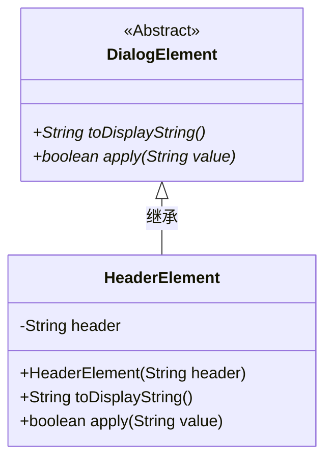
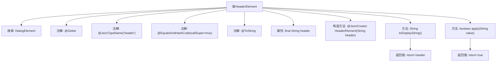

# 基础信息

|      |      |
|------|------|
| 名称 | HeaderElement |
| 编码语言 | .java |
| 代码路径 | xpipe/core/src/main/java/io/xpipe/core/dialog/HeaderElement.java |
| 包名 | io.xpipe.core.dialog |
| 依赖项 | ['com.fasterxml.jackson.annotation.JsonCreator', 'com.fasterxml.jackson.annotation.JsonTypeName', 'lombok.EqualsAndHashCode', 'lombok.Getter', 'lombok.ToString'] |
| 概述说明 | HeaderElement类继承DialogElement，包含header字段和构造方法，实现toDisplayString和apply方法。 |

# 说明

这是一个名为HeaderElement的Java类，继承自DialogElement类。该类使用Lombok注解@Getter自动生成getter方法，@EqualsAndHashCode和@ToString分别生成equals、hashCode和toString方法。类上标注了@JsonTypeName("header")用于JSON序列化。包含一个final字符串字段header，通过@JsonCreator标注的构造函数初始化。重写了toDisplayString方法返回header字段，apply方法固定返回true。这是一个简单的对话框头部元素实现。

# 类列表 Class Summary

| 名称   | 类型  | 说明 |
|-------|------|-------------|
| HeaderElement | class | HeaderElement类继承DialogElement，包含header字段和构造方法，重写toDisplayString和apply方法。 |

## 类 HeaderElement

|      |      |
|------|------|
| 访问范围 | @Getter;@JsonTypeName("header");@EqualsAndHashCode(callSuper = true);@ToString;public |
| 类型 | class |
| 名称 | HeaderElement |
| 说明 | HeaderElement类继承DialogElement，包含header字段和构造方法，重写toDisplayString和apply方法。 |

### UML类图

这段类图展示了HeaderElement继承自抽象类DialogElement的层级关系。DialogElement定义了两个抽象方法toDisplayString()和apply()，HeaderElement作为具体实现类，包含一个私有字符串字段header和对应的构造器，并实现了父类的两个抽象方法。其中toDisplayString()返回header内容，apply()始终返回true。类图通过Lombok注解简化了getter和equals/hashCode方法的显示，体现了Java类继承的基本结构和方法的覆写关系。

### 内部方法调用关系图

该流程图展示了HeaderElement类的完整结构，这是一个继承自DialogElement的Lombok注解增强类。类通过@JsonCreator标注的构造方法初始化final属性header，并重写了toDisplayString()方法直接返回header内容，同时实现了apply()方法固定返回true。所有注解和继承关系清晰呈现，体现了JSON序列化和值比较的定制化能力。

### 字段列表 Field List

| 名称  | 类型  | 说明 |
|-------|-------|------|
| header | String | 保护型字符串头字段 |

### 方法列表 Method List

| 名称  | 类型  | 说明 |
|-------|-------|------|
| toDisplayString | String | 重写方法，返回header字符串。 |
| apply | boolean | Java方法重写，无条件返回true。 |

