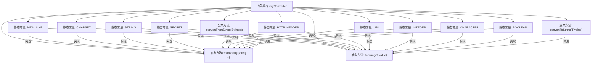

# 基础信息

|      |      |
|------|------|
| 名称 | QueryConverter |
| 编码语言 | .java |
| 代码路径 | xpipe/core/src/main/java/io/xpipe/core/dialog/QueryConverter.java |
| 包名 | io.xpipe.core.dialog |
| 依赖项 | ['io.xpipe.core.util.NewLine', 'io.xpipe.core.util.SecretValue', 'io.xpipe.core.util.StreamCharset', 'java.net.URI', 'java.net.URISyntaxException', 'java.util.AbstractMap', 'java.util.Map'] |
| 概述说明 | 抽象类QueryConverter提供多种类型转换方法。 |

# 说明

该内容定义了一个抽象类QueryConverter<T>，用于实现字符串与各种类型之间的双向转换。类中提供了多个静态常量实例，分别处理不同类型如NewLine、StreamCharset、String、SecretValue、HTTP头、URI、Integer、Character和Boolean的转换逻辑。每个实例都实现了fromString和toString方法，用于将字符串转换为目标类型或反之。类还包含通用的convertFromString和convertToString方法，处理空值并调用相应的抽象方法。该设计支持扩展，可通过继承实现更多类型的转换器。

# 类列表 Class Summary

| 名称   | 类型  | 说明 |
|-------|------|-------------|
| QueryConverter | class | 抽象类QueryConverter实现多种类型转换，包括字符串、整数、布尔等。 |


## 类 QueryConverter

|      |      |
|------|------|
| 访问范围 | public abstract |
| 类型 | class |
| 名称 | QueryConverter |
| 说明 | 抽象类QueryConverter实现多种类型转换，包括字符串、整数、布尔等。 |


### UML类图

```mermaid
classDiagram
    class QueryConverter~T~ {
        <<abstract>>
        +QueryConverter~NewLine~ NEW_LINE
        +QueryConverter~StreamCharset~ CHARSET
        +QueryConverter~String~ STRING
        +QueryConverter~SecretValue~ SECRET
        +QueryConverter~Map.Entry~String,String~~ HTTP_HEADER
        +QueryConverter~URI~ URI
        +QueryConverter~Integer~ INTEGER
        +QueryConverter~Character~ CHARACTER
        +QueryConverter~Boolean~ BOOLEAN
        +T convertFromString(String s)
        +String convertToString(T value)
        #abstract T fromString(String s)
        #abstract String toString(T value)
    }

    class NewLine {
        <<Interface>>
        +static NewLine byId(String s)
        +String getId()
    }

    class StreamCharset {
        <<Interface>>
        +static StreamCharset get(String s)
    }

    class SecretValue {
        <<Interface>>
        +char[] getSecret()
    }

    QueryConverter~NewLine~ --> NewLine : 转换
    QueryConverter~StreamCharset~ --> StreamCharset : 转换
    QueryConverter~SecretValue~ --> SecretValue : 转换
    QueryConverter~Map.Entry~String,String~~ --> Map.Entry : 转换
    QueryConverter~URI~ --> URI : 转换
```

这段代码展示了一个抽象类`QueryConverter<T>`，它提供了多种类型转换的静态实例，包括`NewLine`、`StreamCharset`、`String`、`SecretValue`、`Map.Entry`、`URI`、`Integer`、`Character`和`Boolean`。每个实例都实现了`fromString`和`toString`方法，用于字符串与目标类型之间的双向转换。类图中清晰地展示了`QueryConverter`与各个接口之间的依赖关系，以及每个接口的抽象方法。这种设计模式非常适合需要灵活处理多种类型转换的场景。


### 内部方法调用关系图



这段代码定义了一个抽象类QueryConverter<T>，它提供了类型转换的功能，包含8个静态常量实例（NEW_LINE、CHARSET等），每个实例都实现了fromString和toString抽象方法。公共方法convertFromString和convertToString分别调用对应的抽象方法实现类型转换。该设计实现了多种数据类型（如字符串、整数、URI等）与字符串之间的双向转换，是一个典型的策略模式应用。

### 字段列表 Field List

| 名称  | 类型  | 说明 |
|-------|-------|------|
| BOOLEAN = new QueryConverter<>() {        @Override        protected Boolean fromString(String s) {            if (s.equalsIgnoreCase("y") || s.equalsIgnoreCase("yes") || s.equalsIgnoreCase("true")) {                return true;            }            if (s.equalsIgnoreCase("n") || s.equalsIgnoreCase("no") || s.equalsIgnoreCase("false")) {                return false;            }            throw new IllegalArgumentException("Invalid boolean: " + s);        }        @Override        protected String toString(Boolean value) {            return value ? "yes" : "no";        }    } | QueryConverter<Boolean> | 将字符串转换为布尔值的查询转换器，支持多种字符串格式。 |
| STRING = new QueryConverter<>() {        @Override        protected String fromString(String s) {            return s;        }        @Override        protected String toString(String value) {            return value;        }    } | QueryConverter<String> | 定义字符串查询转换器，实现双向字符串转换。 |
| CHARACTER = new QueryConverter<>() {        @Override        protected Character fromString(String s) {            if (s.length() != 1) {                throw new IllegalArgumentException("Invalid character: " + s);            }            return s.toCharArray()[0];        }        @Override        protected String toString(Character value) {            return value.toString();        }    } | QueryConverter<Character> | 定义字符查询转换器，验证输入为单字符并转换。 |
| INTEGER = new QueryConverter<>() {        @Override        protected Integer fromString(String s) {            return Integer.parseInt(s);        }        @Override        protected String toString(Integer value) {            return value.toString();        }    } | QueryConverter<Integer> | 静态整数查询转换器，实现字符串与整数的互相转换。 |
| URI = new QueryConverter<>() {        @Override        protected URI fromString(String s) {            try {                return new URI(s);            } catch (URISyntaxException e) {                throw new IllegalArgumentException(e.getMessage());            }        }        @Override        protected String toString(URI value) {            return value.toString();        }    } | QueryConverter<URI> | 静态URI查询转换器，处理字符串与URI互转，异常时抛出非法参数异常。 |
| HTTP_HEADER = new QueryConverter<>() {        @Override        protected Map.Entry<String, String> fromString(String s) {            if (!s.contains(":")) {                throw new IllegalArgumentException("Missing colon");            }            var split = s.split(":");            if (split.length != 2) {                throw new IllegalArgumentException("Too many colons");            }            return new AbstractMap.SimpleEntry<>(split[0].trim(), split[1].trim());        }        @Override        protected String toString(Map.Entry<String, String> value) {            return value.getKey() + ": " + value.getValue();        }    } | QueryConverter<Map.Entry<String, String>> | HTTP头转换器：解析冒号分隔键值对，格式校验并返回Map.Entry。 |
| SECRET = new QueryConverter<>() {        @Override        protected SecretValue fromString(String s) {            // TODO            return null;        }        @Override        protected String toString(SecretValue value) {            return new String(value.getSecret());        }    } | QueryConverter<SecretValue> | 静态转换器类，用于SecretValue与字符串互转。 |
| NEW_LINE = new QueryConverter<>() {        @Override        protected NewLine fromString(String s) {            return NewLine.byId(s);        }        @Override        protected String toString(NewLine value) {            return value.getId();        }    } | QueryConverter<NewLine> | 定义静态常量NEW_LINE，实现字符串与NewLine对象的双向转换。 |
| CHARSET = new QueryConverter<>() {        @Override        protected StreamCharset fromString(String s) {            return StreamCharset.get(s);        }        @Override        protected String toString(StreamCharset value) {            return value.toString();        }    } | QueryConverter<StreamCharset> | 静态查询转换器CHARSET，实现字符串与StreamCharset互转。 |

### 方法列表 Method List

| 名称  | 类型  | 说明 |
|-------|-------|------|
| convertFromString | T | 字符串转对象方法，空值返回null，否则调用fromString。 |
| convertToString | String | 将对象转为字符串，若为空则返回空。 |
| fromString | T | 将字符串转换为类型T的受保护抽象方法。 |
| toString | String | 抽象方法：将T类型值转为字符串。 |


