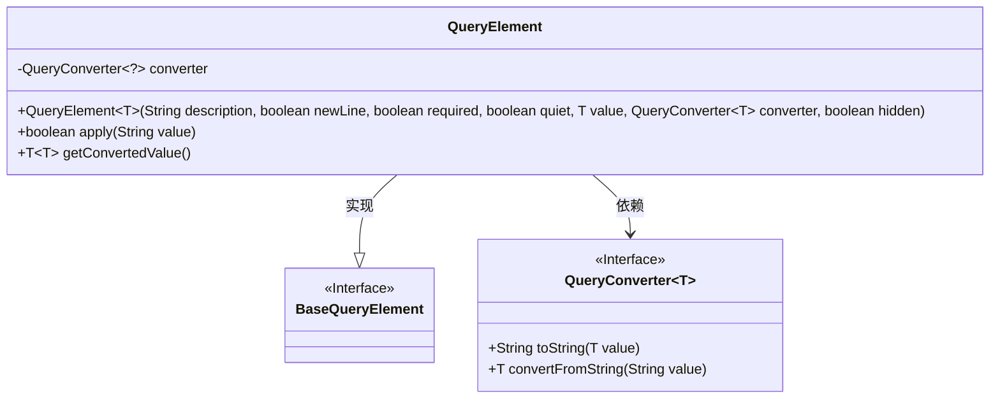
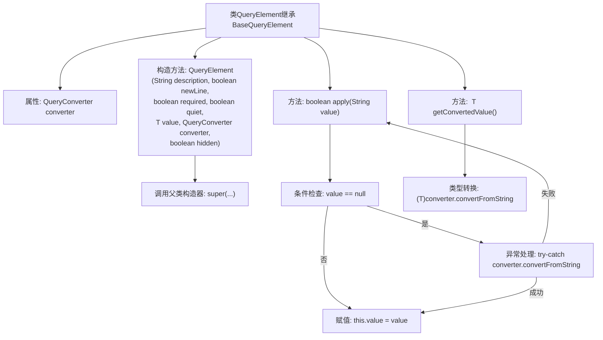

# 基础信息

|      |      |
|------|------|
| 名称 | QueryElement |
| 编码语言 | .java |
| 代码路径 | xpipe/core/src/main/java/io/xpipe/core/dialog/QueryElement.java |
| 包名 | io.xpipe.core.dialog |
| 依赖项 | ['com.fasterxml.jackson.databind.annotation.JsonSerialize'] |
| 概述说明 | QueryElement类继承BaseQueryElement，包含转换器，处理查询参数验证与转换。 |

# 说明

QueryElement类继承自BaseQueryElement，用于处理查询元素的转换和验证。它包含一个QueryConverter类型的转换器，通过构造函数接收描述、换行标志、必填标志、静默标志、值对象、转换器和隐藏标志等参数。构造函数将非空值通过转换器转为字符串存储。apply方法验证输入值是否有效，若必填且值为空则返回false，否则尝试用转换器转换输入值，成功则更新存储值。getConvertedValue方法将存储的字符串值转换回原始类型返回。

# 类列表 Class Summary

| 名称   | 类型  | 说明 |
|-------|------|-------------|
| QueryElement | class | QueryElement类继承BaseQueryElement，包含转换器、构造方法和值转换逻辑。 |

## 类 QueryElement

|      |      |
|------|------|
| 访问范围 | @JsonSerialize(as = BaseQueryElement.class);public |
| 类型 | class |
| 名称 | QueryElement |
| 说明 | QueryElement类继承BaseQueryElement，包含转换器、构造方法和值转换逻辑。 |

### UML类图

类图描述：
该图展示了QueryElement类继承自BaseQueryElement接口，并依赖泛型接口QueryConverter。QueryElement包含核心方法apply()用于验证输入值，getConvertedValue()用于类型转换。QueryConverter接口定义了两个泛型方法实现值转换逻辑。整体结构体现了策略模式，通过注入不同的QueryConverter实现来支持多种数据类型处理。

### 内部方法调用关系图

这段代码展示了一个查询元素类，主要处理参数转换和验证逻辑。流程图清晰呈现了类结构关系，重点描述了构造方法的参数传递、apply方法的空值检查和异常处理流程，以及类型转换方法的安全获取机制。通过继承关系和泛型转换，实现了灵活的参数处理能力，同时严格校验输入值的有效性。

### 字段列表 Field List

| 名称  | 类型  | 说明 |
|-------|-------|------|
| converter | QueryConverter<?> | 私有查询转换器实例。 |

### 方法列表 Method List

| 名称  | 类型  | 说明 |
|-------|-------|------|
| getConvertedValue | T | 方法将字符串值转换为指定类型并返回。 |
| apply | boolean | 重写apply方法，检查输入值是否为空或转换异常，更新value并返回布尔结果。 |

