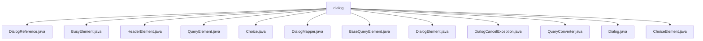

# 基础信息

|      |      |
|------|------|
| 名称 | dialog |
| 编码语言 | .java |
| 代码路径 | xpipe/core/src/main/java/io/xpipe/core/dialog |
| 包名 | xpipe.core.src.main.java.io.xpipe.core.dialog |
| 概述说明 | DialogReference不可变类含dialogId和start。BusyElement表忙碌状态。HeaderElement实现对话框头部。QueryElement处理查询转换验证。Choice类表示可选项。DialogMapper映射对话框元素。BaseQueryElement处理查询操作。DialogElement为抽象基类。DialogCancelException处理取消异常。QueryConverter实现类型转换。Dialog管理对话流程。ChoiceElement处理选择元素。 |

# 说明

```markdown
## 概述

该代码模块是一个用于构建和管理交互式对话框的Java框架，主要提供对话框元素定义、用户输入处理、类型转换和流程控制等功能。模块采用不可变对象设计（如`DialogReference`），通过注解（如`@JsonTypeName`、`@JsonCreator`）支持JSON序列化，并利用Lombok简化代码。核心抽象类`DialogElement`作为所有对话框元素的基类，派生出多种具体实现（如`BusyElement`、`HeaderElement`、`ChoiceElement`等），支持选择、输入、标题显示等交互场景。模块通过`DialogMapper`实现用户输入到键值对的映射，并包含完善的异常处理（`DialogCancelException`）和类型转换机制（`QueryConverter`）。

## 主要业务场景

1. **对话框构建与组合**  
   - 通过`Dialog`类的工厂方法创建复杂对话流（链式对话、条件重复对话等）
   - 支持组合多种元素：选择框（`ChoiceElement`）、输入框（`BaseQueryElement`）、标题（`HeaderElement`）、忙碌状态（`BusyElement`）

2. **用户输入处理**  
   - 选择处理：`ChoiceElement`支持字符/数字/描述文本匹配选项（`Choice`类定义可选项）
   - 输入验证：`QueryElement`通过`QueryConverter`实现类型安全转换（支持字符串、整数、布尔等类型）
   - 敏感输入：`BaseQueryElement`支持秘密字段（secret）和静默模式（quiet）

3. **流程控制**  
   - `DialogMapper`递归遍历对话框元素，处理用户输入并生成键值对结果
   - 支持条件逻辑：通过`Dialog`的条件跳过/重试工厂方法实现动态流程

4. **状态表示**  
   - 不可变引用：`DialogReference`通过UUID标识对话
   - 特殊状态：`BusyElement`表示忙碌状态，`HeaderElement`提供静态信息展示

5. **异常处理**  
   - `DialogCancelException`处理对话取消操作，支持多场景构造方式

6. **类型转换**  
   - `QueryConverter`抽象类提供字符串与多种类型（URI、HTTP头、字符集等）的双向转换
```


### 包内部结构视图



该流程图展示了xpipe/core项目中dialog目录下的文件结构关系。所有Java文件都直接隶属于dialog目录，没有更深层级的子目录。这些文件包括DialogReference、BusyElement、HeaderElement等核心对话框相关组件，以及Dialog、DialogElement等基础类和接口，共同构成了对话框功能模块的实现基础。

# 文件列表 File List

| 名称   | 类型  | 说明 |
|-------|------|-------------|
| [BaseQueryElement.java](BaseQueryElement.md) | file | BaseQueryElement类继承DialogElement，包含描述、换行、必填、保密、静默等属性及显示和输入验证方法。 |
| [DialogMapper.java](DialogMapper.md) | file | DialogMapper处理对话框元素，映射选择与查询结果到LinkedHashMap。 |
| [Choice.java](Choice.md) | file | 选项类，含字符、描述和禁用状态，多构造方法支持不同参数组合。 |
| [QueryElement.java](QueryElement.md) | file | QueryElement类继承BaseQueryElement，包含转换器，处理查询参数验证与转换。 |
| [HeaderElement.java](HeaderElement.md) | file | HeaderElement类继承DialogElement，包含header字段和构造方法，实现toDisplayString和apply方法。 |
| [BusyElement.java](BusyElement.md) | file | BusyElement类继承DialogElement，重写toDisplayString返回"busy"，apply始终返回true。 |
| [DialogReference.java](DialogReference.md) | file | 定义DialogReference类，包含UUID dialogId和DialogElement start字段，使用@NonNull和@JsonCreator注解。 |
| [Dialog.java](Dialog.md) | file | Dialog类提供多种对话创建方法，包括空对话、选择对话、查询对话等，支持链式调用和条件控制。 |
| [QueryConverter.java](QueryConverter.md) | file | 抽象类QueryConverter提供多种类型转换方法。 |
| [DialogCancelException.java](DialogCancelException.md) | file | DialogCancelException继承Exception，提供多种构造方法处理异常。 |
| [ChoiceElement.java](ChoiceElement.md) | file | ChoiceElement类继承DialogElement，含选项列表、描述、必选标记及选中项功能。 |
| [DialogElement.java](DialogElement.md) | file | 抽象类DialogElement含ID字段，提供显示字符串方法，默认不需用户输入。 |


