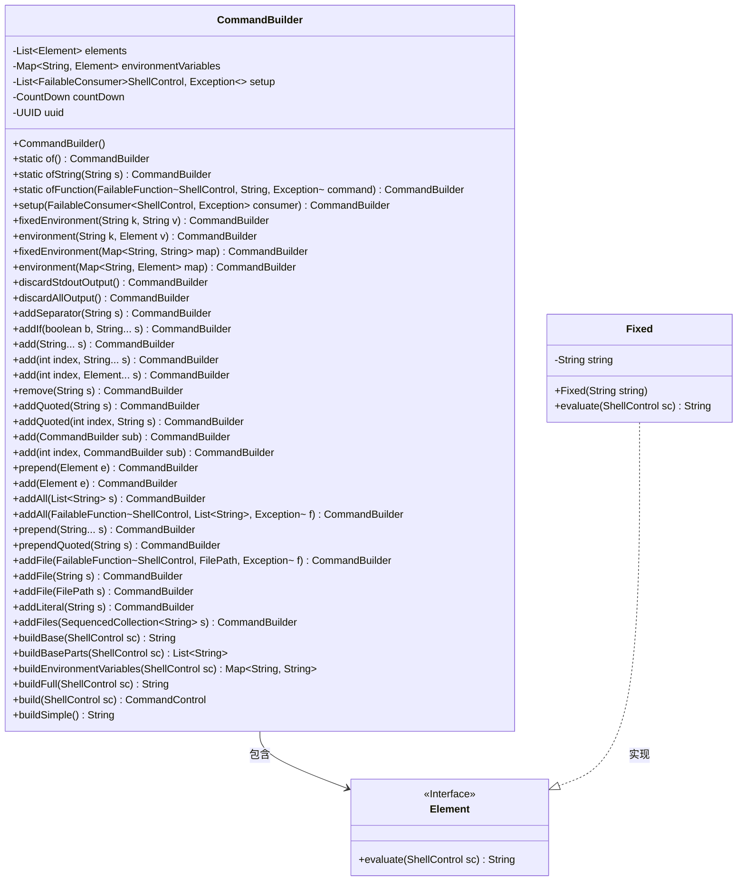

# 基础信息

|      |      |
|------|------|
| 名称 | CommandBuilder |
| 编码语言 | .java |
| 代码路径 | xpipe/core/src/main/java/io/xpipe/core/process/CommandBuilder.java |
| 包名 | io.xpipe.core.process |
| 依赖项 | ['io.xpipe.core.store.FilePath', 'io.xpipe.core.util.FailableConsumer', 'io.xpipe.core.util.FailableFunction', 'lombok.Getter', 'lombok.SneakyThrows', 'java.util'] |
| 概述说明 | 命令构建器类，支持动态添加元素、环境变量和设置操作。 |

# 说明

CommandBuilder是一个用于构建命令行指令的工具类，提供多种方法来添加、修改和管理命令元素。它支持添加固定字符串、带引号的参数、文件路径和环境变量，并能根据条件动态添加元素。类中包含setup方法用于预处理，environmentVariables用于管理环境变量，以及多种add方法用于构建命令。支持链式调用，可生成完整的命令行字符串或部分组件，并能处理ShellControl相关的逻辑。内部使用Element接口和Fixed类来表示命令元素，确保灵活性和可扩展性。

# 类列表 Class Summary

| 名称   | 类型  | 说明 |
|-------|------|-------------|
| CommandBuilder | class | 构建命令行工具类，支持环境变量、参数添加和组合操作。 |

## 类 CommandBuilder

|      |      |
|------|------|
| 访问范围 | public |
| 类型 | class |
| 名称 | CommandBuilder |
| 说明 | 构建命令行工具类，支持环境变量、参数添加和组合操作。 |

### UML类图

这段代码展示了一个命令构建器模式，CommandBuilder类通过链式调用方式动态构建命令行参数和环境变量。核心功能包括：添加/删除参数、处理环境变量、支持条件添加、文件路径处理和多种构建方式。Element接口定义了参数评估规范，Fixed是其基础实现。类图清晰地展示了构建器模式的结构，其中CommandBuilder聚合Element接口，并通过Fixed类实现具体参数处理。

### 内部方法调用关系图

```mermaid
graph TD
    A["类CommandBuilder"]
    B["私有属性: List<Element> elements"]
    C["私有属性: Map<String,Element> environmentVariables"]
    D["私有属性: List<FailableConsumer> setup"]
    E["私有属性: CountDown countDown"]
    F["私有属性: UUID uuid"]
    G["构造方法: CommandBuilder()"]
    H["静态方法: of()"]
    I["静态方法: ofString(String)"]
    J["静态方法: ofFunction(FailableFunction)"]
    K["环境操作方法: fixedEnvironment/environment"]
    L["输出控制方法: discardStdoutOutput/discardAllOutput"]
    M["元素操作方法: add/remove/prepend/addAll"]
    N["引用处理方法: addQuoted/addLiteral"]
    O["文件处理方法: addFile/addFiles"]
    P["构建方法: buildBase/buildFull/buildSimple"]
    Q["辅助接口: Element"]
    R["内部类: Fixed implements Element"]

    A --> B
    A --> C
    A --> D
    A --> E
    A --> F
    A --> G
    A --> H
    A --> I
    A --> J
    A --> K
    A --> L
    A --> M
    A --> N
    A --> O
    A --> P
    A --> Q
    Q --> R
```

该流程图展示了CommandBuilder类的完整结构，包含核心属性、构造方法、静态工厂方法、环境变量操作方法、命令元素操作方法、特殊字符处理方法、文件路径处理方法和最终构建方法。类通过Element接口和Fixed实现类支持灵活的命令元素处理，所有方法都采用链式调用设计，支持环境变量管理、输出控制和多种命令构建方式。

### 字段列表 Field List

| 名称  | 类型  | 说明 |
|-------|-------|------|
| countDown | CountDown | 私有倒计时计数器Getter方法。 |
| elements = new ArrayList<>() | List<Element> | 私有元素列表初始化 |
| setup = new ArrayList<>() | List<FailableConsumer<ShellControl, Exception>> | 私有列表存储可抛出异常的ShellControl消费者。 |
| environmentVariables = new LinkedHashMap<>() | Map<String, Element> | 私有不可变映射存储环境变量 |
| uuid | UUID | 私有UUID获取方法 |

### 方法列表 Method List

| 名称  | 类型  | 说明 |
|-------|-------|------|
| addIf | CommandBuilder | 条件为真时添加字符串到命令构建器，否则跳过。 |
| ofFunction | CommandBuilder | 静态方法，接收函数参数，返回命令构建器实例。 |
| addFile | CommandBuilder | Java方法`addFile`：添加文件参数，处理null并返回构建器对象。 |
| addAll | CommandBuilder | 方法addAll将字符串列表转为Fixed对象并添加到elements，返回当前对象。 |
| add | CommandBuilder | 方法`add`将元素`e`加入集合并返回当前对象。 |
| fixedEnvironment | CommandBuilder | 方法fixedEnvironment接收Map参数，遍历并调用同名方法，返回当前对象。 |
| add | CommandBuilder | 方法在指定位置插入子命令并合并环境变量，返回当前对象。 |
| add | CommandBuilder | 合并子命令元素和环境变量，返回当前对象。 |
| addFile | CommandBuilder | 添加文件路径方法，支持空值处理。 |
| environment | CommandBuilder | 定义环境变量并返回当前对象。 |
| environment | CommandBuilder | 定义环境变量并返回当前对象。 |
| add | CommandBuilder | 方法add接收字符串数组，转为Fixed对象存入elements并返回自身。 |
| addSeparator | CommandBuilder | 方法`addSeparator`添加分隔符到元素列表并返回当前对象。 |
| ofString | CommandBuilder | 静态方法，通过字符串创建CommandBuilder实例。 |
| addFile | CommandBuilder | CommandBuilder的addFile方法：添加文件处理逻辑，支持空检查和ShellDialect适配。 |
| prepend | CommandBuilder | 方法prepend将元素e添加到列表头部并返回当前对象。 |
| addAll | CommandBuilder | 方法addAll接收函数参数，执行后拼接结果并返回自身。 |
| of | CommandBuilder | 创建CommandBuilder实例的静态方法。 |
| remove | CommandBuilder | 移除字符串匹配的Fixed元素并返回自身。 |
| addQuoted | CommandBuilder | 方法`addQuoted`在指定索引处添加带引号的字符串，处理null值和不同shell方言的引用规则。 |
| add | CommandBuilder | 在指定索引处添加元素，返回当前对象。 |
| prependQuoted | CommandBuilder | 方法prependQuoted将字符串s用引号包裹后前置。 |
| addQuoted | CommandBuilder | 方法`addQuoted`将字符串`s`用引号包裹后加入列表，处理空值和不同shell方言。 |
| fixedEnvironment | CommandBuilder | 固定环境变量k为v，返回CommandBuilder实例。 |
| addLiteral | CommandBuilder | 方法addLiteral添加字符串参数，处理null值并返回CommandBuilder实例。 |
| discardAllOutput | CommandBuilder | 方法discardAllOutput添加丢弃所有输出的操作符并返回当前对象。 |
| prepend | CommandBuilder | 在CommandBuilder类中，prepend方法将字符串数组插入元素列表开头并返回自身。 |
| discardStdoutOutput | CommandBuilder | 方法discardStdoutOutput添加丢弃标准输出操作符并返回当前对象。 |
| add | CommandBuilder | 在指定索引处添加字符串元素，返回CommandBuilder实例。 |
| setup | CommandBuilder | CommandBuilder的setup方法，添加FailableConsumer并返回自身。 |
| addFiles | CommandBuilder | 添加文件到命令构建器并返回自身。 |
| buildBase | String | 构建基础字符串，连接各部分结果。 |
| buildBaseParts | List<String> | 构建基础部件列表，处理元素评估并返回非空结果。 |
| buildEnvironmentVariables | Map<String, String> | 构建环境变量映射表，过滤空值后返回。 |
| buildFull | String | 方法根据ShellControl构建完整命令，若sc为空返回简单构建，否则组合基础命令和环境变量后返回组装结果。 |
| build | CommandControl | 构建命令控制对象，调用ShellControl执行命令。 |
| buildSimple | String | 方法遍历元素列表，过滤空值后拼接字符串返回。 |

