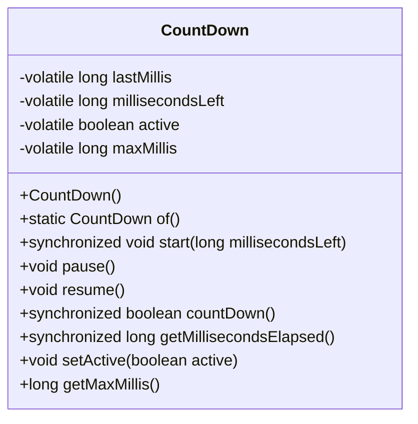
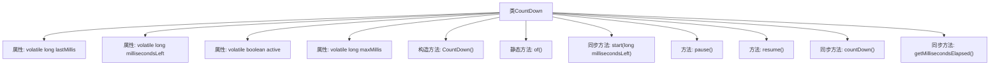

# 基础信息

|      |      |
|------|------|
| 名称 | CountDown |
| 编码语言 | .java |
| 代码路径 | xpipe/core/src/main/java/io/xpipe/core/process/CountDown.java |
| 包名 | io.xpipe.core.process |
| 依赖项 | ['lombok.Getter', 'lombok.Setter'] |
| 概述说明 | 倒计时类，支持开始、暂停、恢复，计算剩余时间。 |

# 说明

这是一个倒计时工具类，用于精确追踪剩余时间。核心功能包括启动、暂停、恢复倒计时，以及实时计算剩余时间。类通过volatile变量确保线程安全，使用系统毫秒时间戳进行差值计算。主要属性包括最后记录时间戳、剩余毫秒数、最大倒计时时长和活动状态标志。关键方法包含同步启动设置初始值、暂停/恢复更新状态、倒计时计算剩余时长，以及获取已消耗时间。所有时间计算均基于System.currentTimeMillis()实现毫秒级精度。

# 类列表 Class Summary

| 名称   | 类型  | 说明 |
|-------|------|-------------|
| CountDown | class | Java倒计时类，支持开始、暂停、恢复和倒计时功能，线程安全。 |

## 类 CountDown

|      |      |
|------|------|
| 访问范围 | public |
| 类型 | class |
| 名称 | CountDown |
| 说明 | Java倒计时类，支持开始、暂停、恢复和倒计时功能，线程安全。 |

### UML类图

该代码实现了一个线程安全的倒计时器功能，通过volatile变量保证多线程可见性，synchronized方法确保原子操作。核心功能包括：记录最大倒计时时长(maxMillis)、剩余时间(millisecondsLeft)、暂停/恢复状态(active)，以及计算已用时间(getMillisecondsElapsed)。start()初始化倒计时，countDown()执行时间递减并返回是否超时，pause()/resume()控制计时状态切换。所有时间操作均基于System.currentTimeMillis()实现精确计算。

### 内部方法调用关系图

这段代码实现了一个线程安全的倒计时器功能，通过volatile变量保证多线程可见性，使用同步方法确保原子操作。核心逻辑包含启动(start)、暂停(pause)、恢复(resume)和倒计时(countDown)四个主要操作，其中countDown()会计算时间差并更新剩余时间。流程图清晰展示了类结构、属性关系和方法调用链，特别突出了同步方法和状态控制的关键路径。

### 字段列表 Field List

| 名称  | 类型  | 说明 |
|-------|-------|------|
| maxMillis | long | 私有可变长整型变量maxMillis，使用Getter注解和volatile修饰。 |
| active | boolean | Java中volatile布尔变量active的setter方法。 |
| millisecondsLeft | long | 私有可变长整型变量，记录剩余毫秒数。 |
| lastMillis = -1 | long | 私有可变长整型变量，初始值为-1。 |

### 方法列表 Method List

| 名称  | 类型  | 说明 |
|-------|-------|------|
| resume | void | 恢复执行，更新计时并激活状态。 |
| of | CountDown | 静态方法of返回CountDown实例 |
| start | void | 同步方法start设置剩余时间、最大时间和激活标志。 |
| getMillisecondsElapsed | long | 同步方法返回已消耗的毫秒数。 |
| countDown | boolean | 同步方法countDown检查时间差并更新剩余毫秒数，返回是否超时。 |
| pause | void | 暂停功能：记录当前时间并设为非活动状态。 |

