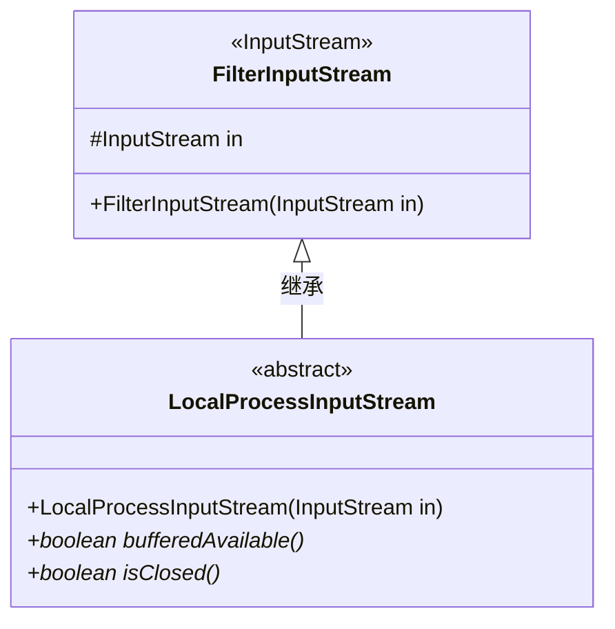
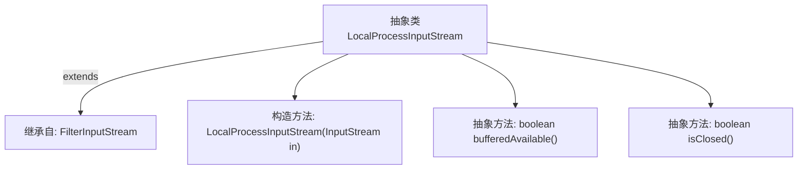

# 基础信息

|      |      |
|------|------|
| 名称 | LocalProcessInputStream |
| 编码语言 | .java |
| 代码路径 | xpipe/core/src/main/java/io/xpipe/core/process/LocalProcessInputStream.java |
| 包名 | io.xpipe.core.process |
| 依赖项 | ['java.io.FilterInputStream', 'java.io.InputStream'] |
| 概述说明 | 本地进程输入流抽象类，继承过滤流，含缓冲可用性和关闭状态检查方法。 |

# 说明

LocalProcessInputStream是一个抽象类，继承自FilterInputStream。它包含一个受保护的构造函数，接收一个InputStream参数并传递给父类。该类定义了两个抽象方法：bufferedAvailable用于检查是否有缓冲数据可用，isClosed用于判断流是否已关闭。

# 类列表 Class Summary

| 名称   | 类型  | 说明 |
|-------|------|-------------|
| LocalProcessInputStream | class | 本地进程输入流抽象类，含缓冲可用性和关闭状态检查方法。 |

## 类 LocalProcessInputStream

|      |      |
|------|------|
| 访问范围 | public abstract |
| 类型 | class |
| 名称 | LocalProcessInputStream |
| 说明 | 本地进程输入流抽象类，含缓冲可用性和关闭状态检查方法。 |

### UML类图

这段类图展示了LocalProcessInputStream作为FilterInputStream的抽象子类，新增了两个抽象方法bufferedAvailable()和isClosed()。该类延续了FilterInputStream对基础输入流的包装功能，并通过抽象方法扩展了缓冲状态检测和关闭状态查询的能力，适用于需要监控流状态的场景。抽象设计表明具体实现需由子类完成，体现了对输入流功能的增强与定制化需求。

### 内部方法调用关系图

这段流程图展示了LocalProcessInputStream抽象类的结构，它继承自FilterInputStream类。包含一个构造方法和两个抽象方法：bufferedAvailable()用于检查缓冲区可用性，isClosed()用于检测流是否关闭。该设计为子类提供了必须实现的接口规范，同时继承了FilterInputStream的基础功能，适用于需要扩展输入流行为的场景。

### 字段列表 Field List

| 名称  | 类型  | 说明 |
|-------|-------|------|

### 方法列表 Method List

| 名称  | 类型  | 说明 |
|-------|-------|------|
| isClosed | boolean | 抽象方法检查是否关闭 |
| bufferedAvailable | boolean | 抽象方法检查缓冲区可用性。 |

