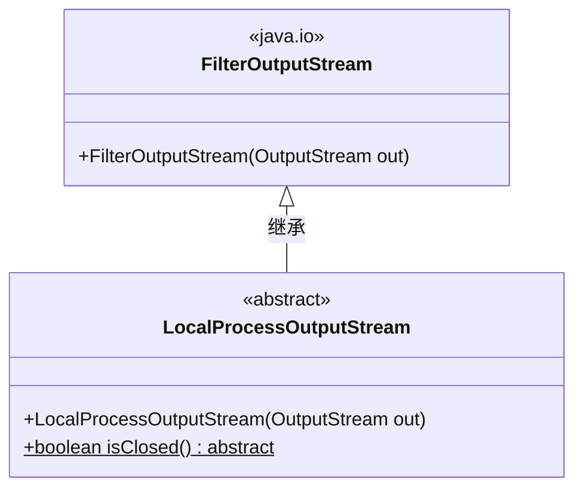
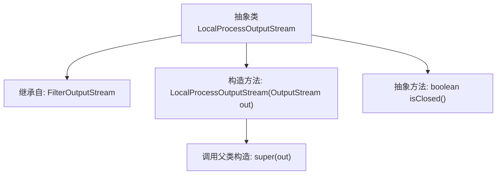

# 基础信息

|      |      |
|------|------|
| 名称 | LocalProcessOutputStream |
| 编码语言 | .java |
| 代码路径 | xpipe/core/src/main/java/io/xpipe/core/process/LocalProcessOutputStream.java |
| 包名 | io.xpipe.core.process |
| 依赖项 | ['java.io.FilterOutputStream', 'java.io.OutputStream'] |
| 概述说明 | 本地进程输出流抽象类，继承过滤输出流，含构造器和关闭状态检查方法。 |

# 说明

这是一个名为LocalProcessOutputStream的抽象类，继承自FilterOutputStream。它包含一个受保护的构造函数，接收一个OutputStream参数并传递给父类。该类还声明了一个抽象方法isClosed，用于判断流是否已关闭。该类主要用于处理本地进程的输出流操作，但具体实现需要由子类完成。

# 类列表 Class Summary

| 名称   | 类型  | 说明 |
|-------|------|-------------|
| LocalProcessOutputStream | class | 本地进程输出流抽象类，继承过滤流，含构造器和关闭状态检查方法。 |

## 类 LocalProcessOutputStream

|      |      |
|------|------|
| 访问范围 | public abstract |
| 类型 | class |
| 名称 | LocalProcessOutputStream |
| 说明 | 本地进程输出流抽象类，继承过滤流，含构造器和关闭状态检查方法。 |

### UML类图

这段类图展示了LocalProcessOutputStream作为FilterOutputStream的抽象子类，新增了isClosed()抽象方法。FilterOutputStream是Java IO包中的基础类，提供输出流过滤功能；抽象子类通过继承扩展了流状态检测能力，要求具体实现类必须提供判断流是否关闭的方法。该设计体现了模板方法模式，父类处理通用逻辑而子类实现特定行为。

### 内部方法调用关系图

该流程图展示了抽象类LocalProcessOutputStream的结构，它继承自FilterOutputStream，包含一个构造方法和一个抽象方法。构造方法通过super(out)调用父类初始化逻辑，而isClosed()作为抽象方法需要子类实现。整个设计体现了对输出流功能的扩展和抽象控制，适用于需要监控流关闭状态的场景。

### 字段列表 Field List

| 名称  | 类型  | 说明 |
|-------|-------|------|

### 方法列表 Method List

| 名称  | 类型  | 说明 |
|-------|-------|------|
| isClosed | boolean | 抽象方法检查是否关闭 |

