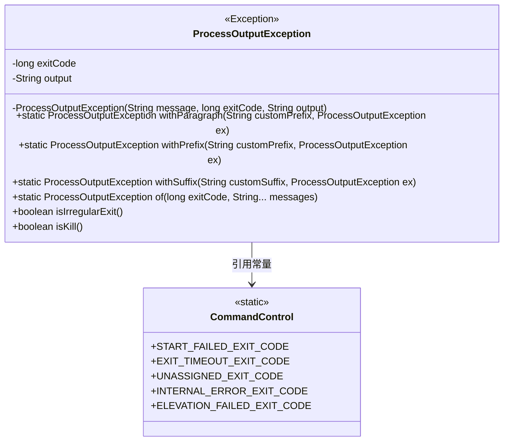
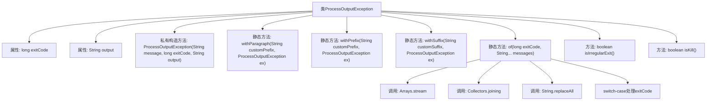

# 基础信息

|      |      |
|------|------|
| 名称 | ProcessOutputException |
| 编码语言 | .java |
| 代码路径 | xpipe/core/src/main/java/io/xpipe/core/process/ProcessOutputException.java |
| 包名 | io.xpipe.core.process |
| 依赖项 | ['lombok.Getter', 'java.util.Arrays', 'java.util.stream.Collectors'] |
| 概述说明 | 自定义异常类，封装进程退出码和输出信息，提供多种构造方法。 |

# 说明

ProcessOutputException是一个自定义异常类，用于封装进程执行相关的错误信息。它包含两个主要字段：exitCode表示进程退出码，output存储进程输出内容。类提供了多种静态工厂方法：withParagraph、withPrefix和withSuffix用于自定义错误消息格式；of方法根据特定退出码生成标准错误描述，支持处理多种预定义错误类型（如启动失败、超时、未知状态等）。此外还包含isIrregularExit和isKill方法用于判断异常类型。所有构造方法均为私有，强制通过工厂方法创建异常实例。

# 类列表 Class Summary

| 名称   | 类型  | 说明 |
|-------|------|-------------|
| ProcessOutputException | class | 自定义异常类，封装进程退出码和输出信息，提供多种构造方法。 |

## 类 ProcessOutputException

|      |      |
|------|------|
| 访问范围 | @Getter;public |
| 类型 | class |
| 名称 | ProcessOutputException |
| 说明 | 自定义异常类，封装进程退出码和输出信息，提供多种构造方法。 |

### UML类图

该代码定义了一个自定义异常类ProcessOutputException，用于封装进程执行的错误信息。类中包含exitCode和output两个核心字段，提供多种静态工厂方法(withParagraph/withPrefix/withSuffix/of)来构造异常对象，并能根据不同的退出码生成对应的错误消息。通过isIrregularExit()和isKill()方法可判断异常类型，其退出码常量依赖于CommandControl类。整体设计实现了对进程执行失败的精细化分类和消息格式化处理。

### 内部方法调用关系图

这段代码定义了一个自定义异常类ProcessOutputException，用于封装进程执行的输出和退出码。流程图展示了类结构，包含两个私有属性(exitCode和output)、一个私有构造方法、四个静态工厂方法(withParagraph/withPrefix/withSuffix/of)和两个实例方法(isIrregularExit/isKill)。特别值得注意的是of方法内部包含复杂的流处理和switch-case逻辑，用于根据不同退出码生成不同的错误消息。该类主要用于处理命令行进程执行过程中可能出现的各种异常情况，包括启动失败、超时、权限提升失败等特殊场景。

### 字段列表 Field List

| 名称  | 类型  | 说明 |
|-------|-------|------|
| output | String | 私有字符串变量output |
| exitCode | long | 私有长整型退出码。 |

### 方法列表 Method List

| 名称  | 类型  | 说明 |
|-------|-------|------|
| withSuffix | ProcessOutputException | 静态方法，用自定义后缀和原异常信息创建新ProcessOutputException实例。 |
| withParagraph | ProcessOutputException | 静态方法，用自定义前缀和异常信息构造ProcessOutputException实例。 |
| withPrefix | ProcessOutputException | 静态方法，用自定义前缀和异常信息生成新ProcessOutputException实例。 |
| of | ProcessOutputException | 静态方法根据退出码生成异常信息，包含错误消息合并与格式化。 |
| isIrregularExit | boolean | 检查退出码是否为异常状态。 |
| isKill | boolean | 方法检查退出码是否为启动失败代码。 |

