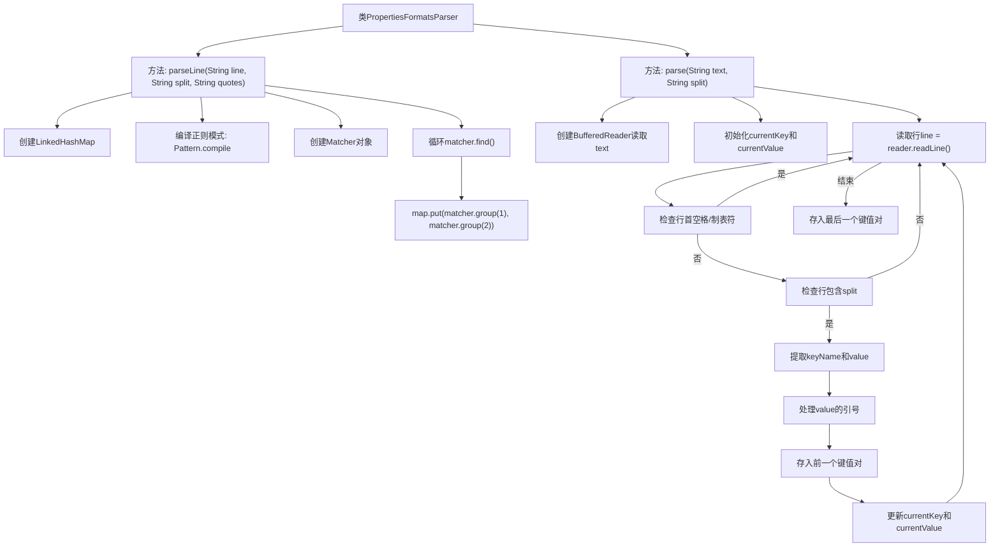

# 基础信息

|      |      |
|------|------|
| 名称 | PropertiesFormatsParser |
| 编码语言 | .java |
| 代码路径 | xpipe/core/src/main/java/io/xpipe/core/process/PropertiesFormatsParser.java |
| 包名 | io.xpipe.core.process |
| 依赖项 | ['lombok.SneakyThrows', 'java.io.BufferedReader', 'java.io.StringReader', 'java.util.LinkedHashMap', 'java.util.Map', 'java.util.regex.Pattern'] |
| 概述说明 | 解析文本为键值对，支持多行和引号处理。 |

# 说明

PropertiesFormatsParser类包含两个静态方法用于解析文本数据。parseLine方法通过正则表达式匹配键值对，其中键和值由指定分隔符和引号包围。parse方法逐行读取文本，处理缩进行作为值延续，提取键值对并去除引号，支持多行值拼接。两者均返回有序的键值映射。

# 类列表 Class Summary

| 名称   | 类型  | 说明 |
|-------|------|-------------|
| PropertiesFormatsParser | class | 解析文本为键值对，支持多行和引号处理。 |


## 类 PropertiesFormatsParser

|      |      |
|------|------|
| 访问范围 | public |
| 类型 | class |
| 名称 | PropertiesFormatsParser |
| 说明 | 解析文本为键值对，支持多行和引号处理。 |


### UML类图

```mermaid
classDiagram
    class PropertiesFormatsParser {
        <<final>>
        +Map~String, String~ parseLine(String line, String split, String quotes)
        +Map~String, String~ parse(String text, String split)
    }
    // PropertiesFormatsParser 是一个工具类，提供两种解析属性格式的方法
    // parseLine方法使用正则表达式解析单行键值对
    // parse方法处理多行文本，支持跨行值和引号处理
```

```mermaid
flowchart TD
    A["parseLine方法"] --> B["创建LinkedHashMap"]
    B --> C["编译正则模式: (\\w+?)\\s* + split + \\s* + quotes + "(.+?)" + quotes"]
    C --> D["创建Matcher匹配line"]
    D --> E{"matcher.find()?"}
    E -->|是| F["map.put(group1, group2)"]
    F --> E
    E -->|否| G["返回map"]

    H["parse方法"] --> I["创建LinkedHashMap和BufferedReader"]
    I --> J["读取一行line"]
    J --> K{"line以空格/tab开头?"}
    K -->|是| L["追加到currentValue"]
    L --> J
    K -->|否| M{"line包含split?"}
    M -->|否| J
    M -->|是| N["提取keyName和value"]
    N --> O{"value有引号?"}
    O -->|是| P["去除首尾引号"]
    O -->|否| Q["保留原值"]
    Q --> R{"currentKey非空?"}
    R -->|是| S["map.put(currentKey, currentValue)"]
    R -->|否| T["更新currentKey和currentValue"]
    S --> T
    T --> J
    J -->|读取完毕| U{"currentKey非空?"}
    U -->|是| V["map.put(currentKey, currentValue)"]
    U -->|否| W["返回map"]
```

这段代码实现了一个属性格式解析器，包含两个核心方法：parseLine通过正则表达式解析单行键值对，支持自定义分隔符和引号字符；parse方法处理多行文本，能识别跨行值（以空格/tab开头的行视为前值的延续），自动处理引号包裹的值，并维护键值对的顺序。两个方法都返回有序的LinkedHashMap，适用于需要保持原始顺序的配置解析场景。


### 内部方法调用关系图



流程图描述：该流程图展示了PropertiesFormatsParser类的两个核心方法。parseLine方法通过正则表达式匹配带引号的分隔键值对，而parse方法采用行处理逻辑，支持多行值和引号处理。两个方法都返回有序的LinkedHashMap，其中parse方法特别处理了缩进表示的值延续和引号包裹的场景，体现了对配置文件格式的灵活解析能力。

### 字段列表 Field List

| 名称  | 类型  | 说明 |
|-------|-------|------|

### 方法列表 Method List

| 名称  | 类型  | 说明 |
|-------|-------|------|
| parse | Map<String, String> | 解析文本为键值对，处理缩进和引号。 |
| parseLine | Map<String, String> | 解析字符串为键值对映射，支持分隔符和引号。 |


