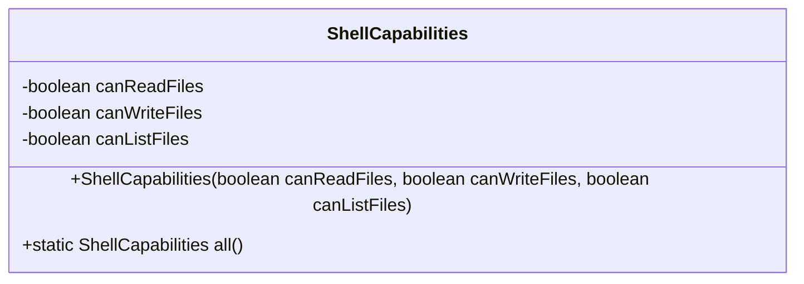
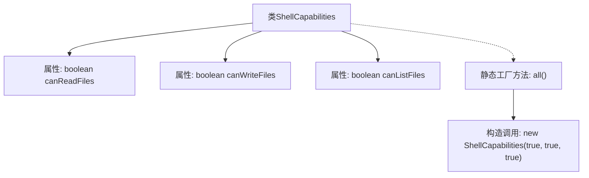

# 基础信息

|      |      |
|------|------|
| 名称 | ShellCapabilities |
| 编码语言 | .java |
| 代码路径 | xpipe/core/src/main/java/io/xpipe/core/process/ShellCapabilities.java |
| 包名 | io.xpipe.core.process |
| 依赖项 | ['lombok.Value'] |
| 概述说明 | ShellCapabilities类定义文件操作能力，包括读写和列出文件。 |

# 说明

ShellCapabilities类定义了文件操作能力，包含三个布尔属性：canReadFiles（读取文件）、canWriteFiles（写入文件）和canListFiles（列出文件）。静态方法all()返回一个具备全部能力的实例，初始化时三个属性均为true。该类用于封装和检查文件系统操作权限。

# 类列表 Class Summary

| 名称   | 类型  | 说明 |
|-------|------|-------------|
| ShellCapabilities | class | ShellCapabilities类定义文件操作能力，包含读写和列文件功能。 |

## 类 ShellCapabilities

|      |      |
|------|------|
| 访问范围 | @Value;public |
| 类型 | class |
| 名称 | ShellCapabilities |
| 说明 | ShellCapabilities类定义文件操作能力，包含读写和列文件功能。 |

### UML类图

这段代码定义了一个`ShellCapabilities`类，用于表示Shell的文件操作能力，包含三个布尔类型的私有字段：`canReadFiles`、`canWriteFiles`和`canListFiles`，分别表示能否读取、写入和列出文件。类提供了一个构造方法用于初始化这些能力标志，并包含一个静态工厂方法`all()`用于快速创建具备全部能力的实例。该类通过简单的字段组合封装了Shell环境的文件操作权限状态。

### 内部方法调用关系图

该流程图展示了ShellCapabilities类的结构，包含三个布尔类型属性(canReadFiles/canWriteFiles/canListFiles)和一个静态工厂方法all()。工厂方法通过调用私有构造函数创建具有全功能(true,true,true)的实例。类设计采用值对象模式，通过工厂方法控制实例创建，适合表示不可变的系统能力配置。

### 字段列表 Field List

| 名称  | 类型  | 说明 |
|-------|-------|------|
| canReadFiles | boolean | 定义布尔变量canReadFiles，表示文件读取权限。 |
| canWriteFiles | boolean | 可写入文件 |
| canListFiles | boolean | 可以列出文件 |

### 方法列表 Method List

| 名称  | 类型  | 说明 |
|-------|-------|------|
| all | ShellCapabilities | 静态方法返回具有全部功能的ShellCapabilities实例。 |

