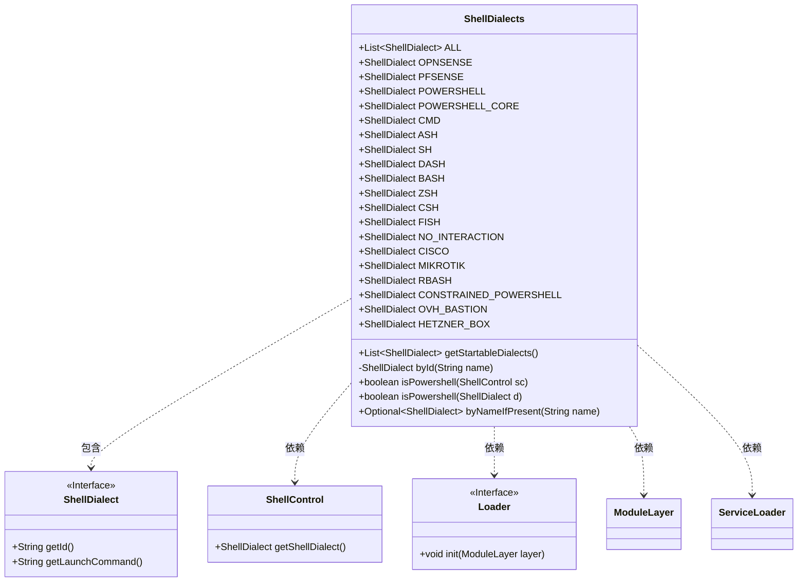
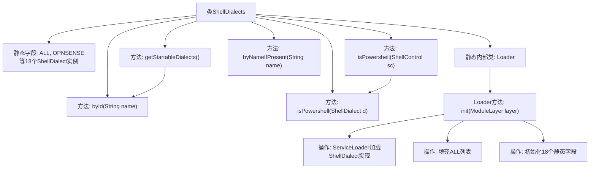

# 基础信息

|      |      |
|------|------|
| 名称 | ShellDialects |
| 编码语言 | .java |
| 代码路径 | xpipe/core/src/main/java/io/xpipe/core/process/ShellDialects.java |
| 包名 | io.xpipe.core.process |
| 依赖项 | ['io.xpipe.core.util.ModuleLayerLoader', 'java.util.ArrayList', 'java.util.List', 'java.util.Optional', 'java.util.ServiceLoader'] |
| 概述说明 | ShellDialects类定义多种Shell方言常量，提供查找和过滤方法。 |

# 说明

ShellDialects类定义了一系列静态ShellDialect实例，代表不同shell类型如OPNSENSE、PFSENSE、POWERSHELL等。它包含方法如getStartableDialects获取可启动的shell类型，isPowershell判断是否为PowerShell类型，byId和byNameIfPresent用于按名称查找shell类型。Loader内部类通过ServiceLoader加载所有ShellDialect实现并初始化静态实例。

# 类列表 Class Summary

| 名称   | 类型  | 说明 |
|-------|------|-------------|
| ShellDialects | class | ShellDialects类定义多种Shell方言常量，提供按名称查找和启动过滤功能。 |

## 类 ShellDialects

|      |      |
|------|------|
| 访问范围 | public |
| 类型 | class |
| 名称 | ShellDialects |
| 说明 | ShellDialects类定义多种Shell方言常量，提供按名称查找和启动过滤功能。 |

### UML类图

这段代码定义了一个`ShellDialects`类，用于管理不同类型的Shell方言。它包含多个静态的`ShellDialect`实例，表示不同的Shell类型，如PowerShell、Bash等。类提供了方法来获取可启动的方言、根据ID查找方言、判断是否为PowerShell等。内部类`Loader`实现了`ModuleLayerLoader`接口，用于初始化所有Shell方言。该类通过`ServiceLoader`动态加载`ShellDialect`实现，并通过ID匹配初始化各个静态实例。整体设计采用静态工厂模式，集中管理Shell方言的实例和操作。

### 内部方法调用关系图

这段代码定义了一个ShellDialects类，用于管理和初始化不同的Shell方言。主要功能包括：维护静态的Shell方言实例集合(ALL)，提供根据ID查找方言的方法(byId)，判断是否为PowerShell的方法(isPowershell)，以及通过Loader内部类动态加载所有Shell方言实现。Loader使用Java模块系统的ServiceLoader机制加载所有ShellDialect实现，并初始化18个预定义的静态方言实例。流程图展示了类结构、方法调用关系和初始化流程。

### 字段列表 Field List

| 名称  | 类型  | 说明 |
|-------|-------|------|
| POWERSHELL_CORE | ShellDialect | 静态ShellDialect实例POWERSHELL_CORE |
| POWERSHELL | ShellDialect | 静态ShellDialect实例POWERSHELL |
| CISCO | ShellDialect | 声明静态ShellDialect变量CISCO |
| ZSH | ShellDialect | ZSH静态ShellDialect实例。 |
| PFSENSE | ShellDialect | pfsense的ShellDialect静态公共变量 |
| BASH | ShellDialect | BASH是ShellDialect的静态公共实例。 |
| NO_INTERACTION | ShellDialect | 静态ShellDialect常量NO_INTERACTION |
| MIKROTIK | ShellDialect | 定义静态ShellDialect变量MIKROTIK |
| OPNSENSE | ShellDialect | OPNSENSE的ShellDialect静态公共变量。 |
| CSH | ShellDialect | 声明静态ShellDialect变量CSH |
| HETZNER_BOX | ShellDialect | HETZNER_BOX是静态ShellDialect类型变量。 |
| RBASH | ShellDialect | 静态ShellDialect变量RBASH声明 |
| ASH | ShellDialect | 声明静态ShellDialect变量ASH |
| CMD | ShellDialect | 定义静态ShellDialect变量CMD。 |
| FISH | ShellDialect | 静态ShellDialect实例FISH |
| ALL = new ArrayList<>() | List<ShellDialect> | 静态常量列表ALL，存储ShellDialect对象。 |
| CONSTRAINED_POWERSHELL | ShellDialect | 静态ShellDialect常量CONSTRAINED_POWERSHELL |
| DASH | ShellDialect | 静态ShellDialect实例DASH |
| SH | ShellDialect | 声明静态ShellDialect变量SH |
| OVH_BASTION | ShellDialect | OVH堡垒机ShellDialect静态实例 |

### 方法列表 Method List

| 名称  | 类型  | 说明 |
|-------|-------|------|
| getStartableDialects | List<ShellDialect> | 获取可启动的Shell方言列表，过滤条件为有启动命令的方言。 |
| byId | ShellDialect | 通过ID查找匹配的ShellDialect实例，无匹配则抛出异常。 |
| isPowershell | boolean | 检查ShellControl是否为PowerShell类型。 |
| isPowershell | boolean | 检查ShellDialect是否为PowerShell类型。 |
| byNameIfPresent | Optional<ShellDialect> | 查找指定名称的ShellDialect，返回首个匹配项或空。 |

