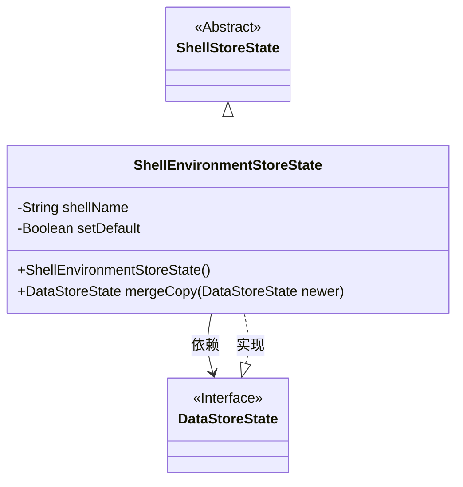
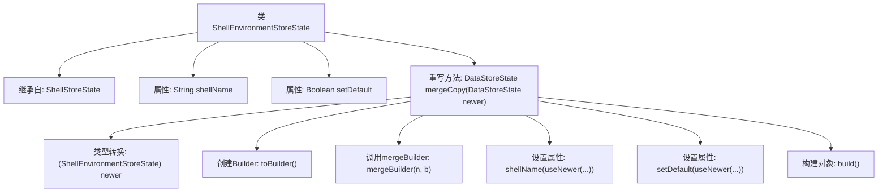

# 基础信息

|      |      |
|------|------|
| 名称 | ShellEnvironmentStoreState |
| 编码语言 | .java |
| 代码路径 | xpipe/core/src/main/java/io/xpipe/core/process/ShellEnvironmentStoreState.java |
| 包名 | io.xpipe.core.process |
| 依赖项 | ['io.xpipe.core.store.DataStoreState', 'lombok.EqualsAndHashCode', 'lombok.Value', 'lombok.experimental.SuperBuilder', 'lombok.extern.jackson.Jacksonized'] |
| 概述说明 | ShellEnvironmentStoreState类继承ShellStoreState，含shellName和setDefault字段，提供mergeCopy方法合并新旧状态。 |

# 说明

ShellEnvironmentStoreState类继承自ShellStoreState，使用Lombok注解实现链式构建、值相等比较和JSON序列化支持。包含两个字段：shellName（字符串类型）和setDefault（布尔类型）。重写了mergeCopy方法用于合并新旧状态，逻辑是优先使用新状态的非空字段值，通过构建器模式生成合并后的新实例。该方法首先转换参数类型，初始化构建器，调用父类合并逻辑，最后逐个字段处理新旧值并构建最终状态对象。

# 类列表 Class Summary

| 名称   | 类型  | 说明 |
|-------|------|-------------|
| ShellEnvironmentStoreState | class | ShellEnvironmentStoreState类继承ShellStoreState，含shellName和setDefault字段，提供mergeCopy方法合并新旧状态。 |

## 类 ShellEnvironmentStoreState

|      |      |
|------|------|
| 访问范围 | @Value;@EqualsAndHashCode(callSuper = true);@SuperBuilder(toBuilder = true);@Jacksonized;public |
| 类型 | class |
| 名称 | ShellEnvironmentStoreState |
| 说明 | ShellEnvironmentStoreState类继承ShellStoreState，含shellName和setDefault字段，提供mergeCopy方法合并新旧状态。 |

### UML类图

这段代码展示了一个名为ShellEnvironmentStoreState的类，继承自ShellStoreState并实现了DataStoreState接口。该类用于存储Shell环境状态，包含shellName和setDefault两个私有属性，以及一个mergeCopy方法用于合并新旧状态。通过Lombok注解实现了建造者模式、值对象相等性比较和JSON序列化支持。类图清晰地反映了继承、实现和依赖关系，体现了状态管理组件的层次结构设计。

### 内部方法调用关系图

这段代码展示了一个继承自ShellStoreState的类ShellEnvironmentStoreState，包含两个属性shellName和setDefault，并重写了mergeCopy方法。该方法通过构建器模式合并新旧状态：先转换输入参数类型，创建构建器实例，调用合并逻辑，最后用useNewer策略更新属性值并构建新对象。流程图清晰地反映了类结构和方法调用链，突出了构建器模式的使用过程。

### 字段列表 Field List

| 名称  | 类型  | 说明 |
|-------|-------|------|
| setDefault | Boolean | 布尔变量setDefault声明 |
| shellName | String | 声明字符串变量shellName |

### 方法列表 Method List

| 名称  | 类型  | 说明 |
|-------|-------|------|
| mergeCopy | DataStoreState | 合并两个数据存储状态，保留较新的属性值。 |

