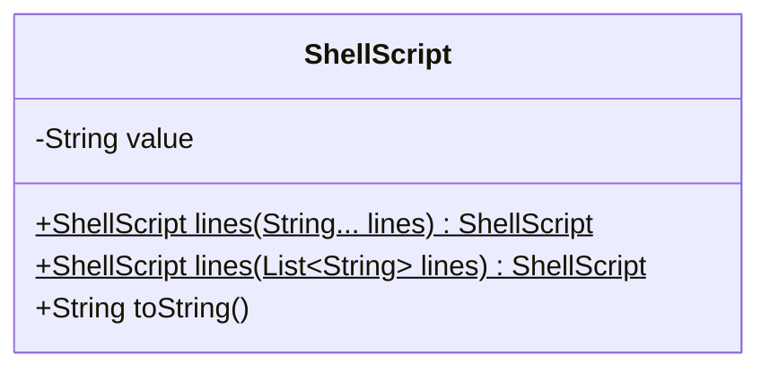
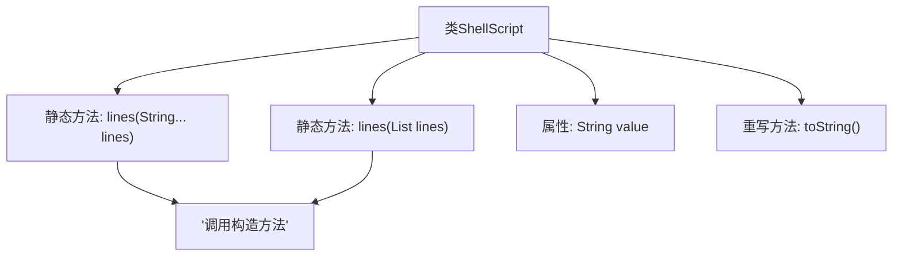

# 基础信息

|      |      |
|------|------|
| 名称 | ShellScript |
| 编码语言 | .java |
| 代码路径 | xpipe/core/src/main/java/io/xpipe/core/process/ShellScript.java |
| 包名 | io.xpipe.core.process |
| 依赖项 | ['lombok.Value', 'java.util.Arrays', 'java.util.List', 'java.util.stream.Collectors'] |
| 概述说明 | ShellScript类提供静态方法将字符串或列表合并为换行连接的脚本。 |

# 说明

ShellScript类是一个值对象，提供两种静态工厂方法lines，分别接受可变参数字符串数组或字符串列表，将其用换行符连接后构造实例。类包含一个字符串字段value，并重写toString方法返回该值。设计简洁，专注于封装多行脚本的构建与字符串表示。

# 类列表 Class Summary

| 名称   | 类型  | 说明 |
|-------|------|-------------|
| ShellScript | class | ShellScript类提供静态方法将字符串或列表合并为换行连接的脚本。 |

## 类 ShellScript

|      |      |
|------|------|
| 访问范围 | @Value;public |
| 类型 | class |
| 名称 | ShellScript |
| 说明 | ShellScript类提供静态方法将字符串或列表合并为换行连接的脚本。 |

### UML类图

这段代码展示了一个简单的ShellScript类，主要用于处理多行shell脚本的构建和字符串表示。类中包含两个静态工厂方法lines()，分别接受可变参数String数组和List<String>作为输入，将它们用换行符连接后创建ShellScript实例。类核心是一个私有字符串value字段，通过toString()方法暴露其内容。该类使用了@Value注解，表明它是一个不可变的值对象，所有字段都通过构造函数初始化。

### 内部方法调用关系图

这段流程图展示了ShellScript类的核心结构和调用关系。该类包含两个静态工厂方法lines()，分别接受可变字符串参数和字符串列表，它们都会调用私有构造方法创建实例。类中维护一个String类型的value属性，并通过重写toString()方法返回该值。流程图清晰地呈现了静态方法到构造方法的调用链路，以及类成员间的关联关系，体现了通过流式操作拼接字符串的核心逻辑。

### 字段列表 Field List

| 名称  | 类型  | 说明 |
|-------|-------|------|
| value | String | 变量声明字符串 |

### 方法列表 Method List

| 名称  | 类型  | 说明 |
|-------|-------|------|
| lines | ShellScript | 静态方法`lines`接收字符串数组，用换行符连接后返回`ShellScript`对象。 |
| lines | ShellScript | 静态方法生成ShellScript，合并字符串列表为换行连接的单字符串。 |
| toString | String | 重写toString方法，直接返回value值。 |

