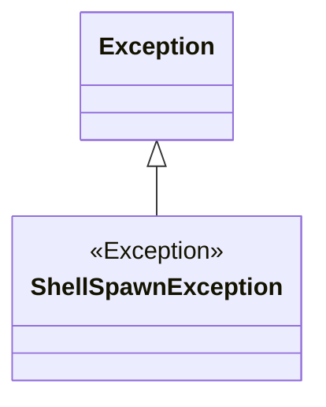
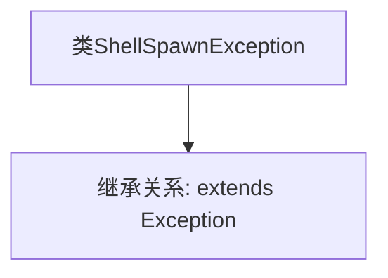

# 基础信息

|      |      |
|------|------|
| 名称 | ShellSpawnException |
| 编码语言 | .java |
| 代码路径 | xpipe/core/src/main/java/io/xpipe/core/process/ShellSpawnException.java |
| 包名 | io.xpipe.core.process |
| 依赖项 | ['lombok.experimental.StandardException'] |
| 概述说明 | ShellSpawnException是继承Exception的标准异常类。 |

# 说明

ShellSpawnException 是一个继承自 Exception 的公共自定义异常类，用于处理与 shell 进程生成相关的错误情况。该异常类遵循标准异常定义规范，通过 @StandardException 注解标记，表明其符合特定框架或库的异常处理标准。作为受检异常，调用方必须显式捕获或声明抛出此类异常。

# 类列表 Class Summary

| 名称   | 类型  | 说明 |
|-------|------|-------------|
| ShellSpawnException | class | ShellSpawnException是继承Exception的标准异常类。 |

## 类 ShellSpawnException

|      |      |
|------|------|
| 访问范围 | @StandardException;public |
| 类型 | class |
| 名称 | ShellSpawnException |
| 说明 | ShellSpawnException是继承Exception的标准异常类。 |

### UML类图

这段类图展示了ShellSpawnException继承自Java标准库中的Exception类的关系。ShellSpawnException是一个自定义异常类，通过继承Exception基类获得标准异常处理能力，用于表示shell进程生成相关的错误情况。图中使用<<Exception>>标记表示继承层次，箭头方向明确显示了从父类到子类的继承关系，符合Java异常类体系结构。

### 内部方法调用关系图

这段mermaid流程图描述了ShellSpawnException类的结构。该流程图清晰地展示了ShellSpawnException继承自Exception类的基本关系，表明这是一个自定义异常类，专门用于处理shell命令生成相关的异常情况。通过继承Java标准库中的Exception基类，ShellSpawnException获得了异常处理的基本功能，同时可以添加特定于shell命令生成的额外异常处理逻辑。这种简单的类结构适用于需要区分特定类型异常的场景。

### 字段列表 Field List

| 名称  | 类型  | 说明 |
|-------|-------|------|

### 方法列表 Method List

| 名称  | 类型  | 说明 |
|-------|-------|------|

