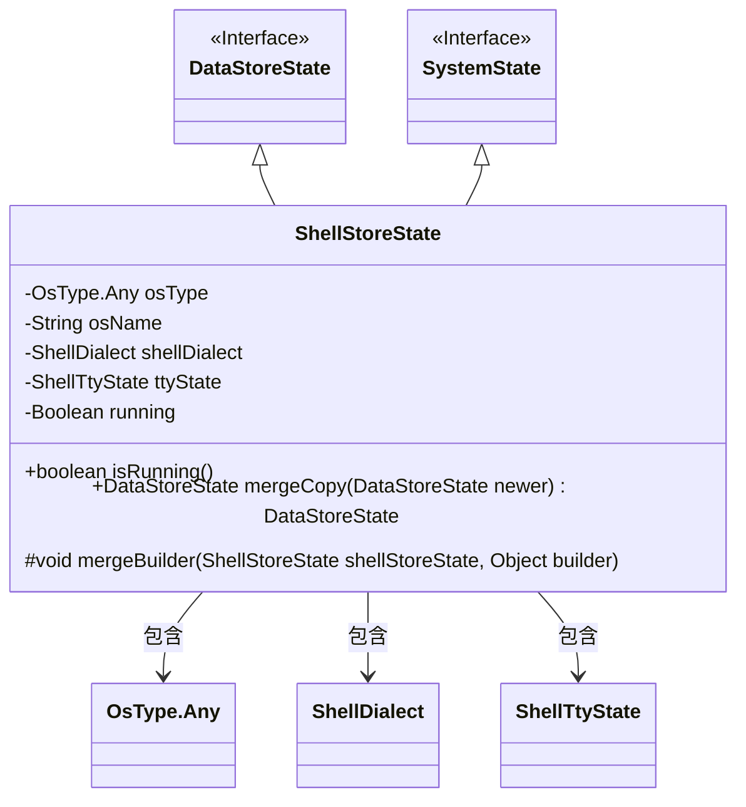
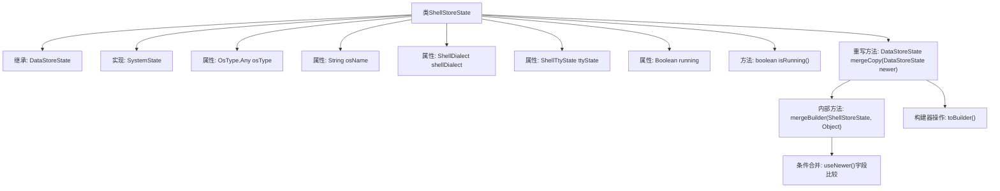

# 基础信息

|      |      |
|------|------|
| 名称 | ShellStoreState |
| 编码语言 | .java |
| 代码路径 | xpipe/core/src/main/java/io/xpipe/core/process/ShellStoreState.java |
| 包名 | io.xpipe.core.process |
| 依赖项 | ['io.xpipe.core.store.DataStoreState', 'lombok.AccessLevel', 'lombok.EqualsAndHashCode', 'lombok.Getter', 'lombok.experimental.FieldDefaults', 'lombok.experimental.SuperBuilder', 'lombok.extern.jackson.Jacksonized'] |
| 概述说明 | ShellStoreState类继承DataStoreState，包含系统状态、OS类型、Shell方言等字段，提供合并复制方法。 |

# 说明

ShellStoreState类是一个继承DataStoreState并实现SystemState接口的Java类，用于存储Shell相关状态信息。该类使用Lombok注解自动生成私有final字段、getter方法、equals/hashCode方法及builder模式支持。主要字段包括操作系统类型(osType)、名称(osName)、Shell方言(shellDialect)、TTY状态(ttyState)和运行状态(running)。提供了isRunning方法检查运行状态，并实现了mergeCopy方法用于合并新旧状态数据，通过mergeBuilder方法逐个字段比较更新。类被@Jacksonized注解标记以支持Jackson反序列化。

# 类列表 Class Summary

| 名称   | 类型  | 说明 |
|-------|------|-------------|
| ShellStoreState | class | ShellStoreState类继承DataStoreState，包含系统状态信息如操作系统类型、名称、Shell方言等，支持合并更新。 |

## 类 ShellStoreState

|      |      |
|------|------|
| 访问范围 | @FieldDefaults(makeFinal = true, level = AccessLevel.PRIVATE);@Getter;@EqualsAndHashCode(callSuper = true);@SuperBuilder(toBuilder = true);@Jacksonized;public |
| 类型 | class |
| 名称 | ShellStoreState |
| 说明 | ShellStoreState类继承DataStoreState，包含系统状态信息如操作系统类型、名称、Shell方言等，支持合并更新。 |

### UML类图

这段类图展示了ShellStoreState类的结构，它继承自DataStoreState接口和SystemState接口。该类包含5个私有字段（osType、osName、shellDialect、ttyState、running），其中running字段通过isRunning()方法提供了安全的空值检查。核心功能mergeCopy()方法实现了状态合并，通过内部mergeBuilder()方法完成各字段的更新逻辑。类通过组合方式引用了OsType.Any、ShellDialect和ShellTtyState等枚举/类，整体设计体现了状态管理模式的实现。

### 内部方法调用关系图

这段代码描述了一个ShellStoreState类，它继承自DataStoreState并实现了SystemState接口。该类使用Lombok注解自动生成getter、equals/hashCode方法和构建器模式实现。核心功能包括通过isRunning()检查运行状态，以及通过mergeCopy()方法合并新旧状态数据，其中mergeBuilder()方法负责逐个字段比较并选择更新的值。整个流程展示了状态对象的构建、字段合并和条件更新的过程，体现了不可变对象的设计思想。

### 字段列表 Field List

| 名称  | 类型  | 说明 |
|-------|-------|------|
| osName | String | 定义字符串变量osName。 |
| osType | OsType.Any | 声明任意操作系统类型的变量osType。 |
| shellDialect | ShellDialect | 声明ShellDialect类型的变量shellDialect。 |
| ttyState | ShellTtyState | Shell终端状态变量声明 |
| running | Boolean | 布尔变量running |

### 方法列表 Method List

| 名称  | 类型  | 说明 |
|-------|-------|------|
| isRunning | boolean | 检查运行状态，返回布尔值。 |
| mergeCopy | DataStoreState | 合并ShellStoreState数据到当前状态并返回新实例。 |
| mergeBuilder | void | 合并ShellStoreState到builder，更新osType、osName等属性。 |

