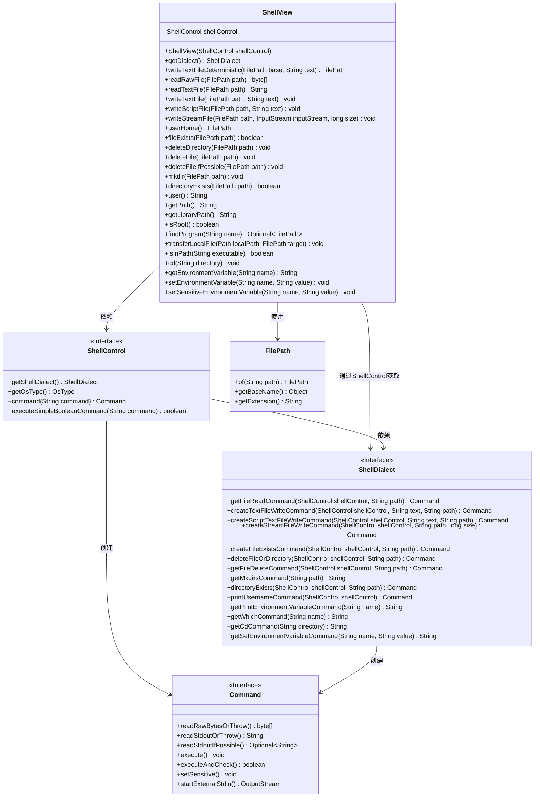

# 基础信息

|      |      |
|------|------|
| 名称 | ShellView |
| 编码语言 | .java |
| 代码路径 | xpipe/core/src/main/java/io/xpipe/core/process/ShellView.java |
| 包名 | io.xpipe.core.process |
| 依赖项 | ['io.xpipe.core.store.FilePath', 'java.io.InputStream', 'java.nio.file.Files', 'java.nio.file.Path', 'java.util.Optional'] |
| 概述说明 | ShellView类提供文件操作、环境变量管理和命令执行功能。 |

# 说明

ShellView类是一个封装了ShellControl功能的工具类，提供文件操作、环境变量管理、路径查询等常用Shell功能。主要功能包括：读写文本文件、检查文件存在性、删除文件目录、创建目录、获取用户信息、查询环境变量、检查用户权限、查找程序路径、传输本地文件、切换工作目录等。通过ShellDialect适配不同Shell方言，所有方法均可能抛出异常。类中不包含状态，所有操作均通过构造时传入的ShellControl实例执行。

# 类列表 Class Summary

| 名称   | 类型  | 说明 |
|-------|------|-------------|
| ShellView | class | ShellView类提供文件操作、环境变量管理和命令行交互功能。 |

## 类 ShellView

|      |      |
|------|------|
| 访问范围 | public |
| 类型 | class |
| 名称 | ShellView |
| 说明 | ShellView类提供文件操作、环境变量管理和命令行交互功能。 |

### UML类图

该类图展示了ShellView及其相关组件的结构关系。ShellView作为核心类，通过组合方式持有ShellControl实例，并依赖ShellDialect接口实现跨平台文件操作。ShellControl作为中介接口，连接ShellView与具体命令执行逻辑，而ShellDialect定义了不同Shell环境下的操作契约。FilePath作为值对象封装路径操作，Command接口规范了命令执行的标准行为。整体设计体现了依赖倒置原则，通过接口隔离了平台相关实现细节。

### 内部方法调用关系图

```mermaid
graph TD
    A["类ShellView"]
    B["属性: ShellControl shellControl"]
    C["构造方法: ShellView(ShellControl shellControl)"]
    D["方法: ShellDialect getDialect()"]
    E["方法: FilePath writeTextFileDeterministic(FilePath base, String text)"]
    F["方法: byte[] readRawFile(FilePath path)"]
    G["方法: String readTextFile(FilePath path)"]
    H["方法: void writeTextFile(FilePath path, String text)"]
    I["方法: void writeScriptFile(FilePath path, String text)"]
    J["方法: void writeStreamFile(FilePath path, InputStream inputStream, long size)"]
    K["方法: FilePath userHome()"]
    L["方法: boolean fileExists(FilePath path)"]
    M["方法: void deleteDirectory(FilePath path)"]
    N["方法: void deleteFile(FilePath path)"]
    O["方法: void deleteFileIfPossible(FilePath path)"]
    P["方法: void mkdir(FilePath path)"]
    Q["方法: boolean directoryExists(FilePath path)"]
    R["方法: String user()"]
    S["方法: String getPath()"]
    T["方法: String getLibraryPath()"]
    U["方法: boolean isRoot()"]
    V["方法: Optional<FilePath> findProgram(String name)"]
    W["方法: void transferLocalFile(Path localPath, FilePath target)"]
    X["方法: boolean isInPath(String executable)"]
    Y["方法: void cd(String directory)"]
    Z["方法: String getEnvironmentVariable(String name)"]
    AA["方法: void setEnvironmentVariable(String name, String value)"]
    AB["方法: void setSensitiveEnvironmentVariable(String name, String value)"]

    A --> B
    A --> C
    A --> D
    A --> E
    A --> F
    A --> G
    A --> H
    A --> I
    A --> J
    A --> K
    A --> L
    A --> M
    A --> N
    A --> O
    A --> P
    A --> Q
    A --> R
    A --> S
    A --> T
    A --> U
    A --> V
    A --> W
    A --> X
    A --> Y
    A --> Z
    A --> AA
    A --> AB
```

这段代码定义了一个ShellView类，主要用于处理文件和目录操作、环境变量管理以及执行Shell命令。该类通过ShellControl和ShellDialect进行底层操作，提供了丰富的文件读写、路径操作、环境变量查询和设置等功能。代码结构清晰，功能全面，涵盖了常见的Shell操作需求，并考虑了Windows和Unix-like系统的兼容性。

### 字段列表 Field List

| 名称  | 类型  | 说明 |
|-------|-------|------|
| shellControl | ShellControl | 受保护的最终ShellControl实例shellControl。 |

### 方法列表 Method List

| 名称  | 类型  | 说明 |
|-------|-------|------|
| writeTextFile | void | Java方法：写入文本文件，参数为路径和内容，可能抛出异常。 |
| getDialect | ShellDialect | 获取ShellDialect实例的方法，返回shellControl中的ShellDialect。 |
| directoryExists | boolean | 检查目录是否存在，返回布尔值，异常时抛出。 |
| fileExists | boolean | 检查文件是否存在，执行命令并返回结果。 |
| writeTextFileDeterministic | FilePath | 写入文本文件并确保唯一性，存在同名文件则直接返回。 |
| mkdir | void | 创建目录方法：执行shell命令mkdir。 |
| deleteDirectory | void | 删除指定路径的目录或文件。 |
| writeStreamFile | void | Java方法：写入流文件至指定路径，处理输入流及大小，异常抛出。 |
| writeScriptFile | void | 方法writeScriptFile创建并执行写入脚本文件的命令，参数为路径和文本。 |
| readRawFile | byte[] | 读取文件原始字节，异常时抛出。 |
| user | String | 获取数据库用户名命令执行结果 |
| readTextFile | String | 读取文本文件内容，异常时抛出。 |
| findProgram | Optional<FilePath> | 查找指定名称的程序路径，返回首个结果。 |
| deleteFile | void | 删除指定路径文件，异常时抛出错误。 |
| userHome | FilePath | 获取用户主目录路径的方法。 |
| getLibraryPath | String | 获取环境变量LD_LIBRARY_PATH的值并返回。 |
| deleteFileIfPossible | void | 删除指定路径文件，失败则抛出异常。 |
| isRoot | boolean | 检查当前用户是否为root（Windows系统直接返回false）。 |
| getPath | String | 获取系统环境变量PATH的值。 |
| transferLocalFile | void | Java方法：将本地文件传输至目标路径，使用输入流写入。 |
| isInPath | boolean | 检查指定可执行文件是否在系统路径中。 |
| cd | void | Java方法：执行shell的cd命令切换目录，异常时抛出。 |
| getEnvironmentVariable | String | 获取指定环境变量的值，失败时抛出异常。 |
| setEnvironmentVariable | void | 设置环境变量的Java方法，通过shell命令执行。 |
| setSensitiveEnvironmentVariable | void | 设置敏感环境变量，执行加密命令。 |

