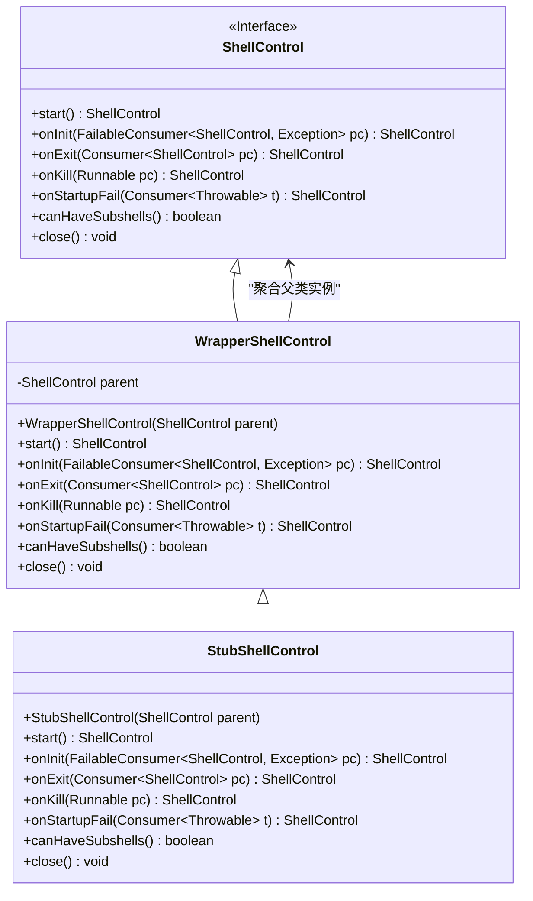
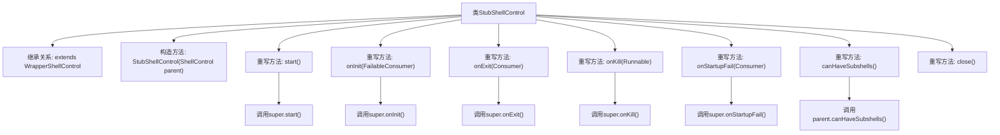

# 基础信息

|      |      |
|------|------|
| 名称 | StubShellControl |
| 编码语言 | .java |
| 代码路径 | xpipe/core/src/main/java/io/xpipe/core/process/StubShellControl.java |
| 包名 | io.xpipe.core.process |
| 依赖项 | ['io.xpipe.core.util.FailableConsumer', 'java.util.function.Consumer'] |
| 概述说明 | StubShellControl继承WrapperShellControl，重写ShellControl方法并返回自身实例。 |

# 说明

StubShellControl是WrapperShellControl的子类，提供对ShellControl的桩实现。它继承父类方法并重写start、onInit、onExit、onKill、onStartupFail等方法，均调用父类实现并返回自身实例。canHaveSubshells方法委托给父类判断，close方法为空实现。该类主要用于测试或模拟场景，不包含实际功能逻辑。

# 类列表 Class Summary

| 名称   | 类型  | 说明 |
|-------|------|-------------|
| StubShellControl | class | StubShellControl继承WrapperShellControl，重写ShellControl方法并返回自身实例。 |

## 类 StubShellControl

|      |      |
|------|------|
| 访问范围 | public |
| 类型 | class |
| 名称 | StubShellControl |
| 说明 | StubShellControl继承WrapperShellControl，重写ShellControl方法并返回自身实例。 |

### UML类图

类图描述：
该图展示了ShellControl接口及其实现类的层级关系。ShellControl定义了shell控制的核心接口，WrapperShellControl作为基础包装类实现了该接口并持有父类实例，StubShellControl作为具体实现继承WrapperShellControl。所有类均包含启动、事件回调、子shell判断和关闭等方法，体现了装饰器模式的结构特点，其中StubShellControl通过重写方法提供了桩实现。

### 内部方法调用关系图

这段代码展示了一个StubShellControl类，它继承自WrapperShellControl并重写了多个关键方法。该类主要作为ShellControl的存根实现，通过super调用父类方法并保持链式调用（返回this），同时实现了空操作的close()方法。特别值得注意的是canHaveSubshells()方法直接委托给父级对象判断，体现了装饰器模式的特征。所有重写方法都严格遵循了父类行为规范，适合作为基础控制类的测试替身或默认实现。

### 字段列表 Field List

| 名称  | 类型  | 说明 |
|-------|-------|------|

### 方法列表 Method List

| 名称  | 类型  | 说明 |
|-------|-------|------|
| close | void | 重写close方法，无具体实现。 |
| onStartupFail | ShellControl | 重写启动失败处理，返回自身实例。 |
| onExit | ShellControl | 重写onExit方法，调用父类并返回当前对象。 |
| onKill | ShellControl | 重写onKill方法，调用父类并返回当前对象。 |
| onInit | ShellControl | 重写onInit方法，调用父类并返回当前对象。 |
| start | ShellControl | 重写start方法，调用父类方法并返回当前对象实例。 |
| canHaveSubshells | boolean | 子方法返回父级canHaveSubshells结果。 |

