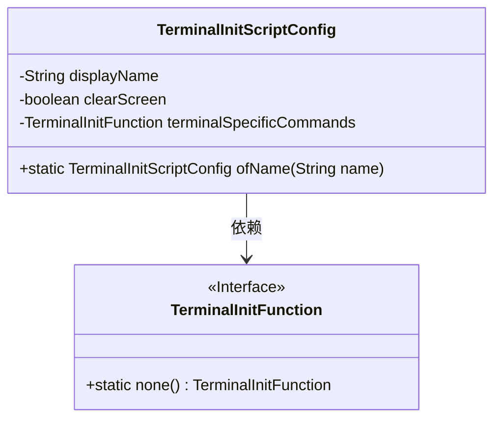
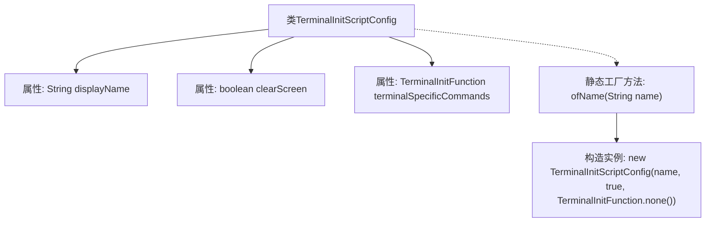

# 基础信息

|      |      |
|------|------|
| 名称 | TerminalInitScriptConfig |
| 编码语言 | .java |
| 代码路径 | xpipe/core/src/main/java/io/xpipe/core/process/TerminalInitScriptConfig.java |
| 包名 | io.xpipe.core.process |
| 依赖项 | ['lombok.Value'] |
| 概述说明 | 终端初始化配置类，含名称、清屏标志和命令函数，提供静态创建方法。 |

# 说明

这是一个名为TerminalInitScriptConfig的公开类，用于配置终端初始化脚本。该类包含三个成员变量：displayName表示显示名称，clearScreen是布尔类型用于控制是否清屏，terminalSpecificCommands是TerminalInitFunction类型用于存储终端特定命令。类中提供了一个静态工厂方法ofName，接收名称参数并返回一个新的TerminalInitScriptConfig实例，默认设置clearScreen为true，terminalSpecificCommands为none()。

# 类列表 Class Summary

| 名称   | 类型  | 说明 |
|-------|------|-------------|
| TerminalInitScriptConfig | class | 终端初始化配置类，含名称、清屏标志和终端命令功能。提供静态方法创建实例。 |

## 类 TerminalInitScriptConfig

|      |      |
|------|------|
| 访问范围 | @Value;public |
| 类型 | class |
| 名称 | TerminalInitScriptConfig |
| 说明 | 终端初始化配置类，含名称、清屏标志和终端命令功能。提供静态方法创建实例。 |

### UML类图

这段类图展示了TerminalInitScriptConfig类的结构，它包含三个私有字段：displayName（字符串类型）、clearScreen（布尔类型）和terminalSpecificCommands（TerminalInitFunction接口类型）。该类提供了一个静态工厂方法ofName用于创建实例。TerminalInitFunction是一个接口，通过依赖关系被TerminalInitScriptConfig使用，其中包含一个静态方法none()。该配置类主要用于终端初始化脚本的相关设置。

### 内部方法调用关系图

这段代码描述了一个终端初始化脚本配置类TerminalInitScriptConfig，包含三个属性：显示名称(displayName)、清屏标志(clearScreen)和终端特定命令函数(terminalSpecificCommands)。类中定义了一个静态工厂方法ofName，用于快速创建默认配置的实例（清屏标志为true且无特定命令）。流程图清晰展示了类结构与工厂方法的调用关系，体现了简洁的配置对象创建模式。

### 字段列表 Field List

| 名称  | 类型  | 说明 |
|-------|-------|------|
| displayName | String | 定义字符串变量displayName。 |
| clearScreen | boolean | 声明布尔变量clearScreen |
| terminalSpecificCommands | TerminalInitFunction | 终端初始化函数，含特定命令。 |

### 方法列表 Method List

| 名称  | 类型  | 说明 |
|-------|-------|------|
| ofName | TerminalInitScriptConfig | 创建终端初始化脚本配置，指定名称并启用功能。 |

