# 基础信息

|      |      |
|------|------|
| 名称 | WrapperShellControl |
| 编码语言 | .java |
| 代码路径 | xpipe/core/src/main/java/io/xpipe/core/process/WrapperShellControl.java |
| 包名 | io.xpipe.core.process |
| 依赖项 | ['io.xpipe.core.store.DataStore', 'io.xpipe.core.store.FilePath', 'io.xpipe.core.util.FailableConsumer', 'lombok.Getter', 'java.io.IOException', 'java.nio.charset.Charset', 'java.util.List', 'java.util.Optional', 'java.util.UUID', 'java.util.concurrent.locks.ReentrantLock', 'java.util.function.Consumer', 'java.util.function.Function'] |
| 概述说明 | 包装ShellControl类，代理所有方法到父实例。 |

# 说明

WrapperShellControl是一个实现了ShellControl接口的包装类，通过封装父级ShellControl实例来代理所有方法调用。该类不包含独立逻辑，所有操作均委托给构造时传入的parent对象处理，包括视图获取、能力查询、终端状态管理、流控制、系统访问、许可证检查、命令执行等核心功能。其设计模式体现了装饰器模式的思想，用于在不修改原始对象的基础上扩展或控制行为。

# 类列表 Class Summary

| 名称   | 类型  | 说明 |
|-------|------|-------------|
| WrapperShellControl | class | WrapperShellControl类继承ShellControl接口，通过封装父类方法实现功能代理。 |

## 类 WrapperShellControl

|      |      |
|------|------|
| 访问范围 | @Getter;public |
| 类型 | class |
| 名称 | WrapperShellControl |
| 说明 | WrapperShellControl类继承ShellControl接口，通过封装父类方法实现功能代理。 |

### UML类图

```mermaid
classDiagram
    class ShellControl {
        <<Interface>>
        +ShellView view()
        +ShellCapabilities getCapabilities()
        +Optional~ShellControl~ getParentControl()
        +ShellTtyState getTtyState()
        +void setNonInteractive()
        +boolean isInteractive()
        +ElevationHandler getElevationHandler()
        +void setElevationHandler(ElevationHandler ref)
        +void closeStdout() throws IOException
        +List~UUID~ getExitUuids()
        +void setWorkingDirectory(WorkingDirectoryFunction workingDirectory)
        +Optional~DataStore~ getSourceStore()
        +Optional~UUID~ getSourceStoreId()
        +ShellControl withSourceStore(DataStore store)
        +List~ShellTerminalInitCommand~ getTerminalInitCommands()
        +ParentSystemAccess getParentSystemAccess()
        +void setParentSystemAccess(ParentSystemAccess access)
        +ParentSystemAccess getLocalSystemAccess()
        +boolean isLocal()
        +ShellControl getMachineRootSession()
        +String getOsName()
        +ReentrantLock getLock()
        +void requireLicensedFeature(String id)
        +ShellDialect getOriginalShellDialect()
        +void setOriginalShellDialect(ShellDialect dialect)
        +ShellControl onInit(FailableConsumer~ShellControl, Exception~ pc)
        +ShellControl onExit(Consumer~ShellControl~ pc)
        +ShellControl onKill(Runnable pc)
        +ShellControl onStartupFail(Consumer~Throwable~ t)
        +UUID getUuid()
        +ShellControl withExceptionConverter(ExceptionConverter converter)
        +void resetData()
        +String prepareTerminalOpen(TerminalInitScriptConfig config, WorkingDirectoryFunction workingDirectory) throws Exception
        +void refreshRunningState()
        +void closeStdin() throws IOException
        +boolean isAnyStreamClosed()
        +boolean isRunning(boolean refresh)
        +ShellDialect getShellDialect()
        +boolean isInitializing()
        +void setDumbOpen(ShellOpenFunction openFunction)
        +void setTerminalOpen(ShellOpenFunction openFunction)
        +void writeLine(String line) throws IOException
        +void writeLine(String line, boolean log) throws IOException
        +void write(byte[] b) throws IOException
        +void close() throws Exception
        +void shutdown() throws Exception
        +void kill()
        +ShellControl start() throws Exception
        +LocalProcessInputStream getStdout()
        +LocalProcessOutputStream getStdin()
        +LocalProcessInputStream getStderr()
        +Charset getCharset()
        +ShellControl withErrorFormatter(Function~String, String~ formatter)
        +void checkLicenseOrThrow()
        +String prepareIntermediateTerminalOpen(TerminalInitFunction content, TerminalInitScriptConfig config, WorkingDirectoryFunction workingDirectory) throws Exception
        +FilePath getSystemTemporaryDirectory()
        +ShellControl withSecurityPolicy(ShellSecurityPolicy policy)
        +ShellSecurityPolicy getEffectiveSecurityPolicy()
        +String buildElevatedCommand(CommandConfiguration input, String prefix, UUID requestId, CountDown countDown) throws Exception
        +void restart() throws Exception
        +OsType.Any getOsType()
        +ShellControl elevated(ElevationFunction elevationFunction)
        +ShellControl withInitSnippet(ShellTerminalInitCommand snippet)
        +Optional~ShellControl~ getActiveReplacementBackgroundSession() throws Exception
        +ShellControl subShell()
        +CommandControl command(CommandBuilder builder)
        +void exitAndWait() throws IOException
    }

    class WrapperShellControl {
        -ShellControl parent
        +WrapperShellControl(ShellControl parent)
        +ShellView view()
        +ShellCapabilities getCapabilities()
        +Optional~ShellControl~ getParentControl()
        +ShellTtyState getTtyState()
        +void setNonInteractive()
        +boolean isInteractive()
        +ElevationHandler getElevationHandler()
        +void setElevationHandler(ElevationHandler ref)
        +void closeStdout() throws IOException
        +List~UUID~ getExitUuids()
        +void setWorkingDirectory(WorkingDirectoryFunction workingDirectory)
        +Optional~DataStore~ getSourceStore()
        +Optional~UUID~ getSourceStoreId()
        +ShellControl withSourceStore(DataStore store)
        +List~ShellTerminalInitCommand~ getTerminalInitCommands()
        +ParentSystemAccess getParentSystemAccess()
        +void setParentSystemAccess(ParentSystemAccess access)
        +ParentSystemAccess getLocalSystemAccess()
        +boolean isLocal()
        +ShellControl getMachineRootSession()
        +String getOsName()
        +ReentrantLock getLock()
        +void requireLicensedFeature(String id)
        +ShellDialect getOriginalShellDialect()
        +void setOriginalShellDialect(ShellDialect dialect)
        +ShellControl onInit(FailableConsumer~ShellControl, Exception~ pc)
        +ShellControl onExit(Consumer~ShellControl~ pc)
        +ShellControl onKill(Runnable pc)
        +ShellControl onStartupFail(Consumer~Throwable~ t)
        +UUID getUuid()
        +ShellControl withExceptionConverter(ExceptionConverter converter)
        +void resetData()
        +String prepareTerminalOpen(TerminalInitScriptConfig config, WorkingDirectoryFunction workingDirectory) throws Exception
        +void refreshRunningState()
        +void closeStdin() throws IOException
        +boolean isAnyStreamClosed()
        +boolean isRunning(boolean refresh)
        +ShellDialect getShellDialect()
        +boolean isInitializing()
        +void setDumbOpen(ShellOpenFunction openFunction)
        +void setTerminalOpen(ShellOpenFunction openFunction)
        +void writeLine(String line) throws IOException
        +void writeLine(String line, boolean log) throws IOException
        +void write(byte[] b) throws IOException
        +void close() throws Exception
        +void shutdown() throws Exception
        +void kill()
        +ShellControl start() throws Exception
        +LocalProcessInputStream getStdout()
        +LocalProcessOutputStream getStdin()
        +LocalProcessInputStream getStderr()
        +Charset getCharset()
        +ShellControl withErrorFormatter(Function~String, String~ formatter)
        +void checkLicenseOrThrow()
        +String prepareIntermediateTerminalOpen(TerminalInitFunction content, TerminalInitScriptConfig config, WorkingDirectoryFunction workingDirectory) throws Exception
        +FilePath getSystemTemporaryDirectory()
        +ShellControl withSecurityPolicy(ShellSecurityPolicy policy)
        +ShellSecurityPolicy getEffectiveSecurityPolicy()
        +String buildElevatedCommand(CommandConfiguration input, String prefix, UUID requestId, CountDown countDown) throws Exception
        +void restart() throws Exception
        +OsType.Any getOsType()
        +ShellControl elevated(ElevationFunction elevationFunction)
        +ShellControl withInitSnippet(ShellTerminalInitCommand snippet)
        +Optional~ShellControl~ getActiveReplacementBackgroundSession() throws Exception
        +ShellControl subShell()
        +CommandControl command(CommandBuilder builder)
        +void exitAndWait() throws IOException
    }

    WrapperShellControl --|> ShellControl : 实现
    WrapperShellControl --> ShellControl : 依赖
```

这段代码展示了一个WrapperShellControl类，它实现了ShellControl接口并封装了另一个ShellControl实例作为父对象。WrapperShellControl通过委托模式将所有方法调用转发给其父对象，这种设计常用于在不修改原有对象行为的情况下添加额外功能或控制。类图清晰地展示了WrapperShellControl与ShellControl接口的继承关系以及对其的依赖关系，体现了装饰器模式的核心思想。

### 内部方法调用关系图

这段代码展示了一个WrapperShellControl类，它实现了ShellControl接口并作为其父类的包装器。该类通过持有parent属性，将所有方法调用委托给父类ShellControl实例。这种设计模式常用于在不修改原有类的情况下扩展或控制其行为。流程图清晰地展示了类与属性、构造方法以及众多委托方法之间的关系，所有方法都通过parent属性将调用转发给父类实例。

### 字段列表 Field List

| 名称  | 类型  | 说明 |
|-------|-------|------|
| parent | ShellControl | 受保护的最终ShellControl父对象 |

### 方法列表 Method List

| 名称  | 类型  | 说明 |
|-------|-------|------|
| refreshRunningState | void | 子方法调用父类刷新运行状态方法。 |
| isLocal | boolean | 重写方法isLocal，返回父类的isLocal结果。 |
| getOriginalShellDialect | ShellDialect | 重写方法返回父类的原始ShellDialect对象。 |
| view | ShellView | 重写父类view方法，返回父类视图实例。 |
| close | void | 重写close方法，调用父类关闭逻辑。 |
| closeStdout | void | 重写closeStdout方法，调用父类关闭标准输出。 |
| onInit | ShellControl | 重写父类onInit方法，调用父类实现并返回结果。 |
| getEffectiveSecurityPolicy | ShellSecurityPolicy | 重写方法返回父级安全策略。 |
| kill | void | 重写kill方法，调用父类的kill方法。 |
| getMachineRootSession | ShellControl | 重写父类方法，返回父级机器根会话。 |
| isInteractive | boolean | 重写父类方法，返回父类的交互状态。 |
| write | void | 重写write方法，调用父类写入字节数组。 |
| setDumbOpen | void | 重写父类方法，设置无感知打开功能。 |
| getUuid | UUID | 重写getUuid方法，返回父类UUID值。 |
| getTtyState | ShellTtyState | 重写父类方法，返回父对象的终端状态。 |
| withSecurityPolicy | ShellControl | 重写方法，设置Shell安全策略并返回父级调用结果。 |
| getStdin | LocalProcessOutputStream | 重写父类方法，返回父对象的输入流。 |
| setOriginalShellDialect | void | 重写方法，设置父类原始Shell方言。 |
| onKill | ShellControl | 重写onKill方法，调用父类处理。 |
| setNonInteractive | void | 重写父类方法，调用父类的非交互设置。 |
| getOsType | OsType.Any | 重写方法，返回父类的操作系统类型。 |
| closeStdin | void | 重写父类closeStdin方法，调用父类实现。 |
| getParentControl | Optional<ShellControl> | 重写方法，返回父级ShellControl的可选对象。 |
| restart | void | 子类重写父类restart方法，调用父类实现。 |
| checkLicenseOrThrow | void | 子方法调用父类许可检查 |
| getCapabilities | ShellCapabilities | 重写父类方法，返回父类的能力集。 |
| getStdout | LocalProcessInputStream | 重写父类方法，返回父类标准输出流。 |
| isInitializing | boolean | 重写父类方法，返回父类初始化状态。 |
| withErrorFormatter | ShellControl | 重写方法，设置错误格式化函数并返回父级调用结果。 |
| setElevationHandler | void | 重写方法，调用父类设置高度处理器。 |
| getSystemTemporaryDirectory | FilePath | 重写方法，返回父类的系统临时目录路径。 |
| getExitUuids | List<UUID> | 重写父类方法，返回父类exitUuids列表。 |
| writeLine | void | 重写writeLine方法，调用父类同名方法处理输入行和日志标记。 |
| prepareTerminalOpen | String | 重写终端打开方法，调用父类处理配置和工作目录。 |
| onStartupFail | ShellControl | 方法重写，调用父类onStartupFail处理启动失败异常。 |
| shutdown | void | 重写父类shutdown方法，调用父类实现。 |
| isAnyStreamClosed | boolean | 重写方法，检查父类流是否关闭。 |
| getLocalSystemAccess | ParentSystemAccess | 重写方法，返回父级本地系统访问对象。 |
| withSourceStore | ShellControl | 重写方法，用指定数据存储设置源存储并返回控制对象。 |
| getActiveReplacementBackgroundSession | Optional<ShellControl> | 重写父类方法，返回父类的后台会话控制对象。 |
| requireLicensedFeature | void | 重写方法，调用父类检查许可功能。 |
| getSourceStoreId | Optional<UUID> | 重写方法，返回父级源存储ID。 |
| buildElevatedCommand | String | 重写父类方法，调用父类构建提升权限命令。 |
| getElevationHandler | ElevationHandler | 重写父类方法，返回父级高度处理器。 |
| withInitSnippet | ShellControl | 重写方法，用父类初始化片段设置Shell控制。 |
| getShellDialect | ShellDialect | 重写父类方法，返回父级ShellDialect实例。 |
| start | ShellControl | 重写父类start方法，调用父类实现并返回结果。 |
| writeLine | void | 重写writeLine方法，调用父类写入行数据。 |
| resetData | void | 重写resetData方法，调用父类同名方法。 |
| getOsName | String | 重写父类方法，返回父类的操作系统名称。 |
| prepareIntermediateTerminalOpen | String | 重写方法，调用父类处理终端初始化参数并返回结果。 |
| getLock | ReentrantLock | 重写getLock方法，返回父级锁对象。 |
| setParentSystemAccess | void | 重写方法，设置父系统访问权限。 |
| getCharset | Charset | 重写getCharset方法，返回父级字符集。 |
| getSourceStore | Optional<DataStore> | 重写父类方法，返回父级数据存储。 |
| isRunning | boolean | 重写方法，调用父类isRunning并强制刷新。 |
| onExit | ShellControl | 重写父类onExit方法，调用父类处理退出逻辑。 |
| setWorkingDirectory | void | 重写父类方法，设置工作目录函数。 |
| setTerminalOpen | void | 重写父类方法，设置终端打开功能。 |
| withExceptionConverter | ShellControl | 重写方法，使用父类异常转换器。 |
| elevated | ShellControl | 重写父类方法，调用父类的权限提升函数。 |
| getTerminalInitCommands | List<ShellTerminalInitCommand> | 重写父类方法，返回父类的终端初始化命令列表。 |
| getParentSystemAccess | ParentSystemAccess | 重写方法返回父系统的访问对象。 |
| getStderr | LocalProcessInputStream | 重写方法，返回父进程的标准错误流。 |
| subShell | ShellControl | 重写父类方法，返回父类的子Shell实例。 |
| command | CommandControl | 重写父类command方法，调用父类实现。 |
| exitAndWait | void | 子方法调用父类退出并等待。 |

