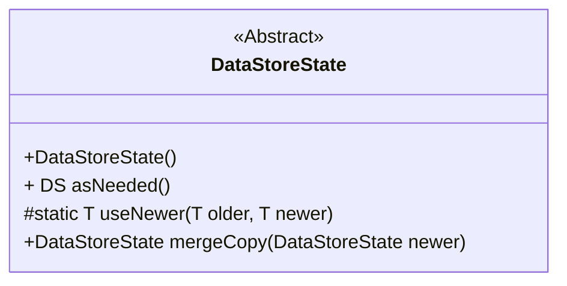
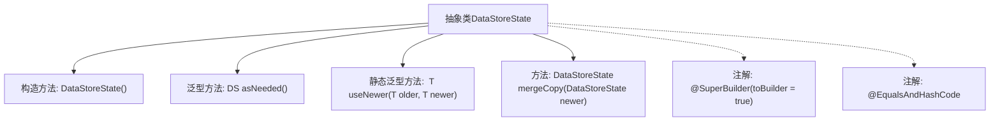

# 基础信息

|      |      |
|------|------|
| 名称 | DataStoreState |
| 编码语言 | .java |
| 代码路径 | xpipe/core/src/main/java/io/xpipe/core/store/DataStoreState.java |
| 包名 | io.xpipe.core.store |
| 依赖项 | ['lombok.EqualsAndHashCode', 'lombok.experimental.SuperBuilder'] |
| 概述说明 | 抽象类DataStoreState，支持构建器模式、相等比较，提供合并拷贝和空安全方法。 |

# 说明

这段代码定义了一个名为DataStoreState的抽象类，使用了Lombok的@SuperBuilder和@EqualsAndHashCode注解。类中包含一个无参构造函数、一个泛型方法asNeeded用于类型转换、一个静态工具方法useNewer用于选择非空对象，以及一个mergeCopy方法用于合并状态（当前实现直接返回自身）。类设计支持构建器模式和对象比较，主要功能是作为数据存储状态的基础类。

# 类列表 Class Summary

| 名称   | 类型  | 说明 |
|-------|------|-------------|
| DataStoreState | class | 抽象类DataStoreState，含构造器、类型转换方法、新旧值选择及合并功能。 |

## 类 DataStoreState

|      |      |
|------|------|
| 访问范围 | @SuperBuilder(toBuilder = true);@EqualsAndHashCode;public abstract |
| 类型 | class |
| 名称 | DataStoreState |
| 说明 | 抽象类DataStoreState，含构造器、类型转换方法、新旧值选择及合并功能。 |

### UML类图

这段类图展示了一个抽象类DataStoreState的设计结构。该类使用@SuperBuilder注解支持建造者模式，并提供了几个核心方法：asNeeded()用于类型安全转换，useNewer()静态方法用于选择较新的非空对象，mergeCopy()用于状态合并（当前实现直接返回自身）。类被标记为抽象类，表明需要子类实现具体功能，同时通过泛型方法增强了类型灵活性。整体设计体现了状态管理的基础模式，适合作为数据存储状态的基础父类。

### 内部方法调用关系图

这段代码定义了一个抽象类DataStoreState，使用@SuperBuilder和@EqualsAndHashCode注解。类包含默认构造方法、一个泛型转换方法asNeeded()、一个静态泛型工具方法useNewer()用于选择非空值，以及一个空实现的mergeCopy()方法。流程图展示了类结构、方法关系和注解依赖，其中asNeeded()和useNewer()涉及泛型类型转换，mergeCopy()当前仅返回自身实例。

### 字段列表 Field List

| 名称  | 类型  | 说明 |
|-------|-------|------|

### 方法列表 Method List

| 名称  | 类型  | 说明 |
|-------|-------|------|
| useNewer | T | 静态方法返回非空新值或旧值。 |
| asNeeded | DS | 将对象强制转换为指定泛型类型并返回。 |
| mergeCopy | DataStoreState | 方法mergeCopy直接返回当前对象，未处理参数newer。 |

