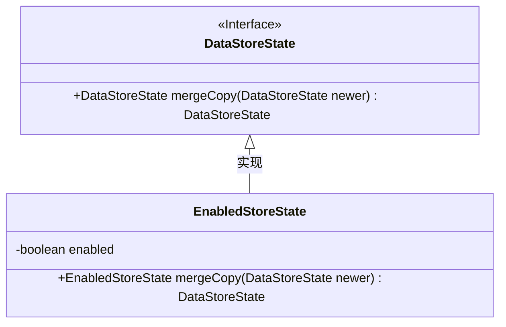
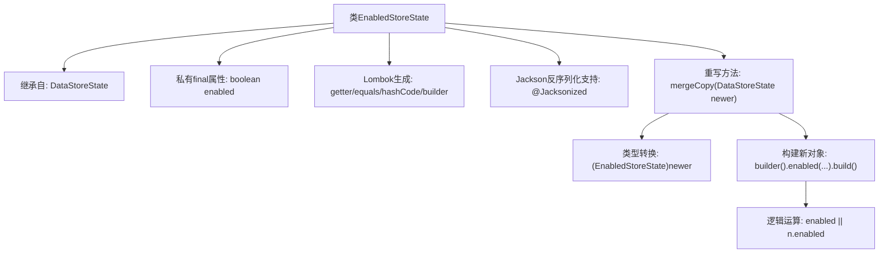

# 基础信息

|      |      |
|------|------|
| 名称 | EnabledStoreState |
| 编码语言 | .java |
| 代码路径 | xpipe/core/src/main/java/io/xpipe/core/store/EnabledStoreState.java |
| 包名 | io.xpipe.core.store |
| 依赖项 | ['lombok.AccessLevel', 'lombok.EqualsAndHashCode', 'lombok.Getter', 'lombok.experimental.FieldDefaults', 'lombok.experimental.SuperBuilder', 'lombok.extern.jackson.Jacksonized'] |
| 概述说明 | EnabledStoreState类继承DataStoreState，私有final字段，含enabled属性和mergeCopy合并方法。 |

# 说明

该内容定义了一个名为EnabledStoreState的Java类，继承自DataStoreState。类使用Lombok注解实现自动生成getter方法、equals/hashCode方法及构建器模式，并通过Jacksonized支持JSON序列化。类包含一个布尔类型字段enabled，表示启用状态。重写了mergeCopy方法，用于合并两个状态实例的逻辑：当任一实例的enabled为true时，合并结果为true。所有字段均为私有且不可变，采用构建器模式创建实例。

# 类列表 Class Summary

| 名称   | 类型  | 说明 |
|-------|------|-------------|
| EnabledStoreState | class | EnabledStoreState类继承DataStoreState，私有final字段，含enabled属性和mergeCopy方法，合并enabled状态。 |

## 类 EnabledStoreState

|      |      |
|------|------|
| 访问范围 | @FieldDefaults(makeFinal = true, level = AccessLevel.PRIVATE);@Getter;@EqualsAndHashCode(callSuper = true);@SuperBuilder(toBuilder = true);@Jacksonized;public |
| 类型 | class |
| 名称 | EnabledStoreState |
| 说明 | EnabledStoreState类继承DataStoreState，私有final字段，含enabled属性和mergeCopy方法，合并enabled状态。 |

### UML类图

这段类图展示了EnabledStoreState类继承自DataStoreState接口的关系。EnabledStoreState包含一个私有布尔字段enabled，并重写了接口的mergeCopy方法，该方法接受DataStoreState参数并返回合并后的新实例。类图清晰地体现了接口实现和继承关系，以及EnabledStoreState特有的状态字段和方法实现，符合Java类继承和接口实现的标准UML表示规范。

### 内部方法调用关系图

这段代码展示了一个使用Lombok和Jackson注解的继承类结构。EnabledStoreState继承DataStoreState，通过@SuperBuilder实现建造者模式，包含一个final布尔属性enabled。核心是重写的mergeCopy方法，该方法将输入参数转型后，通过逻辑或运算合并enabled状态，最终返回新的构建对象。整个设计体现了不可变对象和函数式编程思想，适合在状态管理场景中使用。

### 字段列表 Field List

| 名称  | 类型  | 说明 |
|-------|-------|------|
| enabled | boolean | 布尔型启用状态 |

### 方法列表 Method List

| 名称  | 类型  | 说明 |
|-------|-------|------|
| mergeCopy | DataStoreState | 合并两个数据存储状态，返回启用状态为两者逻辑或的新状态。 |

