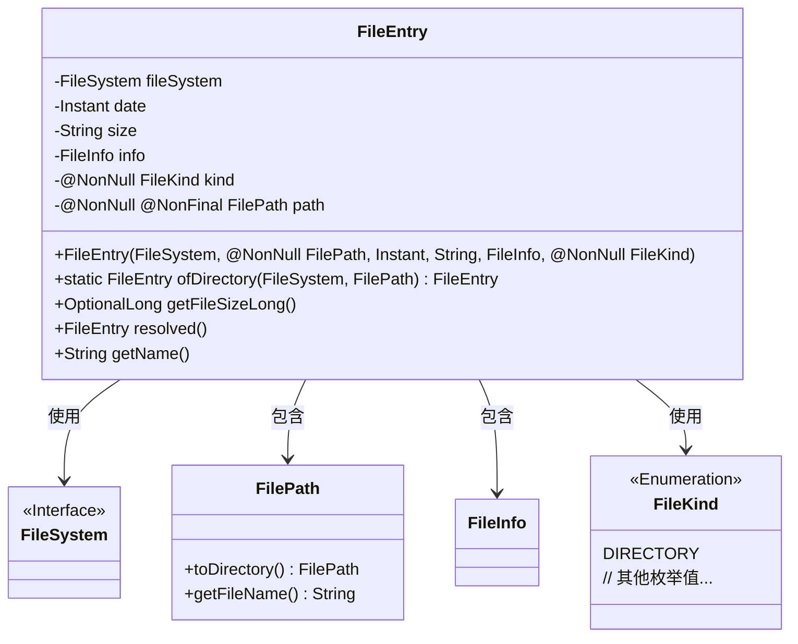
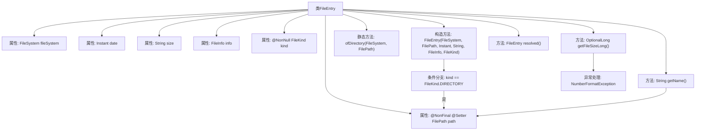

# 基础信息

|      |      |
|------|------|
| 名称 | FileEntry |
| 编码语言 | .java |
| 代码路径 | xpipe/core/src/main/java/io/xpipe/core/store/FileEntry.java |
| 包名 | io.xpipe.core.store |
| 依赖项 | ['lombok.NonNull', 'lombok.Setter', 'lombok.Value', 'lombok.experimental.NonFinal', 'java.time.Instant', 'java.util.OptionalLong'] |
| 概述说明 | 文件类，含路径、日期、大小、类型等属性，支持目录创建和大小解析。 |

# 说明

FileEntry类表示文件系统中的条目，包含文件系统、路径、日期、大小、文件信息和类型等属性。路径和类型不可为空，路径可修改。构造方法根据类型处理路径，目录路径会被标准化。提供静态方法创建目录条目，以及获取文件大小、解析条目和获取名称的方法。文件大小可转为长整型或返回空值。

# 类列表 Class Summary

| 名称   | 类型  | 说明 |
|-------|------|-------------|
| FileEntry | class | 文件条目类，含路径、日期、大小、类型等属性，支持目录创建和大小解析。 |

## 类 FileEntry

|      |      |
|------|------|
| 访问范围 | @Value;@NonFinal;public |
| 类型 | class |
| 名称 | FileEntry |
| 说明 | 文件条目类，含路径、日期、大小、类型等属性，支持目录创建和大小解析。 |

### UML类图

类图描述：该图展示了FileEntry类及其关联关系。FileEntry是一个包含文件系统信息的类，具有文件路径、日期、大小等属性，通过构造方法和静态工厂方法创建实例。它依赖FileSystem接口，包含FilePath和FileInfo对象，并使用FileKind枚举类标识文件类型。核心方法包括获取文件大小、解析路径和获取文件名等操作，体现了文件系统操作的基本功能。

### 内部方法调用关系图

这段代码定义了一个文件条目类FileEntry，包含文件系统、日期、大小等信息。核心功能包括：通过构造方法初始化文件条目，静态方法创建目录条目，获取文件大小（带异常处理），解析路径和获取文件名。流程图展示了类结构、属性关系和方法调用链，特别突出了构造方法中的目录类型判断和getFileSizeLong()的异常处理路径。类设计注重不可变性和空安全，通过@NonNull等注解强化类型约束。

### 字段列表 Field List

| 名称  | 类型  | 说明 |
|-------|-------|------|
| date | Instant | 即时日期 |
| info | FileInfo | 文件信息对象 |
| size | String | 字符串大小 |
| path | FilePath | 非空非终文件路径变量可设值 |
| fileSystem | FileSystem | 文件系统对象声明。 |
| kind | FileKind | 非空文件类型kind |

### 方法列表 Method List

| 名称  | 类型  | 说明 |
|-------|-------|------|
| resolved | FileEntry | 方法返回当前文件对象自身。 |
| ofDirectory | FileEntry | 创建目录文件条目，含文件系统、路径、当前时间和目录类型。 |
| getFileSizeLong | OptionalLong | 方法返回文件大小的OptionalLong，解析失败或空时返回空OptionalLong。 |
| getName | String | 获取文件名的方法，返回路径中的文件名部分。 |

