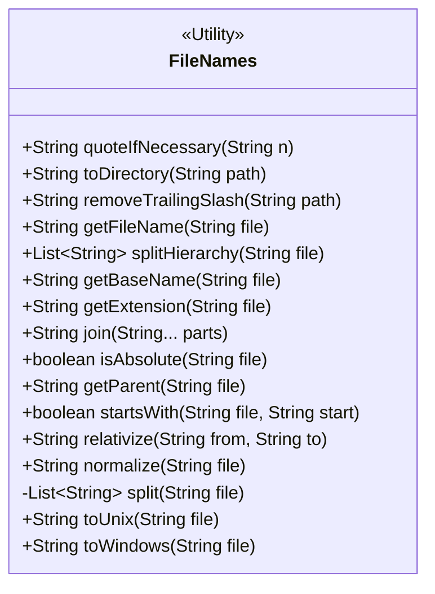
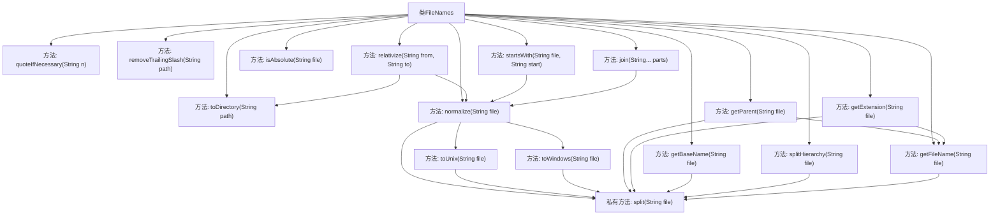

# 基础信息

|      |      |
|------|------|
| 名称 | FileNames |
| 编码语言 | .java |
| 代码路径 | xpipe/core/src/main/java/io/xpipe/core/store/FileNames.java |
| 包名 | io.xpipe.core.store |
| 依赖项 | ['java.util.ArrayList', 'java.util.Arrays', 'java.util.List'] |
| 概述说明 | 文件路径处理工具类，包含路径拼接、标准化、分割、相对路径转换等功能。 |

# 说明

FileNames类提供了一系列处理文件路径和名称的静态方法。主要功能包括：为含空格的路径添加引号；确保路径以斜杠结尾或移除末尾斜杠；提取文件名、扩展名或基本名称；拆分路径层级；连接路径部分；检查是否为绝对路径；获取父路径；比较路径起始部分；相对化路径；规范化路径为Unix或Windows格式。这些方法处理了不同操作系统下的路径分隔符差异，并确保路径格式一致性。

# 类列表 Class Summary

| 名称   | 类型  | 说明 |
|-------|------|-------------|
| FileNames | class | 文件路径处理工具类，包含路径拼接、标准化、分割等操作。 |

## 类 FileNames

|      |      |
|------|------|
| 访问范围 | public |
| 类型 | class |
| 名称 | FileNames |
| 说明 | 文件路径处理工具类，包含路径拼接、标准化、分割等操作。 |

### UML类图

该代码是一个文件路径处理工具类，包含15个静态方法，主要功能包括：路径规范化（Unix/Windows格式转换）、路径拼接、相对路径计算、文件名/扩展名提取、路径层级拆分等。所有方法均为静态且无状态，采用防御性编程处理空值和边界情况，支持跨平台路径分隔符（/和\）。类设计为不可实例化的工具类，通过方法组合可完成复杂的文件路径操作。

### 内部方法调用关系图

这段代码是FileNames工具类，提供文件路径处理的静态方法集合。主要功能包括路径规范化(Unix/Windows格式转换)、路径拼接、文件名/扩展名提取、路径层级拆分等。核心方法normalize()通过toUnix()和toWindows()实现路径标准化，其他方法如getFileName()、splitHierarchy()等依赖split()方法进行路径分割。所有方法都处理了空值、边界斜杠和不同操作系统路径分隔符等边缘情况，形成完整的路径处理工具链。

### 字段列表 Field List

| 名称  | 类型  | 说明 |
|-------|-------|------|

### 方法列表 Method List

| 名称  | 类型  | 说明 |
|-------|-------|------|
| normalize | String | 静态方法normalize根据字符串是否含反斜杠返回对应系统路径格式。 |
| getParent | String | 获取文件路径的父目录，处理根目录和空路径情况。 |
| getExtension | String | 获取文件扩展名的静态方法，空文件返回null。 |
| removeTrailingSlash | String | 静态方法移除路径末尾斜杠，根路径"/"除外。 |
| split | List<String> | 拆分文件路径为列表，过滤空字符串。 |
| getFileName | String | 提取文件路径中的文件名，处理空值和空路径。 |
| toDirectory | String | 将路径转换为目录格式，自动添加斜杠。 |
| startsWith | boolean | 检查文件路径是否以指定开头，忽略格式差异。 |
| isAbsolute | boolean | 检查文件路径是否为绝对路径，验证斜杠、反斜杠、起始字符及驱动器号。 |
| splitHierarchy | List<String> | 静态方法splitHierarchy按路径分隔符拆分字符串，返回层级列表。 |
| relativize | String | 方法relativize返回从路径from到路径to的相对路径，通过标准化处理并截取子串实现。 |
| join | String | 静态方法合并字符串路径并标准化。 |
| getBaseName | String | 获取文件名无后缀部分，空值返回null。 |
| quoteIfNecessary | String | 静态方法检查字符串含空格则加引号，否则返回原字符串。 |
| toUnix | String | 将文件路径转换为Unix风格，处理斜杠和前缀后缀。 |
| toWindows | String | 将路径转换为Windows格式，处理斜杠和反斜杠。 |

