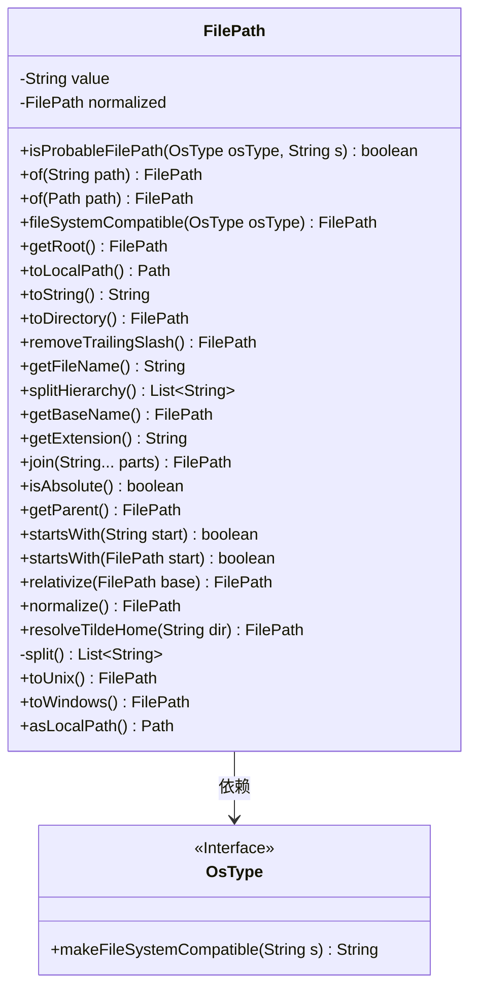

# 基础信息

|      |      |
|------|------|
| 名称 | FilePath |
| 编码语言 | .java |
| 代码路径 | xpipe/core/src/main/java/io/xpipe/core/store/FilePath.java |
| 包名 | io.xpipe.core.store |
| 依赖项 | ['io.xpipe.core.process.OsType', 'lombok.EqualsAndHashCode', 'lombok.NonNull', 'java.nio.file.Path', 'java.util.ArrayList', 'java.util.Arrays', 'java.util.List', 'java.util.regex.Pattern'] |
| 概述说明 | FilePath类处理文件路径操作，支持Windows和Unix格式转换、路径拼接、标准化及根目录获取等功能。 |

# 说明

FilePath类是一个不可变工具类，用于处理文件路径操作。主要功能包括：判断路径有效性（Windows盘符或Unix根路径）、路径规范化（Unix/Windows格式互转）、获取根目录/父目录/文件名/扩展名、路径拼接与相对化、处理波浪号家目录。类内部维护规范化缓存，提供与java.nio.Path的互操作方法。路径分隔符自动适配操作系统，支持空值安全检查和前后空格校验。

# 类列表 Class Summary

| 名称   | 类型  | 说明 |
|-------|------|-------------|
| FilePath | class | FilePath类处理文件路径，支持跨平台操作、路径转换和规范化。 |

## 类 FilePath

|      |      |
|------|------|
| 访问范围 | @EqualsAndHashCode;public final |
| 类型 | class |
| 名称 | FilePath |
| 说明 | FilePath类处理文件路径，支持跨平台操作、路径转换和规范化。 |

### UML类图

这段代码定义了一个`FilePath`类，用于处理文件路径相关的操作。该类提供了多种方法来检查、转换和操作文件路径，包括判断是否为文件路径、获取根路径、转换为目录路径、移除尾部斜杠、获取文件名、拆分路径层次、获取扩展名等。`FilePath`类依赖于`OsType`接口来处理不同操作系统下的文件路径兼容性问题。该类还支持路径的规范化、相对化以及在不同操作系统风格（Unix/Windows）之间的转换。

### 内部方法调用关系图

```mermaid
graph TD
    A["类FilePath"]
    B["静态方法: isProbableFilePath(OsType, String)"]
    C["静态方法: of(String)"]
    D["静态方法: of(Path)"]
    E["私有构造方法: FilePath(String)"]
    F["方法: fileSystemCompatible(OsType)"]
    G["方法: getRoot()"]
    H["方法: toLocalPath()"]
    I["方法: toString()"]
    J["方法: toDirectory()"]
    K["方法: removeTrailingSlash()"]
    L["方法: getFileName()"]
    M["方法: splitHierarchy()"]
    N["方法: getBaseName()"]
    O["方法: getExtension()"]
    P["方法: join(String...)"]
    Q["方法: isAbsolute()"]
    R["方法: getParent()"]
    S["方法: startsWith(String/FilePath)"]
    T["方法: relativize(FilePath)"]
    U["方法: normalize()"]
    V["方法: resolveTildeHome(String)"]
    W["私有方法: split()"]
    X["方法: toUnix()"]
    Y["方法: toWindows()"]
    Z["方法: asLocalPath()"]

    A --> B
    A --> C
    A --> D
    A --> E
    A --> F
    A --> G
    A --> H
    A --> I
    A --> J
    A --> K
    A --> L
    A --> M
    A --> N
    A --> O
    A --> P
    A --> Q
    A --> R
    A --> S
    A --> T
    A --> U
    A --> V
    A --> W
    A --> X
    A --> Y
    A --> Z
    F --> W
    G --> W
    J --> W
    K --> W
    L --> W
    M --> W
    N --> W
    O --> W
    P --> W
    Q --> W
    R --> W
    S --> U
    T --> U
    U --> X
    U --> Y
    X --> W
    Y --> W
```

这段代码定义了一个FilePath类，用于处理不同操作系统下的文件路径操作。主要功能包括路径验证、标准化、转换(Windows/Unix格式)、路径拼接、相对路径计算等。类通过私有构造方法确保路径有效性，并提供20余个公共方法处理各种路径操作场景，核心逻辑依赖split()方法进行路径分割。所有方法都考虑了跨平台兼容性，特别处理了斜杠/反斜杠、根目录识别、路径规范化等边界情况。

### 字段列表 Field List

| 名称  | 类型  | 说明 |
|-------|-------|------|
| normalized | FilePath | 私有文件路径已标准化 |
| value | String | 非空字符串值 |

### 方法列表 Method List

| 名称  | 类型  | 说明 |
|-------|-------|------|
| join | FilePath | 方法join合并路径部分，返回规范化路径。 |
| asLocalPath | Path | 将字符串值转换为本地路径对象。 |
| getFileName | String | 提取文件路径中的最后部分作为文件名。 |
| isAbsolute | boolean | 检查路径是否为绝对路径：不含斜杠或反斜杠返回假；不以斜杠、反斜杠、波浪线或盘符开头也返回假；否则为真。 |
| split | List<String> | 拆分字符串并过滤非空值 |
| getParent | FilePath | 获取文件路径的父目录，处理根目录和单级路径特殊情况。 |
| toDirectory | FilePath | 方法返回目录路径，自动补全路径分隔符。 |
| toUnix | FilePath | 将文件路径转换为Unix格式，处理首尾斜杠并拼接。 |
| startsWith | boolean | 检查字符串是否以指定前缀开头。 |
| fileSystemCompatible | FilePath | 文件路径适配不同操作系统，检查并替换不兼容字符。 |
| normalize | FilePath | 文件路径规范化方法：检查缓存后根据反斜杠选择Windows或Unix格式并返回结果。 |
| of | FilePath | 静态方法，根据路径字符串创建FilePath对象，路径为空则返回null。 |
| of | FilePath | 静态方法，根据Path创建FilePath对象，若Path为null则返回null。 |
| splitHierarchy | List<String> | 方法按分隔符拆分字符串为层级列表。 |
| isProbableFilePath | boolean | 检查字符串是否为文件路径：Windows下以盘符开头或Unix下以斜杠开头。 |
| resolveTildeHome | FilePath | 解析路径中的~为指定目录，否则返回原路径。 |
| toString | String | 方法返回对象的字符串表示形式。 |
| startsWith | boolean | 检查文件路径是否以指定路径开头。 |
| relativize | FilePath | 文件路径相对化方法，基于基准路径截取并返回相对路径。 |
| toLocalPath | Path | 将字符串值转换为本地路径对象。 |
| getRoot | FilePath | 获取文件路径根目录：处理绝对路径、Windows盘符和网络路径，否则抛出异常。 |
| getBaseName | FilePath | 获取文件名（不含扩展名），若无扩展名返回原值。 |
| removeTrailingSlash | FilePath | 方法移除路径末尾斜杠，保留根路径"/"，其他情况截掉末尾斜杠或反斜杠。 |
| toWindows | FilePath | 将路径转换为Windows格式，确保以反斜杠结尾。 |
| getExtension | String | 获取文件扩展名的方法，若无则返回空。 |

