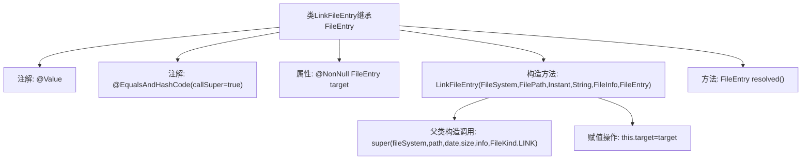

# 基础信息

|      |      |
|------|------|
| 名称 | LinkFileEntry |
| 编码语言 | .java |
| 代码路径 | xpipe/core/src/main/java/io/xpipe/core/store/LinkFileEntry.java |
| 包名 | io.xpipe.core.store |
| 依赖项 | ['lombok.EqualsAndHashCode', 'lombok.NonNull', 'lombok.Value', 'java.time.Instant'] |
| 概述说明 | LinkFileEntry继承FileEntry，包含目标文件引用和解析方法。 |

# 说明

LinkFileEntry类继承自FileEntry，用于表示文件系统中的链接文件。它包含一个不可为空的目标文件条目target，并通过构造函数初始化文件系统、路径、日期、大小、文件信息和目标文件。构造函数将文件类型固定为LINK。类提供了resolved方法返回目标文件条目。该类重写了equals和hashCode方法，并包含父类属性。

# 类列表 Class Summary

| 名称   | 类型  | 说明 |
|-------|------|-------------|
| LinkFileEntry | class | LinkFileEntry继承FileEntry，包含目标文件引用和解析方法。 |


## 类 LinkFileEntry

|      |      |
|------|------|
| 访问范围 | @Value;@EqualsAndHashCode(callSuper = true);public |
| 类型 | class |
| 名称 | LinkFileEntry |
| 说明 | LinkFileEntry继承FileEntry，包含目标文件引用和解析方法。 |


### UML类图

```mermaid
classDiagram
    class FileEntry {
        <<Abstract>>
        #FileSystem fileSystem
        #FilePath path
        #Instant date
        #String size
        #FileInfo info
        #FileKind kind
        +FileEntry(FileSystem, FilePath, Instant, String, FileInfo, FileKind)
    }

    class LinkFileEntry {
        -@NonNull FileEntry target
        +LinkFileEntry(FileSystem, FilePath, Instant, String, FileInfo, FileEntry)
        +FileEntry resolved()
    }

    FileEntry <|-- LinkFileEntry : 继承
    LinkFileEntry --> FileEntry : 包含\n: target
```

这段代码展示了一个文件系统中的符号链接实现。LinkFileEntry继承自抽象类FileEntry，表示一个指向另一个文件条目(FileEntry)的链接。类图清晰地呈现了继承关系(LinkFileEntry扩展FileEntry)和组合关系(包含目标FileEntry)。LinkFileEntry通过resolved()方法提供对目标文件的直接访问，体现了符号链接的核心功能。注解@NonNull确保关键字段的非空约束，而父类构造函数的FileKind.LINK参数明确标识了条目类型。


### 内部方法调用关系图



这段代码描述了一个LinkFileEntry类，它继承自FileEntry类，用于表示文件系统中的链接文件条目。类中包含一个不可为空的target属性指向实际文件条目，构造方法初始化父类属性并设置链接类型，resolved()方法直接返回目标文件条目。流程图展示了类结构、注解、属性、构造方法逻辑和方法调用关系。

### 字段列表 Field List

| 名称  | 类型  | 说明 |
|-------|-------|------|
| target | FileEntry | 非空文件条目目标 |

### 方法列表 Method List

| 名称  | 类型  | 说明 |
|-------|-------|------|
| resolved | FileEntry | 方法返回目标文件对象。 |


