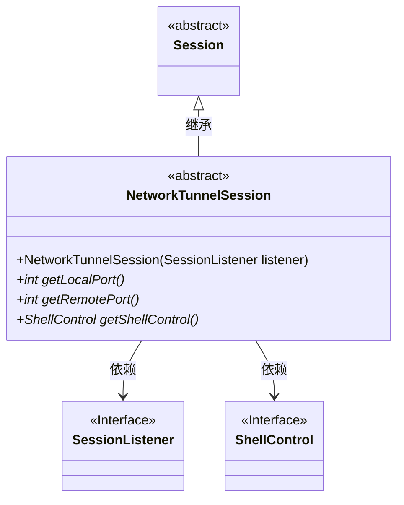
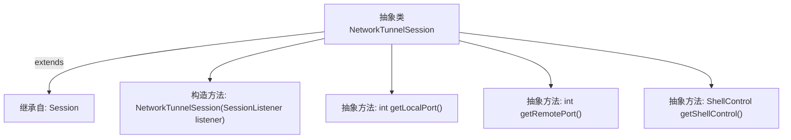

# 基础信息

|      |      |
|------|------|
| 名称 | NetworkTunnelSession |
| 编码语言 | .java |
| 代码路径 | xpipe/core/src/main/java/io/xpipe/core/store/NetworkTunnelSession.java |
| 包名 | io.xpipe.core.store |
| 依赖项 | ['io.xpipe.core.process.ShellControl'] |
| 概述说明 | 抽象类NetworkTunnelSession继承Session，定义本地端口、远程端口和ShellControl的抽象方法。 |

# 说明

这是一个名为NetworkTunnelSession的抽象类，继承自Session类。它提供了网络隧道会话的基础功能，包含一个受保护的构造函数，接收SessionListener参数并传递给父类。该类定义了三个抽象方法：getLocalPort用于获取本地端口号，getRemotePort用于获取远程端口号，getShellControl用于获取Shell控制接口。这些方法需要由具体子类实现。

# 类列表 Class Summary

| 名称   | 类型  | 说明 |
|-------|------|-------------|
| NetworkTunnelSession | class | 抽象类NetworkTunnelSession继承Session，定义本地端口、远程端口和ShellControl的抽象方法。 |

## 类 NetworkTunnelSession

|      |      |
|------|------|
| 访问范围 | public abstract |
| 类型 | class |
| 名称 | NetworkTunnelSession |
| 说明 | 抽象类NetworkTunnelSession继承Session，定义本地端口、远程端口和ShellControl的抽象方法。 |

### UML类图

该类图展示了NetworkTunnelSession作为Session的抽象子类，通过构造器依赖SessionListener接口，并声明了三个抽象方法：获取本地/远程端口号及ShellControl接口实例。NetworkTunnelSession作为网络隧道会话的基类，强制子类实现端口管理和Shell控制功能，体现了对会话扩展性的设计。SessionListener和ShellControl作为关键接口，分别处理会话事件和Shell操作交互。

### 内部方法调用关系图

这段流程图描述了抽象类NetworkTunnelSession的结构，该类继承自Session基类。包含一个需要SessionListener参数的构造方法，以及三个抽象方法：getLocalPort用于获取本地端口号，getRemotePort用于获取远程端口号，getShellControl用于获取Shell控制接口。所有抽象方法都需要子类实现，体现了网络隧道会话的核心功能契约。

### 字段列表 Field List

| 名称  | 类型  | 说明 |
|-------|-------|------|

### 方法列表 Method List

| 名称  | 类型  | 说明 |
|-------|-------|------|
| getRemotePort | int | 获取远程端口号的抽象方法。 |
| getLocalPort | int | 获取本地端口号的抽象方法。 |
| getShellControl | ShellControl | 获取Shell控制抽象方法 |

