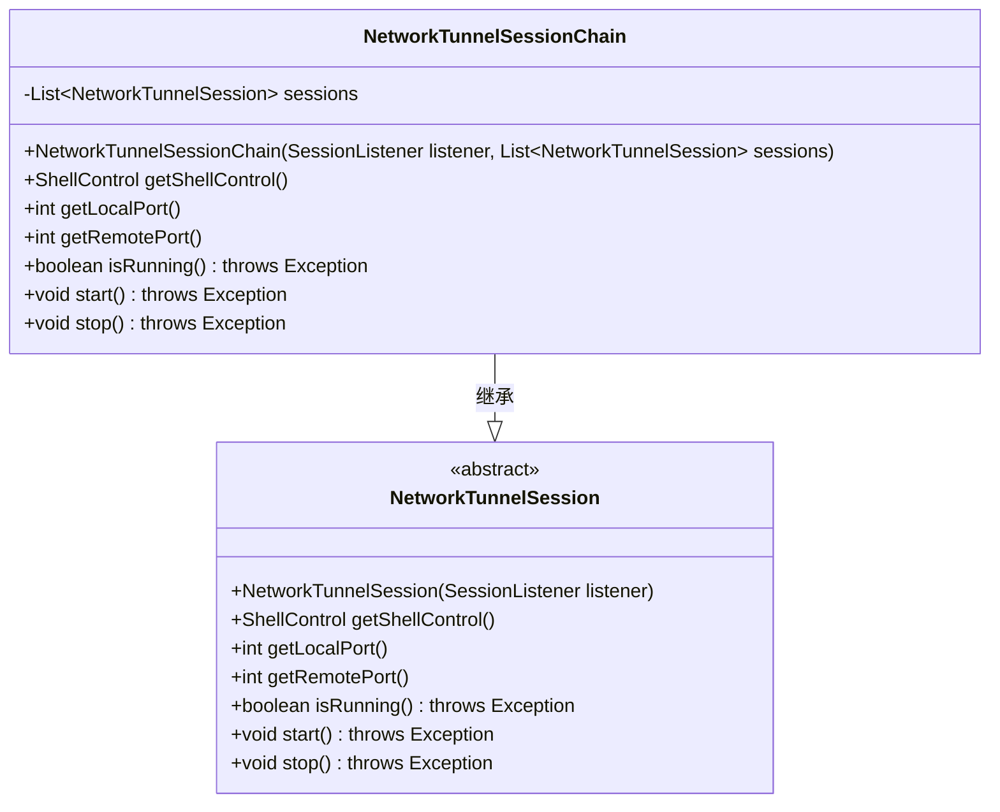
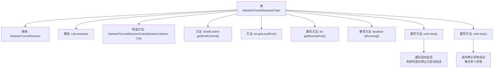

# 基础信息

|      |      |
|------|------|
| 名称 | NetworkTunnelSessionChain |
| 编码语言 | .java |
| 代码路径 | xpipe/core/src/main/java/io/xpipe/core/store/NetworkTunnelSessionChain.java |
| 包名 | io.xpipe.core.store |
| 依赖项 | ['io.xpipe.core.process.ShellControl', 'java.util.List'] |
| 概述说明 | 网络隧道会话链类，管理多个会话，提供端口控制、运行状态及启停功能。 |

# 说明

NetworkTunnelSessionChain是NetworkTunnelSession的子类，用于管理多个网络隧道会话链。它包含一个会话列表，通过构造函数初始化。主要功能包括获取最后一个会话的ShellControl、首个会话的本地端口和末会话的远程端口。检查所有会话运行状态，若任一停止则返回false。启动时会依次启动各会话，失败时回滚已启动会话。停止时逆序停止各会话，收集异常统一抛出。

# 类列表 Class Summary

| 名称   | 类型  | 说明 |
|-------|------|-------------|
| NetworkTunnelSessionChain | class | NetworkTunnelSessionChain管理多个隧道会话链，提供启动、停止及状态检查功能。 |

## 类 NetworkTunnelSessionChain

|      |      |
|------|------|
| 访问范围 | public |
| 类型 | class |
| 名称 | NetworkTunnelSessionChain |
| 说明 | NetworkTunnelSessionChain管理多个隧道会话链，提供启动、停止及状态检查功能。 |

### UML类图

这段代码展示了一个网络隧道会话链的实现，其中`NetworkTunnelSessionChain`继承自抽象类`NetworkTunnelSession`。该类通过维护一个`NetworkTunnelSession`列表来管理多个会话，提供了获取Shell控制、本地端口、远程端口以及检查运行状态的方法。`start()`和`stop()`方法实现了链式启动和停止的容错机制，确保在异常情况下能正确处理已启动的会话。整体设计体现了组合模式和异常处理的良好实践。

### 内部方法调用关系图

这段代码实现了网络隧道会话链的功能，通过组合多个NetworkTunnelSession对象形成链式结构。主要特点包括：1) 通过getShellControl()和端口方法代理到最后/首个会话；2) isRunning()需要检查所有会话状态；3) start()方法实现原子性启动，失败时自动回滚；4) stop()方法逆向停止并聚合异常。该设计体现了组合优于继承原则，支持会话链的可靠启动和关闭。

### 字段列表 Field List

| 名称  | 类型  | 说明 |
|-------|-------|------|
| sessions | List<NetworkTunnelSession> | 私有网络隧道会话列表。 |

### 方法列表 Method List

| 名称  | 类型  | 说明 |
|-------|-------|------|
| getShellControl | ShellControl | 获取最新会话的Shell控制对象。 |
| isRunning | boolean | 检查所有网络隧道会话是否运行，全部运行返回真，否则返回假。 |
| getLocalPort | int | 获取首个会话的本地端口号 |
| getRemotePort | int | 重写getRemotePort方法，返回最后会话的远程端口。 |
| start | void | 启动会话，失败时回滚已启动的会话。 |
| stop | void | 逆序停止会话，合并异常后抛出。 |

