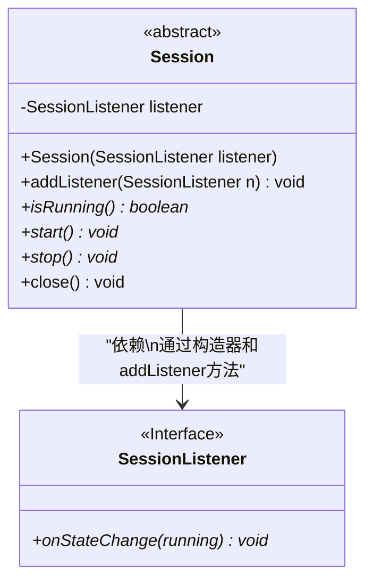
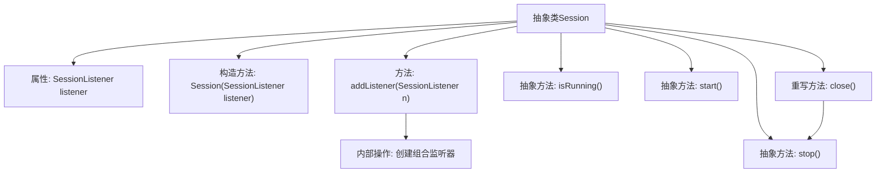

# 基础信息

|      |      |
|------|------|
| 名称 | Session |
| 编码语言 | .java |
| 代码路径 | xpipe/core/src/main/java/io/xpipe/core/store/Session.java |
| 包名 | io.xpipe.core.store |
| 依赖项 | [] |
| 概述说明 | 抽象类Session实现AutoCloseable，含监听器管理、启停抽象方法及关闭时自动停止。 |

# 说明

这是一个抽象类Session，实现了AutoCloseable接口。类中包含一个受保护的SessionListener类型成员变量listener。构造函数接收一个SessionListener参数初始化listener。提供addListener方法用于添加新的监听器，新监听器会与现有监听器形成链式调用。类声明了三个抽象方法：isRunning用于检查运行状态，start和stop分别控制启动和停止。close方法通过调用stop实现自动关闭功能。所有方法都可能抛出异常。

# 类列表 Class Summary

| 名称   | 类型  | 说明 |
|-------|------|-------------|
| Session | class | 抽象类Session实现AutoCloseable，含监听器管理和启停抽象方法。 |

## 类 Session

|      |      |
|------|------|
| 访问范围 | public abstract |
| 类型 | class |
| 名称 | Session |
| 说明 | 抽象类Session实现AutoCloseable，含监听器管理和启停抽象方法。 |

### UML类图

这段代码展示了一个抽象类`Session`及其与接口`SessionListener`的关系。`Session`实现了`AutoCloseable`接口，包含核心方法如`isRunning`、`start`、`stop`和`close`，并通过组合模式管理`SessionListener`。监听器接口定义状态变更回调方法`onStateChange`，`Session`通过构造器注入初始监听器，并支持动态添加多监听器（链式调用）。类图体现了抽象类与接口的依赖关系，以及`Session`对监听器生命周期的控制能力。

### 内部方法调用关系图

这段代码展示了一个抽象类Session的结构，该类实现了AutoCloseable接口。核心功能包括管理会话状态监听器（通过链式调用的方式组合多个监听器）、提供会话运行状态检查（isRunning）、启动（start）和停止（stop）等抽象方法。其中close()方法通过调用stop()实现自动关闭功能，addListener方法采用装饰器模式将新旧监听器组合成新函数，确保多个监听器能同时接收状态变更通知。整体设计体现了对会话生命周期的精细控制能力。

### 字段列表 Field List

| 名称  | 类型  | 说明 |
|-------|-------|------|
| listener | SessionListener | 保护型会话监听器变量listener。 |

### 方法列表 Method List

| 名称  | 类型  | 说明 |
|-------|-------|------|
| start | void | 抽象方法start，可能抛出异常。 |
| addListener | void | 添加监听器，合并新旧回调处理状态变更。 |
| stop | void | 抽象方法stop，可能抛出异常。 |
| isRunning | boolean | 抽象方法isRunning()，返回布尔值，可能抛出异常。 |
| close | void | 重写close方法，调用stop()。 |

