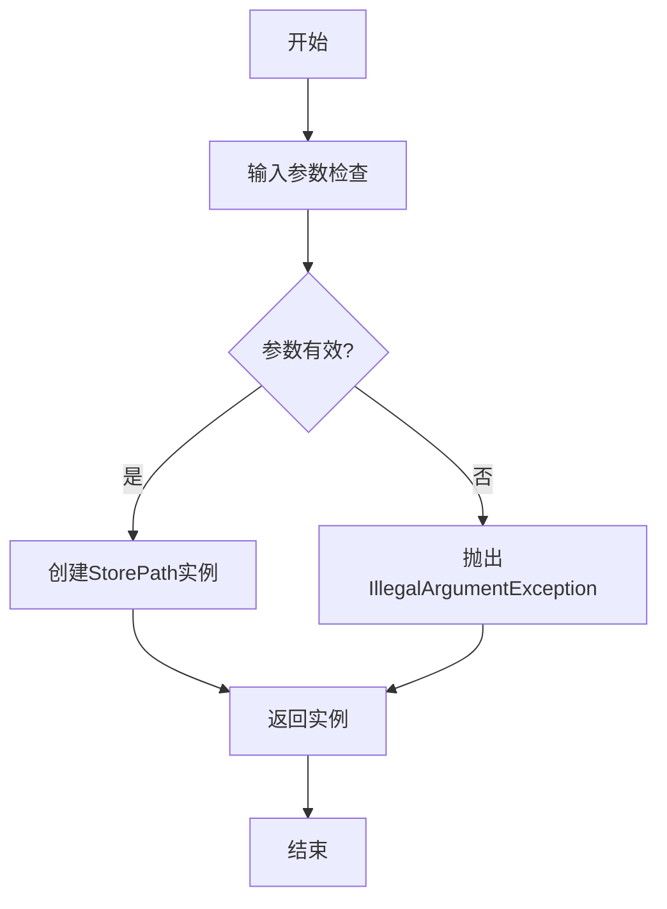
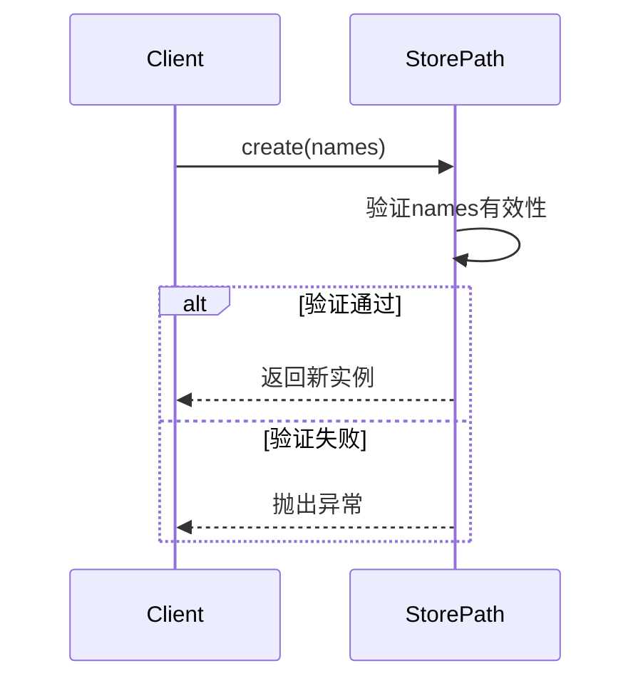
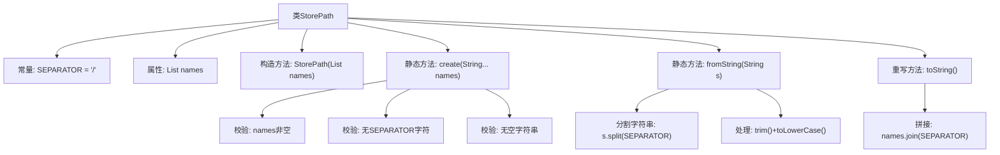

# 基础信息

|      |      |
|------|------|
| 名称 | StorePath |
| 编码语言 | .java |
| 代码路径 | xpipe/core/src/main/java/io/xpipe/core/store/StorePath.java |
| 包名 | io.xpipe.core.store |
| 依赖项 | ['com.fasterxml.jackson.annotation.JsonCreator', 'lombok.EqualsAndHashCode', 'lombok.Getter', 'java.util.Arrays', 'java.util.List', 'java.util.stream.Collectors'] |
| 概述说明 | 存储路径类，含名称列表，校验分隔符和空值，提供创建和字符串转换方法。 |

# 说明

这是一个名为StorePath的Java类，用于表示存储路径。它包含一个由字符串列表构成的路径名称，路径分隔符为斜杠。类提供了两个静态创建方法：create方法接受可变参数并验证名称非空、不含分隔符且非空字符串；fromString方法从字符串解析路径并验证有效性。toString方法将路径名称转为小写并用分隔符连接。类使用Lombok生成equals、hashCode和getter方法，确保路径对象的比较和访问一致性。

# 类列表 Class Summary

| 名称   | 类型  | 说明 |
|-------|------|-------------|
| StorePath | class | 存储路径类，含分隔符校验和名称列表，提供创建和字符串转换方法。 |


## 类 StorePath

|      |      |
|------|------|
| 访问范围 | @EqualsAndHashCode;@Getter;public |
| 类型 | class |
| 名称 | StorePath |
| 说明 | 存储路径类，含分隔符校验和名称列表，提供创建和字符串转换方法。 |


### UML类图

```mermaid
classDiagram
    class StorePath {
        -List~String~ names
        +SEPARATOR : char = '/'
        +StorePath(List~String~ names)
        +static StorePath create(String... names)
        +static StorePath fromString(String s)
        +String toString()
    }
    // StorePath类封装了路径存储逻辑，包含路径分隔符常量和路径名称列表
    // 提供静态工厂方法create()和fromString()来创建实例，并进行严格的输入验证
    // toString()方法将路径名称列表转换为小写并用分隔符连接的字符串
```

流程图：


时序图：


这段代码定义了一个StorePath类，用于管理由分隔符连接的路径名称。类中包含两个核心静态工厂方法：create()直接接收可变参数并验证，fromString()解析字符串为路径。两者都严格执行空值检查、分隔符检查和空白名称检查，确保路径格式合法。toString()方法统一输出小写字母且用分隔符连接的路径字符串，维护了路径表示的规范性。


### 内部方法调用关系图



这段代码定义了一个StorePath类，用于管理路径字符串的存储和转换。核心功能包括：1）通过create()方法校验并创建路径对象；2）通过fromString()解析字符串为路径对象；3）toString()将路径列表拼接为字符串。类中严格校验输入参数，禁止包含分隔符/、空值或空白字符串，所有路径组件会被自动转为小写。流程图清晰展示了构造方法、静态工厂方法和字符串处理的调用关系。

### 字段列表 Field List

| 名称  | 类型  | 说明 |
|-------|-------|------|
| names | List<String> | 私有字符串列表names |
| SEPARATOR = '/' | char | 静态常量字符分隔符为'/' |

### 方法列表 Method List

| 名称  | 类型  | 说明 |
|-------|-------|------|
| fromString | StorePath | 静态方法将字符串转为StorePath，检查非空且无空段，转为小写列表后构造对象。 |
| toString | String | 重写toString方法，将names转为小写并用分隔符连接。 |
| create | StorePath | 创建StorePath方法：检查名称非空、无分隔符、非空字符串后返回路径对象。 |


