# 基础信息

|      |      |
|------|------|
| 名称 | store |
| 编码语言 | .java |
| 代码路径 | xpipe/core/src/main/java/io/xpipe/core/store |
| 包名 | xpipe.core.src.main.java.io.xpipe.core.store |
| 概述说明 | FileEntry类表示文件系统条目，含路径、日期、大小等属性。DataStoreState是抽象基类，支持构建器模式。FilePath处理路径操作，支持跨平台。LinkFileEntry表示链接文件，含目标条目。EnabledStoreState继承DataStoreState，管理启用状态。FileNames提供路径处理静态方法。NetworkTunnelSession是抽象类，定义端口和Shell控制方法。Session是抽象基类，管理监听器和运行状态。NetworkTunnelSessionChain管理多个会话链。StorePath表示存储路径，支持创建和验证。 |

# 说明

```markdown
## 概述

该代码模块是一个文件系统与数据存储管理框架，主要提供以下核心功能：

1. **文件系统抽象**：通过`FileSystem`、`FileEntry`及其子类（如`LinkFileEntry`）实现跨平台文件条目管理，支持文件/目录操作、链接解析和元数据（路径、大小、类型等）处理。
2. **路径标准化**：`FilePath`和`FileNames`类提供统一的路径操作工具，包括格式转换（Unix/Windows）、路径拼接、相对化、有效性校验及缓存优化。
3. **状态管理**：`DataStoreState`及其子类（如`EnabledStoreState`）通过构建器模式和合并策略管理数据存储状态，支持类型安全转换和条件合并。
4. **会话控制**：`Session`及其子类（如`NetworkTunnelSession`）定义生命周期管理（启动/停止/运行状态），支持监听器链式调用和异常处理。
5. **网络隧道**：`NetworkTunnelSessionChain`实现多隧道会话的级联管理，提供端口映射、Shell控制及原子化启动/停止。

## 主要业务场景

1. **跨平台文件操作**  
   - 通过`FileEntry`和`FileSystem`抽象不同操作系统的文件访问，支持目录遍历、文件属性读取和符号链接解析（`LinkFileEntry.resolved()`）。
   - 使用`FileNames`和`FilePath`处理路径标准化，确保Windows/Unix路径兼容性。

2. **数据存储状态管理**  
   - `EnabledStoreState`等子类实现业务状态（如启用/禁用）的合并逻辑（`mergeCopy`），适用于配置动态更新场景。
   - `DataStoreState.useNewer()`提供版本冲突解决策略。

3. **网络隧道服务**  
   - `NetworkTunnelSessionChain`管理多跳隧道，确保端口转发链的原子化启停，适用于远程服务访问和安全代理场景。

4. **资源会话生命周期**  
   - `Session`及其子类（如`SingletonSessionStore`）控制资源（如SSH连接）的自动关闭（`AutoCloseable`）和状态监听。

5. **存储路径规范化**  
   - `StorePath`强制路径命名规则（小写、分隔符校验），适用于统一存储定位和层级访问。
```


### 包内部结构视图

```mermaid
graph TD
    store --> FileSystem.java
    store --> FileEntry.java
    store --> DataStoreState.java
    store --> InternalCacheDataStore.java
    store --> FileSystemStore.java
    store --> StatefulDataStore.java
    store --> FilePath.java
    store --> LinkFileEntry.java
    store --> FileInfo.java
    store --> FileKind.java
    store --> NetworkTunnelStore.java
    store --> SingletonSessionStore.java
    store --> SessionListener.java
    store --> FixedChildStore.java
    store --> EnabledStoreState.java
    store --> DataStore.java
    store --> FileNames.java
    store --> NetworkTunnelSession.java
    store --> Session.java
    store --> ValidatableStore.java
    store --> ExpandedLifecycleStore.java
    store --> NetworkTunnelSessionChain.java
    store --> StorePath.java
```



该流程图展示了xpipe/core模块中store目录下的文件结构，包含23个直接子文件，主要涉及文件系统操作、数据存储状态管理、网络隧道会话等核心功能类。所有文件均直接隶属于store节点，没有中间层级，形成扁平化结构，反映了该模块高度集中的功能设计。

# 文件列表 File List

| 名称   | 类型  | 说明 |
|-------|------|-------------|
| [FileSystem.java](FileSystem.md) | file | 输入内容为空，无法生成概要。请提供具体信息。 |
| [FileKind.java](FileKind.md) | file | 输入内容为空，无法生成概要。请提供具体信息以便总结。 |
| [FileInfo.java](FileInfo.md) | file | 输入内容为空，无法生成概要描述。请提供具体信息。 |
| [LinkFileEntry.java](LinkFileEntry.md) | file | LinkFileEntry继承FileEntry，包含目标文件引用和解析方法。 |
| [FilePath.java](FilePath.md) | file | FilePath类处理文件路径操作，支持Windows和Unix格式转换、路径拼接、标准化及根目录获取等功能。 |
| [StatefulDataStore.java](StatefulDataStore.md) | file | 输入内容为空，无法生成概要。请提供具体信息。 |
| [FileSystemStore.java](FileSystemStore.md) | file | 输入内容为空，无法生成概要描述。请提供具体信息以便总结。 |
| [InternalCacheDataStore.java](InternalCacheDataStore.md) | file | 输入内容为空，无法生成概要描述。 |
| [DataStoreState.java](DataStoreState.md) | file | 抽象类DataStoreState，支持构建器模式、相等比较，提供合并拷贝和空安全方法。 |
| [StorePath.java](StorePath.md) | file | 存储路径类，含名称列表，校验分隔符和空值，提供创建和字符串转换方法。 |
| [NetworkTunnelSessionChain.java](NetworkTunnelSessionChain.md) | file | 网络隧道会话链类，管理多个会话，提供端口控制、运行状态及启停功能。 |
| [ExpandedLifecycleStore.java](ExpandedLifecycleStore.md) | file | 当前输入内容为空，无法生成概要描述。请提供具体信息以便提炼关键点。 |
| [ValidatableStore.java](ValidatableStore.md) | file | 输入内容为空，无法生成概要描述。请提供具体信息以便总结。 |
| [Session.java](Session.md) | file | 抽象类Session实现AutoCloseable，含监听器管理、启停抽象方法及关闭时自动停止。 |
| [NetworkTunnelSession.java](NetworkTunnelSession.md) | file | 抽象类NetworkTunnelSession继承Session，定义本地端口、远程端口和ShellControl的抽象方法。 |
| [FileNames.java](FileNames.md) | file | 文件路径处理工具类，包含路径拼接、标准化、分割、相对路径转换等功能。 |
| [DataStore.java](DataStore.md) | file | 信息内容为空，无法生成概要。 |
| [EnabledStoreState.java](EnabledStoreState.md) | file | EnabledStoreState类继承DataStoreState，私有final字段，含enabled属性和mergeCopy合并方法。 |
| [FixedChildStore.java](FixedChildStore.md) | file | 输入内容为空，无法生成概要描述。 |
| [SessionListener.java](SessionListener.md) | file | 输入内容为空，无法生成概要。请提供具体信息。 |
| [SingletonSessionStore.java](SingletonSessionStore.md) | file | 输入内容为空，无法生成概要描述。 |
| [NetworkTunnelStore.java](NetworkTunnelStore.md) | file | 当前输入内容为空，请提供需要总结的具体信息。 |
| [FileEntry.java](FileEntry.md) | file | 文件类，含路径、日期、大小、类型等属性，支持目录创建和大小解析。 |


