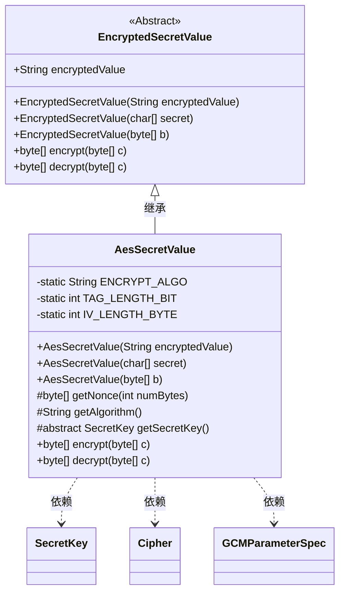
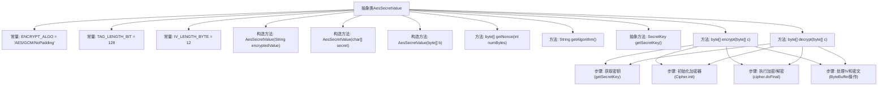

# 基础信息

|      |      |
|------|------|
| 名称 | AesSecretValue |
| 编码语言 | .java |
| 代码路径 | xpipe/core/src/main/java/io/xpipe/core/util/AesSecretValue.java |
| 包名 | io.xpipe.core.util |
| 依赖项 | ['lombok.EqualsAndHashCode', 'lombok.SneakyThrows', 'lombok.experimental.SuperBuilder', 'java.nio.ByteBuffer', 'java.nio.ByteOrder', 'java.security.SecureRandom', 'javax.crypto.Cipher', 'javax.crypto.SecretKey', 'javax.crypto.spec.GCMParameterSpec'] |
| 概述说明 | AesSecretValue类实现AES/GCM加密解密，含密钥生成与随机数生成功能。 |

# 说明

AesSecretValue是一个抽象类，继承自EncryptedSecretValue，用于AES加密解密操作。它使用AES/GCM/NoPadding算法，标签长度为128位，初始化向量为12字节。类提供了三种构造方法，分别接受加密字符串、字符数组或字节数组作为输入。核心功能包括生成随机nonce、获取加密算法以及抽象方法getSecretKey用于获取密钥。加密方法将初始化向量与密文拼接，解密方法则分离向量并解密数据。所有操作均依赖SecretKey，若密钥缺失将抛出异常。

# 类列表 Class Summary

| 名称   | 类型  | 说明 |
|-------|------|-------------|
| AesSecretValue | class | 抽象类AesSecretValue继承EncryptedSecretValue，使用AES/GCM加密算法，提供加解密功能。 |

## 类 AesSecretValue

|      |      |
|------|------|
| 访问范围 | @SuperBuilder;@EqualsAndHashCode(callSuper = true);public abstract |
| 类型 | class |
| 名称 | AesSecretValue |
| 说明 | 抽象类AesSecretValue继承EncryptedSecretValue，使用AES/GCM加密算法，提供加解密功能。 |

### UML类图

类图描述：
AesSecretValue是EncryptedSecretValue的抽象子类，实现了基于AES/GCM算法的加密解密功能。包含静态加密参数配置，提供构造方法和加解密实现。通过getSecretKey()抽象方法强制子类提供密钥，依赖Java密码学类（Cipher/GCMParameterSpec）完成核心操作。加解密过程包含IV生成、字节序处理等安全措施，体现了完整的AES-GCM算法实现流程。

### 内部方法调用关系图

该流程图展示了AesSecretValue抽象类的完整结构，包含3个构造方法、5个成员方法和3个常量定义。核心加密/解密流程分为4个关键步骤：获取密钥、初始化加密器、执行加密/解密操作、处理IV和密文的字节缓冲操作。类通过继承EncryptedSecretValue实现AES-GCM算法的加密功能，使用SecureRandom生成随机IV，并通过ByteBuffer进行数据拼接和解析。抽象方法getSecretKey()要求子类必须实现密钥获取逻辑。

### 字段列表 Field List

| 名称  | 类型  | 说明 |
|-------|-------|------|
| ENCRYPT_ALGO = "AES/GCM/NoPadding" | String | 私有静态常量，加密算法为AES/GCM/NoPadding。 |
| TAG_LENGTH_BIT = 128 | int | 私有静态常量TAG_LENGTH_BIT值为128。 |
| IV_LENGTH_BYTE = 12 | int | 定义常量IV_LENGTH_BYTE值为12，表示初始化向量字节长度。 |

### 方法列表 Method List

| 名称  | 类型  | 说明 |
|-------|-------|------|
| getNonce | byte[] | 生成指定长度的随机字节数组。 |
| encrypt | byte[] | 加密方法：检查密钥，生成IV，加密数据并拼接IV和密文返回。 |
| decrypt | byte[] | 解密方法：读取IV和密文，检查密钥后使用GCM模式解密。 |
| getAlgorithm | String | 方法返回加密算法"AES/GCM/NoPadding"。 |
| getSecretKey | SecretKey | 获取密钥的抽象方法 |

