# 基础信息

|      |      |
|------|------|
| 名称 | CoreJacksonModule |
| 编码语言 | .java |
| 代码路径 | xpipe/core/src/main/java/io/xpipe/core/util/CoreJacksonModule.java |
| 包名 | io.xpipe.core.util |
| 依赖项 | ['io.xpipe.core.dialog.BaseQueryElement', 'io.xpipe.core.dialog.BusyElement', 'io.xpipe.core.dialog.ChoiceElement', 'io.xpipe.core.dialog.HeaderElement', 'io.xpipe.core.process.OsType', 'io.xpipe.core.process.ShellDialect', 'io.xpipe.core.process.ShellDialects', 'io.xpipe.core.process.ShellScript', 'io.xpipe.core.store.FilePath', 'io.xpipe.core.store.StorePath', 'com.fasterxml.jackson.annotation.JsonIdentityInfo', 'com.fasterxml.jackson.annotation.ObjectIdGenerators', 'com.fasterxml.jackson.core.JsonGenerator', 'com.fasterxml.jackson.core.JsonParser', 'com.fasterxml.jackson.databind', 'com.fasterxml.jackson.databind.annotation.JsonSerialize', 'com.fasterxml.jackson.databind.jsontype.NamedType', 'com.fasterxml.jackson.databind.module.SimpleModule', 'java.io.IOException', 'java.nio.charset.Charset', 'java.nio.file.Path', 'java.util.List', 'java.util.stream.Stream'] |
| 概述说明 | CoreJacksonModule注册多种序列化器和子类型，处理文件路径、字符集、脚本等类型转换。 |

# 说明

CoreJacksonModule是一个自定义Jackson模块，用于注册多种类型的序列化器和反序列化器。它注册了InPlaceSecretValue、BaseQueryElement等类的子类型，并为FilePath、StorePath、Charset、ShellDialect、NewLine、StreamCharset、Path、OsType等类型提供了序列化和反序列化实现。模块还处理了ShellScript的序列化，并通过ThrowableTypeMixIn为Throwable类添加了混入注解。所有序列化器和反序列化器均实现了将对象转换为JSON字符串或从JSON字符串重建对象的功能。

# 类列表 Class Summary

| 名称   | 类型  | 说明 |
|-------|------|-------------|
| CoreJacksonModule | class | CoreJacksonModule注册多种序列化器和子类型，处理文件路径、字符集、Shell脚本等对象的JSON转换。 |

## 类 CoreJacksonModule

|      |      |
|------|------|
| 访问范围 | public |
| 类型 | class |
| 名称 | CoreJacksonModule |
| 说明 | CoreJacksonModule注册多种序列化器和子类型，处理文件路径、字符集、Shell脚本等对象的JSON转换。 |

### UML类图

```mermaid
classDiagram
    class CoreJacksonModule {
        +setupModule(SetupContext context) void
    }

    class JsonSerializer~T~ {
        <<Interface>>
        +serialize(T value, JsonGenerator jgen, SerializerProvider provider) void
    }

    class JsonDeserializer~T~ {
        <<Interface>>
        +deserialize(JsonParser p, DeserializationContext ctxt) T
    }

    class ShellScriptSerializer {
        +serialize(ShellScript value, JsonGenerator jgen, SerializerProvider provider) void
    }
    ShellScriptSerializer --|> JsonSerializer~ShellScript~

    class ShellScriptDeserializer {
        +deserialize(JsonParser p, DeserializationContext ctxt) ShellScript
    }
    ShellScriptDeserializer --|> JsonDeserializer~ShellScript~

    class StorePathSerializer {
        +serialize(StorePath value, JsonGenerator jgen, SerializerProvider provider) void
    }
    StorePathSerializer --|> JsonSerializer~StorePath~

    class StorePathDeserializer {
        +deserialize(JsonParser p, DeserializationContext ctxt) StorePath
    }
    StorePathDeserializer --|> JsonDeserializer~StorePath~

    class FilePathSerializer {
        +serialize(FilePath value, JsonGenerator jgen, SerializerProvider provider) void
    }
    FilePathSerializer --|> JsonSerializer~FilePath~

    class FilePathDeserializer {
        +deserialize(JsonParser p, DeserializationContext ctxt) FilePath
    }
    FilePathDeserializer --|> JsonDeserializer~FilePath~

    class CharsetSerializer {
        +serialize(Charset value, JsonGenerator jgen, SerializerProvider provider) void
    }
    CharsetSerializer --|> JsonSerializer~Charset~

    class CharsetDeserializer {
        +deserialize(JsonParser p, DeserializationContext ctxt) Charset
    }
    CharsetDeserializer --|> JsonDeserializer~Charset~

    class ShellDialectSerializer {
        +serialize(ShellDialect value, JsonGenerator jgen, SerializerProvider provider) void
    }
    ShellDialectSerializer --|> JsonSerializer~ShellDialect~

    class ShellDialectDeserializer {
        +deserialize(JsonParser p, DeserializationContext ctxt) ShellDialect
    }
    ShellDialectDeserializer --|> JsonDeserializer~ShellDialect~

    class NewLineSerializer {
        +serialize(NewLine value, JsonGenerator jgen, SerializerProvider provider) void
    }
    NewLineSerializer --|> JsonSerializer~NewLine~

    class NewLineDeserializer {
        +deserialize(JsonParser p, DeserializationContext ctxt) NewLine
    }
    NewLineDeserializer --|> JsonDeserializer~NewLine~

    class StreamCharsetSerializer {
        +serialize(StreamCharset value, JsonGenerator jgen, SerializerProvider provider) void
    }
    StreamCharsetSerializer --|> JsonSerializer~StreamCharset~

    class StreamCharsetDeserializer {
        +deserialize(JsonParser p, DeserializationContext ctxt) StreamCharset
    }
    StreamCharsetDeserializer --|> JsonDeserializer~StreamCharset~

    class LocalPathSerializer {
        +serialize(Path value, JsonGenerator jgen, SerializerProvider provider) void
    }
    LocalPathSerializer --|> JsonSerializer~Path~

    class LocalPathDeserializer {
        +deserialize(JsonParser p, DeserializationContext ctxt) Path
    }
    LocalPathDeserializer --|> JsonDeserializer~Path~

    class OsTypeSerializer {
        +serialize(OsType value, JsonGenerator jgen, SerializerProvider provider) void
    }
    OsTypeSerializer --|> JsonSerializer~OsType~

    class OsTypeLocalDeserializer {
        +deserialize(JsonParser p, DeserializationContext ctxt) OsType.Local
    }
    OsTypeLocalDeserializer --|> JsonDeserializer~OsType.Local~

    class OsTypeAnyDeserializer {
        +deserialize(JsonParser p, DeserializationContext ctxt) OsType.Any
    }
    OsTypeAnyDeserializer --|> JsonDeserializer~OsType.Any~

    class ThrowableTypeMixIn {
        -Throwable cause
    }

    CoreJacksonModule --> JsonSerializer : "注册序列化器"
    CoreJacksonModule --> JsonDeserializer : "注册反序列化器"
```

这段代码是CoreJacksonModule类，它继承自SimpleModule，用于配置Jackson的序列化和反序列化规则。该类通过setupModule方法注册了多个自定义的序列化器和反序列化器，用于处理特定类型的对象，如ShellScript、StorePath、FilePath、Charset等。每个序列化器和反序列化器都实现了对应的接口，并通过泛型指定处理的类型。此外，还通过MixIn机制为Throwable类添加了额外的序列化配置。整体设计采用了模块化的方式，便于扩展和维护。

### 内部方法调用关系图

这段代码是CoreJacksonModule类的实现，主要用于配置Jackson JSON处理模块。它通过setupModule方法注册了多种类型的序列化器和反序列化器，包括文件路径、存储路径、字符集、Shell方言等特定类型的处理逻辑。每个内部类都实现了对应类型的序列化/反序列化逻辑，采用标准的Jackson接口实现。该模块还通过混入注解为Throwable类型添加了特殊的JSON处理配置，整体构成了一个完整的Jackson扩展模块，用于处理特定领域的对象序列化需求。

### 字段列表 Field List

| 名称  | 类型  | 说明 |
|-------|-------|------|

### 方法列表 Method List

| 名称  | 类型  | 说明 |
|-------|-------|------|
| setupModule | void | 注册子类型并添加序列化与反序列化器。 |

