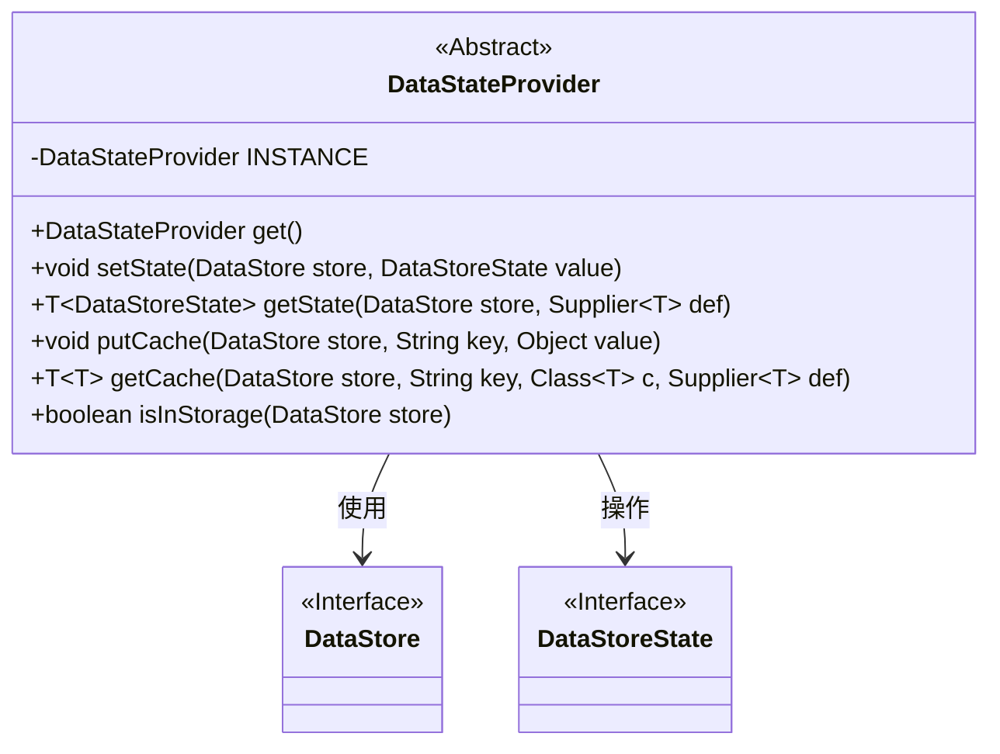
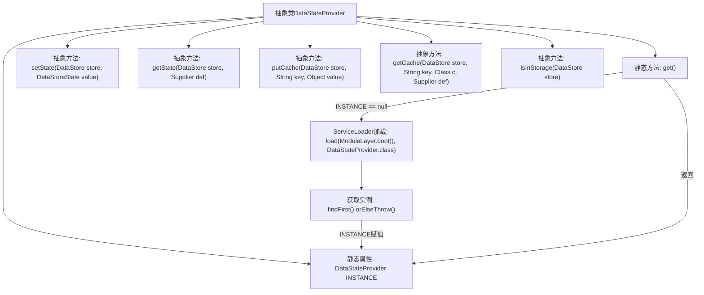

# 基础信息

|      |      |
|------|------|
| 名称 | DataStateProvider |
| 编码语言 | .java |
| 代码路径 | xpipe/core/src/main/java/io/xpipe/core/util/DataStateProvider.java |
| 包名 | io.xpipe.core.util |
| 依赖项 | ['io.xpipe.core.store.DataStore', 'io.xpipe.core.store.DataStoreState', 'java.util.ServiceLoader', 'java.util.function.Supplier'] |
| 概述说明 | 抽象类提供数据状态管理，含单例获取、状态存取、缓存操作及存储检查方法。 |

# 说明

这是一个抽象类DataStateProvider，用于管理数据状态。它采用单例模式，通过ServiceLoader加载实现类并缓存到INSTANCE。提供获取实例的静态方法get()。包含五个抽象方法：setState用于设置数据状态，getState用于获取数据状态，putCache和getCache用于缓存操作，isInStorage检查数据是否在存储中。所有方法都基于DataStore对象操作。

# 类列表 Class Summary

| 名称   | 类型  | 说明 |
|-------|------|-------------|
| DataStateProvider | class | 抽象类提供数据状态管理，含单例获取、状态读写、缓存操作及存储检查功能。 |

## 类 DataStateProvider

|      |      |
|------|------|
| 访问范围 | public abstract |
| 类型 | class |
| 名称 | DataStateProvider |
| 说明 | 抽象类提供数据状态管理，含单例获取、状态读写、缓存操作及存储检查功能。 |

### UML类图

这段代码定义了一个抽象类`DataStateProvider`，采用单例模式通过`ServiceLoader`加载实现实例。它提供了数据存储状态管理的核心功能，包括设置/获取状态、缓存操作和存储检测等抽象方法。类图中清晰地展示了与`DataStore`和`DataStoreState`两个接口的依赖关系，其中泛型方法通过`~T~`语法标注，体现了对多种状态类型的支持能力。

### 内部方法调用关系图

该流程图展示了DataStateProvider抽象类的核心结构和初始化流程。类包含一个静态INSTANCE属性和获取实例的get()方法，该方法通过ServiceLoader动态加载实现类并初始化单例。类定义了5个抽象方法用于数据状态管理，包括设置/获取状态、缓存操作和存储检查。初始化流程采用懒加载模式，当首次调用get()时通过ServiceLoader机制加载实现类实例。

### 字段列表 Field List

| 名称  | 类型  | 说明 |
|-------|-------|------|
| INSTANCE | DataStateProvider | 私有静态单例实例DataStateProvider。 |

### 方法列表 Method List

| 名称  | 类型  | 说明 |
|-------|-------|------|
| isInStorage | boolean | 检查数据是否在存储中。 |
| putCache | void | 抽象方法：存入缓存，参数为存储对象、键、值。 |
| getState | T | 获取存储状态，若无则使用默认值生成。 |
| setState | void | 抽象方法：设置数据存储状态。 |
| get | DataStateProvider | 获取单例DataStateProvider实例，若未初始化则通过ServiceLoader加载并返回首个实现。 |
| getCache | T | 抽象方法：根据键从缓存获取数据，无则调用Supplier生成。 |

