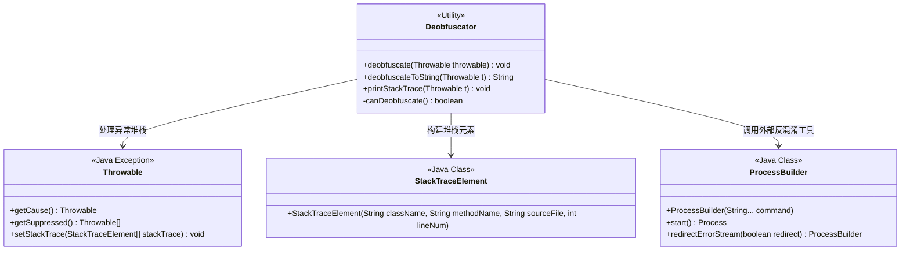
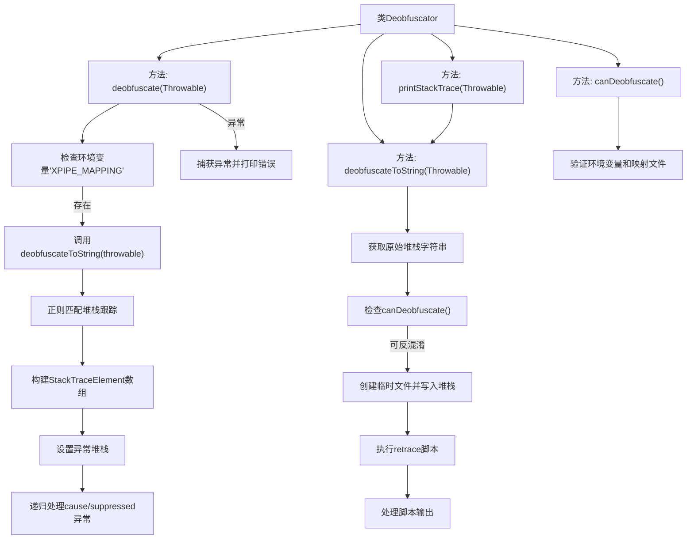

# 基础信息

|      |      |
|------|------|
| 名称 | Deobfuscator |
| 编码语言 | .java |
| 代码路径 | xpipe/core/src/main/java/io/xpipe/core/util/Deobfuscator.java |
| 包名 | io.xpipe.core.util |
| 依赖项 | ['io.xpipe.core.process.OsType', 'java.io.PrintWriter', 'java.io.StringWriter', 'java.nio.file.Files', 'java.nio.file.Path', 'java.util.ArrayList', 'java.util.List', 'java.util.regex.Matcher', 'java.util.regex.Pattern'] |
| 概述说明 | 反混淆异常堆栈，解析并重设堆栈信息，支持递归处理嵌套异常。 |

# 说明

该代码定义了一个名为Deobfuscator的类，用于对混淆的异常堆栈信息进行反混淆处理。主要功能包括检查环境变量XPIPE_MAPPING是否存在，若存在则调用外部脚本对堆栈信息进行反混淆。反混淆过程包括解析堆栈跟踪字符串，提取类名、方法名、源文件和行号，并重新设置异常堆栈。同时处理异常的cause和suppressed异常。若反混淆失败，则输出原始堆栈信息。还提供了打印反混淆后堆栈信息的方法。整个过程包括临时文件操作和外部进程调用。

# 类列表 Class Summary

| 名称   | 类型  | 说明 |
|-------|------|-------------|
| Deobfuscator | class | 反混淆异常堆栈信息，支持递归处理。 |

## 类 Deobfuscator

|      |      |
|------|------|
| 访问范围 | public |
| 类型 | class |
| 名称 | Deobfuscator |
| 说明 | 反混淆异常堆栈信息，支持递归处理。 |

### UML类图

类图描述：
该图展示了Deobfuscator工具类与Java核心类的关系，主要功能是通过环境变量XPIPE_MAPPING调用外部工具对混淆后的异常堆栈进行反混淆处理。Deobfuscator包含4个方法：deobfuscate递归处理异常链、deobfuscateToString转换堆栈字符串、printStackTrace输出结果，以及私有方法canDeobfuscate检查环境配置。通过ProcessBuilder调用外部脚本，最终重构StackTraceElement数组来还原原始堆栈信息。

### 内部方法调用关系图

流程图描述：该流程图展示了Deobfuscator类的完整工作流程。核心方法deobfuscate首先检查环境变量，然后通过deobfuscateToString获取反混淆后的堆栈字符串，使用正则表达式解析并重建堆栈跟踪，递归处理所有关联异常。deobfuscateToString方法负责执行实际的反混淆操作，包括调用外部retrace工具处理混淆后的堆栈跟踪。整个过程包含完善的错误处理和验证机制，确保反混淆操作的可靠性。

### 字段列表 Field List

| 名称  | 类型  | 说明 |
|-------|-------|------|

### 方法列表 Method List

| 名称  | 类型  | 说明 |
|-------|-------|------|
| printStackTrace | void | Java方法：打印异常堆栈信息到标准错误流。 |
| canDeobfuscate | boolean | 检查环境变量XPIPE_MAPPING是否存在且对应文件有效。 |
| deobfuscate | void | 静态方法解混淆异常堆栈，需环境变量XPIPE_MAPPING，匹配堆栈元素并重构。递归处理原因和抑制异常。失败时打印错误。 |
| deobfuscateToString | String | Java方法：反混淆异常堆栈，调用外部工具处理失败返回原堆栈。 |

