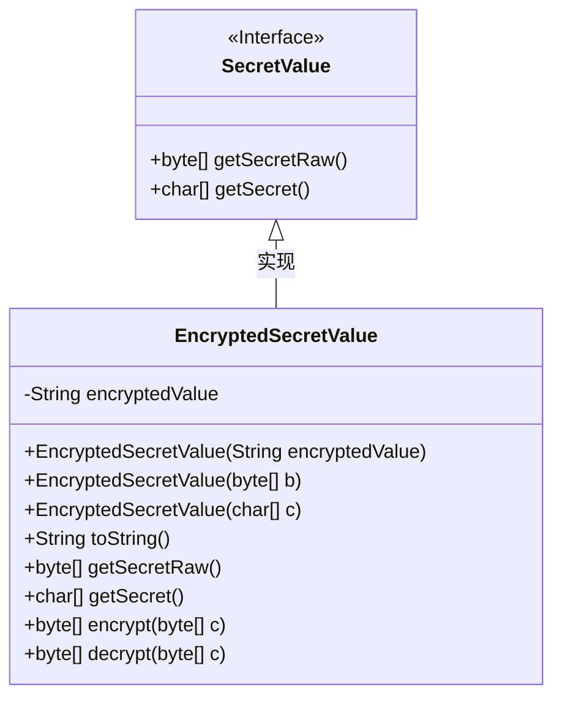
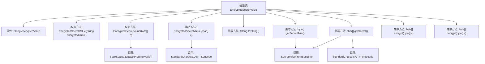

# 基础信息

|      |      |
|------|------|
| 名称 | EncryptedSecretValue |
| 编码语言 | .java |
| 代码路径 | xpipe/core/src/main/java/io/xpipe/core/util/EncryptedSecretValue.java |
| 包名 | io.xpipe.core.util |
| 依赖项 | ['lombok.EqualsAndHashCode', 'lombok.Getter', 'lombok.experimental.SuperBuilder', 'java.nio.ByteBuffer', 'java.nio.CharBuffer', 'java.nio.charset.StandardCharsets'] |
| 概述说明 | 抽象类EncryptedSecretValue实现SecretValue，含加密解密方法，支持字符串、字节数组和字符数组操作。 |

# 说明

该代码定义了一个抽象类EncryptedSecretValue，实现了SecretValue接口，用于处理加密的敏感数据。类中包含一个encryptedValue字段存储加密值，提供三种构造方法：直接传入加密字符串、字节数组或字符数组。类提供了getSecretRaw和getSecret方法分别返回解密后的字节数组和字符数组，内部使用Base64编解码和加解密操作。加解密方法encrypt和decrypt被声明为抽象方法需子类实现。toString方法返回固定字符串避免泄露敏感信息。类使用了Lombok注解生成Getter、构建器和EqualsHashCode方法。

# 类列表 Class Summary

| 名称   | 类型  | 说明 |
|-------|------|-------------|
| EncryptedSecretValue | class | 抽象类EncryptedSecretValue实现加密存储，提供字符串、字节数组和字符数组的加密转换方法。 |

## 类 EncryptedSecretValue

|      |      |
|------|------|
| 访问范围 | @Getter;@SuperBuilder;@EqualsAndHashCode;public abstract |
| 类型 | class |
| 名称 | EncryptedSecretValue |
| 说明 | 抽象类EncryptedSecretValue实现加密存储，提供字符串、字节数组和字符数组的加密转换方法。 |

### UML类图

这段代码展示了一个抽象类`EncryptedSecretValue`及其与接口`SecretValue`的关系。`EncryptedSecretValue`实现了`SecretValue`接口，提供了加密秘密值的基本功能，包括从不同数据类型构造加密值、获取原始秘密数据和解密功能。类中包含核心字段`encryptedValue`和多个构造函数，以及处理字节数组和字符数组的加密/解密方法（默认抛出未支持操作异常）。该类使用Lombok注解自动生成getter、builder和equals/hashCode方法，体现了秘密值的安全处理模式。

### 内部方法调用关系图

这段代码定义了一个抽象类`EncryptedSecretValue`，用于处理加密的敏感数据。类中包含三个构造方法，分别接受字符串、字节数组和字符数组作为输入，并将其转换为加密的Base64字符串。类还提供了获取原始字节数组和字符数组的方法`getSecretRaw`和`getSecret`，这两个方法会先解密数据再返回。加密和解密的具体实现由子类完成，抽象方法`encrypt`和`decrypt`需要子类实现。整个流程涉及Base64编解码、UTF-8字符编码转换等操作。

### 字段列表 Field List

| 名称  | 类型  | 说明 |
|-------|-------|------|
| encryptedValue | String | 加密字符串变量声明 |

### 方法列表 Method List

| 名称  | 类型  | 说明 |
|-------|-------|------|
| decrypt | byte[] | 解密方法未实现，抛出不支持操作异常。 |
| encrypt | byte[] | 未实现的加密方法，抛出不支持操作异常。 |
| getSecret | char[] | 解密Base64编码的加密值并转为UTF-8字符数组，失败返回空数组。 |
| toString | String | 重写toString方法，返回加密字符串。 |
| getSecretRaw | byte[] | 方法解密Base64编码值，失败返回空字节数组。 |

