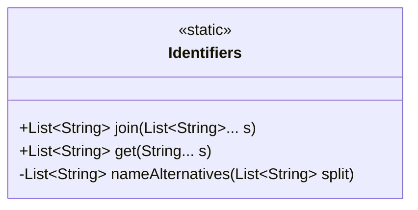
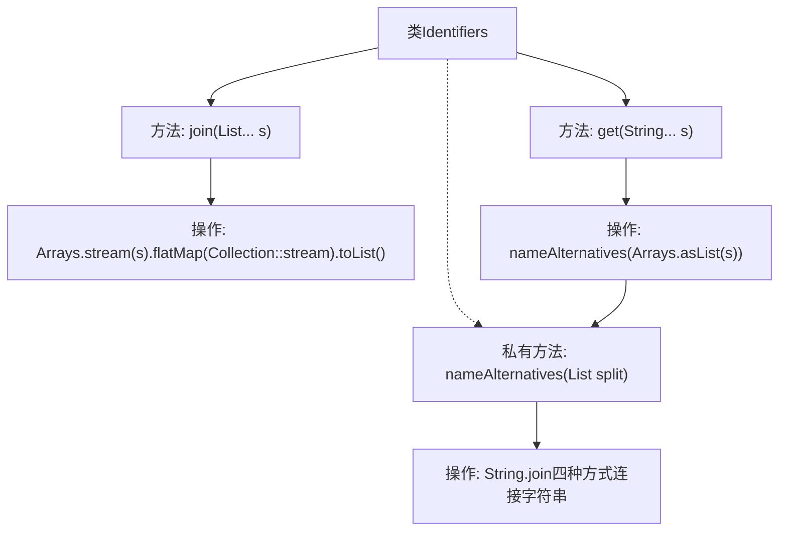

# 基础信息

|      |      |
|------|------|
| 名称 | Identifiers |
| 编码语言 | .java |
| 代码路径 | xpipe/core/src/main/java/io/xpipe/core/util/Identifiers.java |
| 包名 | io.xpipe.core.util |
| 依赖项 | ['java.util.Arrays', 'java.util.Collection', 'java.util.List'] |
| 概述说明 | 合并字符串列表并生成多种格式组合。 |

# 说明

该代码定义了一个名为Identifiers的类，包含三个方法。join方法使用可变参数接收多个字符串列表，通过流操作合并为一个新列表。get方法接收可变字符串参数，调用私有方法nameAlternatives处理。nameAlternatives方法将输入的字符串列表生成四种不同连接形式：无间隔、空格间隔、下划线间隔和短横线间隔，并返回包含这四种结果的列表。所有方法均返回不可修改的列表。

# 类列表 Class Summary

| 名称   | 类型  | 说明 |
|-------|------|-------------|
| Identifiers | class | 类Identifiers提供合并字符串列表和生成名称变体的方法。 |

## 类 Identifiers

|      |      |
|------|------|
| 访问范围 | public |
| 类型 | class |
| 名称 | Identifiers |
| 说明 | 类Identifiers提供合并字符串列表和生成名称变体的方法。 |

### UML类图

该代码展示了一个名为`Identifiers`的工具类，包含三个处理字符串列表的方法。静态方法`join()`使用可变参数接收多个字符串列表，通过流式操作将其合并为单一列表；`get()`方法接收可变字符串参数并调用私有方法`nameAlternatives()`；后者生成四种不同分隔符连接的字符串变体（无分隔符、空格、下划线和连字符）。类设计专注于字符串标识符的格式转换，采用函数式编程风格且线程安全。

### 内部方法调用关系图

这段代码流程图展示了Identifiers类的三个核心方法调用关系。join方法接收可变参数列表并通过流式操作扁平化合并多个列表；get方法将可变字符串参数转换为列表后调用私有方法nameAlternatives；nameAlternatives使用四种不同分隔符（无间隔、空格、下划线、连字符）连接字符串列表生成新列表。整个流程体现了字符串处理的灵活性和组合性。

### 字段列表 Field List

| 名称  | 类型  | 说明 |
|-------|-------|------|

### 方法列表 Method List

| 名称  | 类型  | 说明 |
|-------|-------|------|
| join | List<String> | 合并多个字符串列表为一个列表。 |
| get | List<String> | 静态方法get接收可变字符串参数，返回字符串列表。 |
| nameAlternatives | List<String> | 生成字符串列表的不同连接形式：无分隔、空格、下划线、连字符。 |

