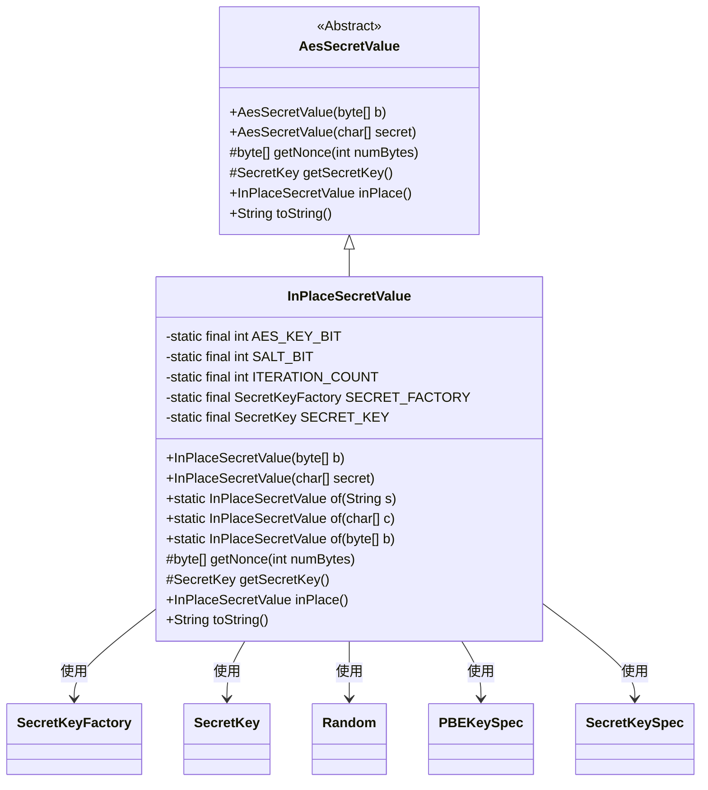

# 基础信息

|      |      |
|------|------|
| 名称 | InPlaceSecretValue |
| 编码语言 | .java |
| 代码路径 | xpipe/core/src/main/java/io/xpipe/core/util/InPlaceSecretValue.java |
| 包名 | io.xpipe.core.util |
| 依赖项 | ['com.fasterxml.jackson.annotation.JsonTypeName', 'lombok.EqualsAndHashCode', 'lombok.experimental.SuperBuilder', 'lombok.extern.jackson.Jacksonized', 'java.security.NoSuchAlgorithmException', 'java.security.spec.InvalidKeySpecException', 'java.security.spec.KeySpec', 'java.util.Random', 'javax.crypto.SecretKey', 'javax.crypto.SecretKeyFactory', 'javax.crypto.spec.PBEKeySpec', 'javax.crypto.spec.SecretKeySpec'] |
| 概述说明 | InPlaceSecretValue类继承AesSecretValue，使用AES加密和PBKDF2算法生成密钥，支持多种输入类型。 |

# 说明

InPlaceSecretValue类继承自AesSecretValue，用于处理加密密钥。使用PBKDF2WithHmacSHA256算法生成128位AES密钥，包含16位随机盐和2048次迭代。提供多种构造方法，支持字符串、字符数组和字节数组输入。包含生成随机nonce和获取密钥的方法，重写了toString返回固定字符串。静态初始化块负责密钥工厂和密钥的生成，异常时抛出IllegalStateException。

# 类列表 Class Summary

| 名称   | 类型  | 说明 |
|-------|------|-------------|
| InPlaceSecretValue | class | InPlaceSecretValue类，继承AesSecretValue，使用AES-128加密，提供多种构造方法和密钥生成功能。 |


## 类 InPlaceSecretValue

|      |      |
|------|------|
| 访问范围 | @JsonTypeName("default");@SuperBuilder;@Jacksonized;@EqualsAndHashCode(callSuper = true);public |
| 类型 | class |
| 名称 | InPlaceSecretValue |
| 说明 | InPlaceSecretValue类，继承AesSecretValue，使用AES-128加密，提供多种构造方法和密钥生成功能。 |


### UML类图



类图描述：
InPlaceSecretValue继承自抽象类AesSecretValue，实现了基于AES的加密功能。该类包含静态常量用于配置加密参数（如密钥长度、盐值长度等），并通过静态初始化块创建SecretKeyFactory和SecretKey实例。提供了多种静态工厂方法of()用于创建实例，并重写了父类的加密相关方法。该类与Java加密体系中的SecretKeyFactory、SecretKey等类存在依赖关系，用于实现PBKDF2密钥派生和AES加密功能。


### 内部方法调用关系图

```mermaid
graph TD
    A["类InPlaceSecretValue"]
    B["静态常量: AES_KEY_BIT=128"]
    C["静态常量: SALT_BIT=16"]
    D["静态常量: ITERATION_COUNT=2048"]
    E["静态变量: SECRET_FACTORY"]
    F["静态变量: SECRET_KEY"]
    G["静态初始化块"]
    H["构造方法: InPlaceSecretValue(byte[] b)"]
    I["构造方法: InPlaceSecretValue(char[] secret)"]
    J["静态工厂方法: of(String s)"]
    K["静态工厂方法: of(char[] c)"]
    L["静态工厂方法: of(byte[] b)"]
    M["方法: getNonce(int numBytes)"]
    N["重写方法: getSecretKey()"]
    O["重写方法: inPlace()"]
    P["重写方法: toString()"]

    A --> B
    A --> C
    A --> D
    A --> E
    A --> F
    A --> G
    G -->|"try-catch块"| E
    G -->|"生成随机salt"| F
    A --> H
    A --> I
    A --> J
    J -->|"调用构造方法"| I
    A --> K
    K -->|"调用构造方法"| I
    A --> L
    L -->|"调用构造方法"| H
    A --> M
    M -->|"生成随机nonce"| "new Random"
    A --> N
    N -->|"返回SECRET_KEY"| F
    A --> O
    O -->|"返回this"| A
    A --> P
    P -->|"返回固定字符串"| "'<in place secret>'"
```

这段代码定义了一个用于安全存储秘密值的`InPlaceSecretValue`类，继承自`AesSecretValue`。类通过静态初始化块使用PBKDF2算法生成AES密钥，提供多种构造方法和工厂方法创建实例，并实现了密钥获取、随机数生成等安全相关功能。所有静态字段在类加载时初始化，确保密钥生成过程的安全性和唯一性。

### 字段列表 Field List

| 名称  | 类型  | 说明 |
|-------|-------|------|
| SECRET_FACTORY | SecretKeyFactory | 私有静态常量密钥工厂SECRET_FACTORY |
| SECRET_KEY | SecretKey | 私有静态常量密钥SECRET_KEY。 |
| AES_KEY_BIT = 128 | int | 定义AES密钥长度为128位的私有静态常量。 |
| SALT_BIT = 16 | int | 定义16位盐值的静态常量。 |
| ITERATION_COUNT = 2048 | int | 私有静态常量迭代次数2048 |

### 方法列表 Method List

| 名称  | 类型  | 说明 |
|-------|-------|------|
| of | InPlaceSecretValue | 静态方法，创建InPlaceSecretValue实例，参数为字符数组。 |
| of | InPlaceSecretValue | 创建InPlaceSecretValue实例的静态方法，参数为字节数组。 |
| getNonce | byte[] | 生成固定随机数的方法，返回指定长度的字节数组。 |
| of | InPlaceSecretValue | 静态方法，创建包含字符数组的InPlaceSecretValue对象。 |
| getSecretKey | SecretKey | 重写方法返回密钥常量SECRET_KEY。 |
| inPlace | InPlaceSecretValue | 重写方法返回当前对象实例。 |
| toString | String | 重写toString方法，返回固定字符串。 |


