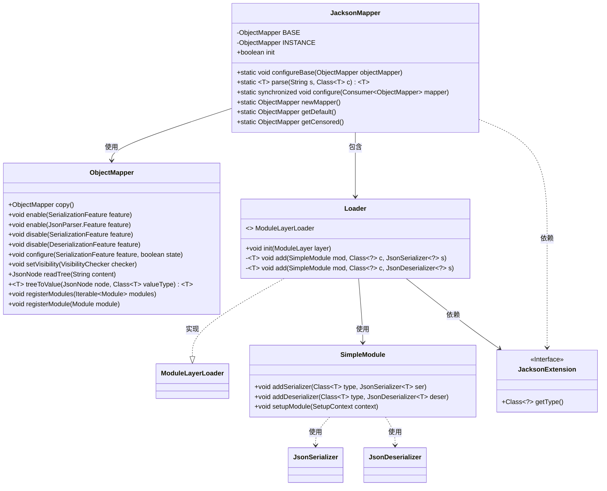
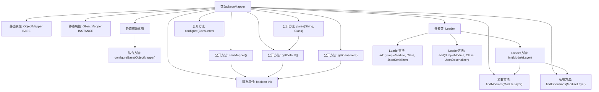

# 基础信息

|      |      |
|------|------|
| 名称 | JacksonMapper |
| 编码语言 | .java |
| 代码路径 | xpipe/core/src/main/java/io/xpipe/core/util/JacksonMapper.java |
| 包名 | io.xpipe.core.util |
| 依赖项 | ['com.fasterxml.jackson.annotation.JsonAutoDetect', 'com.fasterxml.jackson.core.JsonGenerator', 'com.fasterxml.jackson.core.JsonParser', 'com.fasterxml.jackson.core.JsonProcessingException', 'com.fasterxml.jackson.databind', 'com.fasterxml.jackson.databind.Module', 'com.fasterxml.jackson.databind.jsontype.TypeSerializer', 'com.fasterxml.jackson.databind.module.SimpleModule', 'lombok.Getter', 'java.io.IOException', 'java.util.ArrayList', 'java.util.List', 'java.util.ServiceLoader', 'java.util.function.Consumer'] |
| 概述说明 | JacksonMapper类提供静态ObjectMapper实例，支持JSON序列化配置、模块扩展和敏感数据脱敏处理。 |

# 说明

这是一个名为JacksonMapper的Java工具类，主要用于配置和管理ObjectMapper实例。它包含静态的BASE和INSTANCE ObjectMapper对象，通过configureBase方法进行基础配置，如启用缩进输出、允许注释、禁用空bean序列化失败等。提供parse方法用于JSON解析，configure方法用于自定义配置。Loader内部类实现ModuleLayerLoader接口，用于初始化时注册模块和扩展。还提供newMapper、getDefault和getCensored方法获取不同用途的ObjectMapper实例，其中getCensored会对敏感信息进行脱敏处理。

# 类列表 Class Summary

| 名称   | 类型  | 说明 |
|-------|------|-------------|
| JacksonMapper | class | JacksonMapper类提供静态ObjectMapper实例，支持JSON序列化配置、模块加载和敏感数据脱敏。 |

## 类 JacksonMapper

|      |      |
|------|------|
| 访问范围 | public |
| 类型 | class |
| 名称 | JacksonMapper |
| 说明 | JacksonMapper类提供静态ObjectMapper实例，支持JSON序列化配置、模块加载和敏感数据脱敏。 |

### UML类图

这段代码展示了一个JacksonMapper工具类，主要用于配置和管理ObjectMapper实例。它包含静态初始化方法、JSON解析功能、模块加载机制以及敏感信息过滤功能。核心是通过BASE和INSTANCE两个ObjectMapper实例提供不同场景的JSON处理能力，Loader内部类实现了模块化扩展机制，支持动态注册序列化/反序列化组件。类图清晰地展示了各组件间的依赖关系，包括与Jackson核心类(ObjectMapper)、扩展接口(JacksonExtension)以及模块系统(SimpleModule)的交互。

### 内部方法调用关系图

这段代码是Jackson JSON处理库的高级封装类，主要功能包括：1) 通过静态初始化块配置基础ObjectMapper；2) 提供JSON解析/序列化方法；3) 支持动态模块加载机制；4) 实现敏感数据脱敏处理。核心流程包含静态初始化配置、模块动态加载、JSON数据处理三个主要环节，通过嵌套Loader类实现SPI扩展机制，同时提供线程安全的配置修改接口。

### 字段列表 Field List

| 名称  | 类型  | 说明 |
|-------|-------|------|
| init = false | boolean | 私有静态布尔变量init初始为false |
| INSTANCE | ObjectMapper | 私有静态常量对象映射器实例 |
| BASE = new ObjectMapper() | ObjectMapper | 私有静态对象映射器BASE初始化 |

### 方法列表 Method List

| 名称  | 类型  | 说明 |
|-------|-------|------|
| findExtensions | List<JacksonExtension> | 查找模块层中的Jackson扩展，返回列表。 |
| findModules | List<Module> | 查找模块列表方法：根据层参数加载并返回模块集合。 |
| configure | void | 静态同步方法，配置ObjectMapper实例。 |
| parse | T | 静态方法parse将JSON字符串s解析为类型T的对象，使用默认映射器处理异常。 |
| configureBase | void | 配置ObjectMapper：启用格式化、注释、尾逗号，禁用空Bean报错，设置字段可见性。 |
| newMapper | ObjectMapper | 静态方法newMapper返回未初始化的BASE或INSTANCE的副本。 |
| getDefault | ObjectMapper | 静态方法返回默认ObjectMapper，未初始化时返回BASE，否则返回INSTANCE。 |
| getCensored | ObjectMapper | 获取脱敏ObjectMapper：未初始化返回BASE，否则复制实例并注册SecretValue序列化模块，输出"<secret>"。 |

