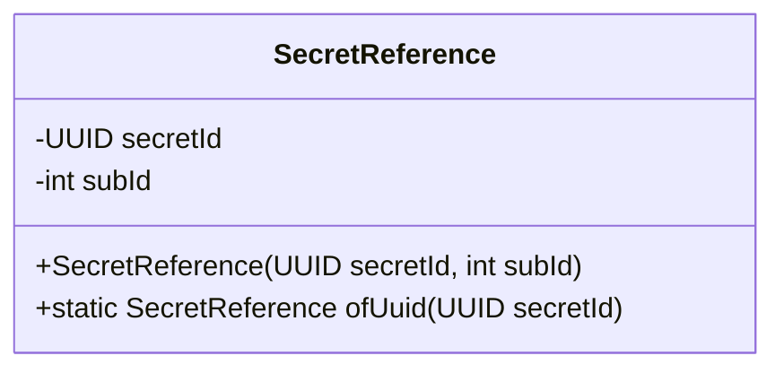
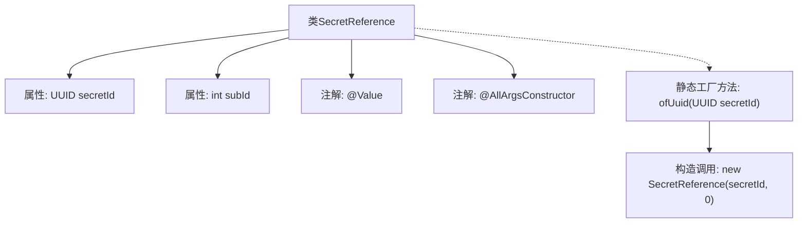

# 基础信息

|      |      |
|------|------|
| 名称 | SecretReference |
| 编码语言 | .java |
| 代码路径 | xpipe/core/src/main/java/io/xpipe/core/util/SecretReference.java |
| 包名 | io.xpipe.core.util |
| 依赖项 | ['lombok.AllArgsConstructor', 'lombok.Value', 'java.util.UUID'] |
| 概述说明 | SecretReference类含UUID和int字段，提供静态创建方法。 |

# 说明

这是一个名为SecretReference的Java类，使用@Value和@AllArgsConstructor注解。类包含两个字段：UUID类型的secretId和int类型的subId。提供了一个静态工厂方法ofUuid，接收secretId参数并创建subId为0的SecretReference实例。整个类设计用于封装秘密ID及其子ID的引用关系。

# 类列表 Class Summary

| 名称   | 类型  | 说明 |
|-------|------|-------------|
| SecretReference | class | SecretReference类包含secretId和subId，提供静态方法ofUuid创建实例。 |

## 类 SecretReference

|      |      |
|------|------|
| 访问范围 | @Value;@AllArgsConstructor;public |
| 类型 | class |
| 名称 | SecretReference |
| 说明 | SecretReference类包含secretId和subId，提供静态方法ofUuid创建实例。 |

### UML类图

这段代码定义了一个名为SecretReference的类，用于存储秘密引用的标识信息。该类包含两个私有字段：secretId（UUID类型）和subId（整型），并通过@AllArgsConstructor注解自动生成全参数构造函数。此外，还提供了一个静态工厂方法ofUuid，用于创建subId默认为0的SecretReference实例。这个类适合用于需要唯一标识和版本控制的场景，如密钥管理系统中的引用处理。

### 内部方法调用关系图

这段代码定义了一个不可变的`SecretReference`类，使用Lombok的`@Value`和`@AllArgsConstructor`注解自动生成final字段、getter和全参数构造函数。核心功能是通过静态工厂方法`ofUuid`创建默认subId为0的对象实例。流程图展示了类结构、注解关系和工厂方法到构造函数的调用链路，体现了简洁的值对象设计模式。

### 字段列表 Field List

| 名称  | 类型  | 说明 |
|-------|-------|------|
| secretId | UUID | UUID密钥ID |
| subId | int | 声明整型变量subId |

### 方法列表 Method List

| 名称  | 类型  | 说明 |
|-------|-------|------|
| ofUuid | SecretReference | 静态方法，通过UUID创建SecretReference实例，初始版本为0。 |

